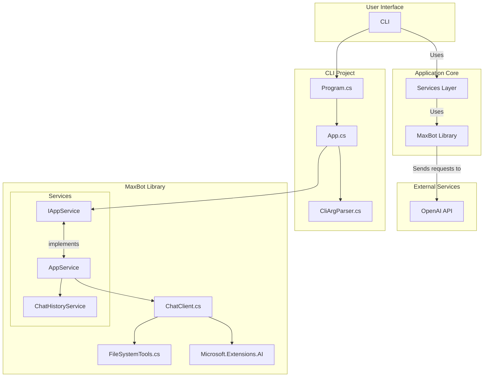
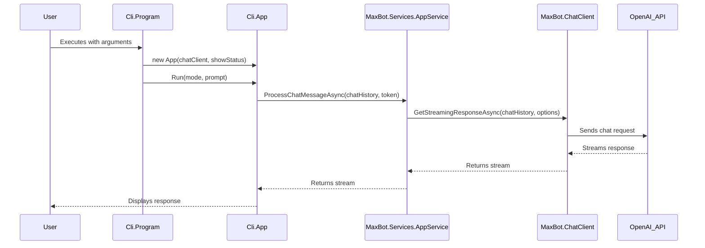

# Developer Guidelines

This document outlines the coding conventions, rules, and patterns used in this project.

## General Conventions

- **`namespace`:** All code should be within a namespace. Use file-scoped namespaces to reduce nesting.
- **`GlobalUsings.cs`:** Use `GlobalUsings.cs` to define `using` statements that apply to the entire project.
- **`var` keyword:** Use the `var` keyword for local variable declarations.
- **String interpolation:** Use string interpolation for creating formatted strings.
- **`async Task`:** Use `async Task` for asynchronous operations.
- **`try-catch` blocks:** Use `try-catch` blocks for error handling.
- **Comments:** Use single-line (`//`) or multi-line (`/* */`) comments to document code.

## Class Design

- **`class`:** Classes should be `public` unless they are internal to an assembly.
- **`static class`:** Use `static` classes for collections of utility methods.
- **`partial class`:** Use `partial` classes to split large class definitions into multiple files.
- **`record`:** Use `record` types for immutable data transfer objects (DTOs).
- **`init` properties:** Use `init` setters for properties that should be immutable after initialization.
- **POCOs:** Use Plain Old CLR Objects (POCOs) for data structures.

## Error Handling

- **`FluentResults`:** Use the `FluentResults` library to handle success and failure without throwing exceptions. Return `Result<T>` from methods that can fail.

## Asynchronous Programming

- **`async`/`await`:** Use `async` and `await` for non-blocking I/O operations.

## JSON Serialization

- **`System.Text.Json`:** Use the `System.Text.Json` library for JSON serialization and deserialization.
- **`[JsonPropertyName]`:** Use the `[JsonPropertyName]` attribute to map JSON property names to C# property names.
- **`[JsonSerializable]`:** Use the `[JsonSerializable]` attribute and `JsonSerializerContext` for improved serialization performance.

## Dependency Management

- **Builder pattern:** Use the builder pattern for complex object construction.
- **Factory method:** Use static factory methods to create instances of classes.

## LINQ

- **LINQ:** Use LINQ for querying collections.

## Changelog Management

- **Unreleased Changes:** Add new changes under a `[TBD]` or `[Unreleased]` heading at the top of the `CHANGELOG.md`.
- **Follow Keep a Changelog:** Adhere to the conventions outlined in [Keep a Changelog](https://keepachangelog.com/en/1.0.0/).

## Command-line Argument Parsing

- **Manual parsing:** Arguments are parsed manually.
- **`--help` and `--version`:** Provide `--help` and `--version` options for command-line tools.

## Best Practices

- **File-scoped namespaces:** Use file-scoped namespaces to reduce indentation and improve readability.
- **Expression-bodied members:** Use expression-bodied members for simple methods and properties.
- **`IAsyncEnumerable<T>`:** Use `IAsyncEnumerable<T>` for streaming asynchronous data.
- **`nameof` operator:** Use the `nameof` operator to get the name of a variable, type, or member as a string.
- **Assume Cross-Platform:** All code that interacts with the operating system (e.g., file paths, processes, environment variables) **must** be written and tested for Windows, macOS, and Linux compatibility from the start. Use `System.Runtime.InteropServices.RuntimeInformation` for OS-specific logic.
- **Verify AOT Compatibility:** This is an AOT-compiled project. Before adding any new NuGet package or using a .NET API, you **must** verify it is compatible with Native AOT compilation to avoid significant rework.

## CLI Design

- **Finalize command structure:** Before implementation, ensure that the command structure is finalized to avoid rework.

## Testing

- **Black-box testing:** Prefer black-box testing for integration tests.
- **Invoke `Program.Main`:** Invoke the `Program.Main` method directly from tests to simulate running the CLI.
- **Redirect Console I/O:** Use `Console.SetIn` and `Console.SetOut` to redirect console input and output for testing.
- **Test `ChatClient`:** Create a test implementation of `ChatClient` to return predictable responses.
- **Keep tests in sync:** Always update tests to reflect the latest changes in the CLI's behavior.
- **Test LLM interactions flexibly:** When testing interactions with LLMs, avoid asserting for exact string matches. Instead, use regular expressions or keyword checks to verify that the response contains the key information or intent, accommodating the conversational nature of AI.
- **Refine tests on failure:** When a black-box test fails, especially one involving an LLM, do not immediately revert to a mocked implementation. First, analyze the failure to understand if the test's assertions are too brittle. If the core behavior is correct but the output is conversational, adapt the test to be more flexible before considering a change in testing strategy.
- **Ensure test isolation:** Tests should not depend on shared state. Each test should create its own required state (e.g., configuration files, temporary directories) to ensure it can run independently and produce consistent results.
- **Test Against Defaults:** Acceptance and integration tests should verify feature behavior against the application's default, secure-by-default configuration (e.g., `tool_approvals: readonly`). Tests should only override these settings when explicitly testing a less secure mode.

## Package Management

- **NuGet dependencies:** Be mindful of NuGet package dependencies and version conflicts.
- **Update packages:** When updating packages, ensure that all related packages are updated to compatible versions.

## Architecture

This section provides an overview of the project's architecture, including the relationship between the `Cli` and `MaxBot` projects and the key program logic flows.

### Architectural Principles

The project follows these key architectural principles:

1. **Separation of Concerns**: UI logic (CLI) is separated from core application logic (MaxBot)
2. **Service-Oriented Design**: Core functionality is exposed through service interfaces
3. **Dependency Inversion**: High-level modules depend on abstractions, not concrete implementations
4. **Single Responsibility**: Each class has a single, well-defined responsibility

### Component Diagram

This diagram illustrates the relationship between the `Cli` and `MaxBot` projects and their key components.



### Sequence Diagram

This diagram shows the sequence of events from the user running the application to receiving a response from the AI.



### Services Layer

The Services layer provides a clean separation between the UI and core application logic:

1. **IAppService**: Interface defining all core application operations
2. **AppService**: Implementation of IAppService that coordinates between ChatClient and ChatHistoryService
3. **ChatHistoryService**: Handles persistence of chat history to disk

This layered architecture provides several benefits:
- **Testability**: Core logic can be tested independently of the UI
- **Maintainability**: Changes to the UI don't affect core logic and vice versa
- **Extensibility**: New UIs can be built on top of the same services
- **Separation of Concerns**: Each component has a clear, single responsibility

## System Specifications and Requirements

### Documentation Standards Philosophy
The MaxBot system follows DO-178C/DO-330 aerospace documentation standards as a process framework to ensure systematic development and comprehensive traceability. While MaxBot is not safety-critical software, these regulatory standards provide proven methodologies for:

- **Rigorous Requirements Management**: Clear, traceable, and verifiable requirements
- **Systematic Development Process**: Structured approach to implementation and verification
- **Professional Documentation**: Industry-standard documentation practices
- **Quality Assurance**: Comprehensive verification and validation processes

### Requirements Documentation
The MaxBot system is governed by comprehensive requirements documentation:

- **[System Requirements](../docs/specs/_index.md)**: Complete Tool Operational Requirements (TORs) specification with 24 requirements organized into 8 functional categories
- **[Traceability Matrix](../docs/specs/trace_matrix.md)**: Requirements traceability and verification status mapping
- **[Project Implementation Plan](../docs/project_plan.md)**: Phased development approach with milestones and success criteria

### Development Approach
All development must follow the requirements-driven approach:

1. **Requirements Traceability**: Every implementation component must trace to specific TORs
2. **Verification Requirements**: Each TOR specifies verification methods (Test, Analysis, Demonstration, Inspection)
3. **Phase-Based Implementation**: Follow the 3-phase priority approach defined in the project plan
4. **Documentation Updates**: Update traceability matrix as implementation progresses

### Critical Requirements Priority
Phase 1 Critical requirements (12 TORs) must be implemented first:
- Core AI functionality (TOR-1.1, TOR-1.2)
- File system operations (TOR-3.1, TOR-3.2, TOR-3.3)
- Development environment integration (TOR-4.1, TOR-4.2)
- Security controls (TOR-7.1, TOR-7.2)
- Error handling (TOR-8.2)

### Verification Standards
- All implementations must include corresponding test cases
- Critical requirements require comprehensive testing
- Maintain 100% traceability from requirements to verification
- Update verification status in traceability matrix upon completion

## Development

### Requirements-Driven Workflow

All new feature development or modification must follow a "requirements-first" black-box testing workflow. This process ensures that every piece of code is directly traceable to a requirement and is verified against that requirement from the outset.

1.  **Step 1: Create a Test Skeleton:** Before writing any implementation code, the developer **MUST** create or update the relevant test file with skeleton test cases.
    -   These tests must be derived directly from the system requirements (TORs).
    -   Each test should represent a specific, verifiable aspect of the requirement.
    -   The tests can be initially empty or marked with `[Fact(Skip = "Skeleton only")]`. Their purpose is to serve as a contract for what the implementation needs to achieve.

2.  **Step 2: Implement the Feature:** With the test contract defined, write the production code necessary to satisfy the requirements.

3.  **Step 3: Complete and Pass the Tests:** Flesh out the logic for the skeleton tests created in Step 1. The feature is not considered complete until all requirements-based tests are passing.

This workflow is mandatory and is the primary method for ensuring quality and traceability.

### Acceptance Testing

To ensure the CLI works as expected from an end-user perspective, run the local acceptance test script:

```sh
./test/local_exe_acceptance.ps1
```

This script publishes the executable and runs a series of tests against it. If the script exits with a non-zero status code, the tests have failed.

### Building the Project

To build the project, run the following command from the root directory:

```sh
dotnet build src/MaxBot.sln
```

### Publishing maxbox

```sh
dotnet publish ./src/Cli\Cli.csproj -r {{RUNTIME_IDENTIFIER}} -o ./dist
```


### Running Tests

To run all tests in the solution, run the following command from the root directory:

```sh
dotnet test src/MaxBot.sln
```

To run acceptacne tests the

```sh
./test/local_exe_acceptance.ps1 # This script will publish the exe to ./dist and exerceise a sample of the feature switches
#if it exist non-zero than it is a fail otherwise pass
```

## AI Tool Implementation Essentials

### Rich XML Response Format (CRITICAL)
**All AI tools MUST return structured XML responses** for LLM integration:

```xml
<tool_response tool_name="tool_name">
    <notes>Human-readable summary of what happened</notes>
    <result status="SUCCESS|FAILED" absolute_path="/path" sha256_checksum="hash" />
    <content_on_disk>Actual content read from disk</content_on_disk>
</tool_response>
```

**Key Requirements:**
- Always include `absolute_path` and `sha256_checksum` for file operations
- Return actual content read from disk, not just what was written
- Use `SecurityElement.Escape()` for XML content
- Provide clear error messages in `<error>` tags for failures

### Tool Registration Pattern
```csharp
AIFunctionFactory.Create(
    MethodName,
    new AIFunctionFactoryOptions
    {
        Name = "snake_case_name",
        Description = "Clear description"
    })
```

### Security Boundaries (CRITICAL)
- **Always check tool approvals**: `if (_config.ToolApprovals == "readonly")` 
- **Always validate working directory**: `IsPathInWorkingDirectory(path)`
- **Always check file permissions**: `new FileInfo(path).IsReadOnly`

### File Operations Pattern
1. Create backup → 2. Write to temp file → 3. Verify checksum → 4. Atomic move → 5. Final verification

These patterns ensure consistency, security, and proper LLM integration across all tools.

## Microsoft.Extensions.AI Developer Docs

- docs\llmctx\usage-of-microsoft-extensions-ai.md
