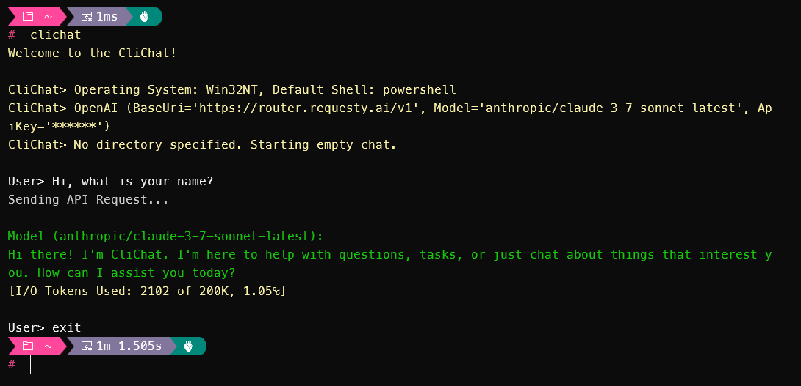

# MaxBot CLI

An interactive command-line chat application that leverages multiple AI providers to deliver conversational AI capabilities. This application features streaming responses, support for multiple API providers, and AOT compilation for optimal performance.

## Features

- Interactive chat interface with streaming AI responses
- Support for multiple API providers:
  - OpenAI-compatible APIs
  - Anthropic APIs
- Profile-based configuration for easy switching between providers and models
- Automatic operating system detection and shell configuration
- AOT (Ahead-of-Time) compilation support for improved performance
- Cross-platform support (Windows, MacOS, Linux)
- Built-in help command (`-h` or `--help`)

## Screenshot



## Prerequisites

Before running the application, ensure you have:

- .NET SDK installed
- Access to at least one supported API provider
- Configuration file set up with your API providers and profiles

## Setup

1. Create a configuration file (`maxbot.config.json`) with your API provider details:

   ```json
   {
       "maxbotConfig": {
           "apiProviders": [
               {
                   "name": "ProviderName",
                   "type": "OpenAI-Compatible",
                   "apiKey": "your-api-key",
                   "baseUrl": "https://api.provider.com/v1"
               },
               {
                   "name": "Anthropic",
                   "type": "Anthropic",
                   "apiKey": "your-anthropic-api-key"
               }
           ],
           "profiles": [
               {
                   "default": true,
                   "name": "DefaultProfile",
                   "apiProvider": "ProviderName",
                   "modelId": "model-name"
               },
               {
                   "name": "AnthropicProfile",
                   "apiProvider": "Anthropic",
                   "modelId": "claude-3-sonnet"
               }
           ]
       }
   }
   ```

## Usage

```bash
maxbot [options]
```

### Options

- `-h, --help`: Show help message
- `-c, --config <path>`: Specify a custom configuration file path (default: maxbot.config.json)
- `-p, --profile <name>`: Specify a profile name to use (overrides default profile in config)

### Examples

```bash
maxbot                                # Start with default configuration
maxbot -c custom-config.json          # Start with custom configuration file
maxbot -p "Anthropic"                 # Start with specific profile
maxbot -c custom-config.json -p "GPT" # Start with custom config and specific profile
```

### Chat Interface

- Start typing your messages after the `User>` prompt
- AI responses will stream in real-time with green text
- Exit the chat by typing `exit`, `quit`, or pressing Enter with no message

### Configuration

The application uses a JSON configuration file with the following structure:

- **apiProviders**: List of available API providers
  - **name**: Unique identifier for the provider
  - **type**: Provider type (OpenAI-Compatible or Anthropic)
  - **apiKey**: Your API key for the provider
  - **baseUrl**: Base URL for the API (for OpenAI-Compatible providers)

- **profiles**: List of available profiles
  - **default**: Whether this is the default profile (true/false)
  - **name**: Profile name
  - **apiProvider**: Name of the API provider to use (must match a provider name)
  - **modelId**: Model ID to use for chat completion

## AOT Compilation

MaxBot supports AOT (Ahead-of-Time) compilation for improved performance:

```bash
dotnet publish -c Release -r win-x64 --self-contained
```

## Exit

To exit the application:

- Type `exit` or `quit`
- Press Enter with an empty message
- The application will cleanly terminate

## References

- [Microsoft.Extensions.AI Documentation](https://learn.microsoft.com/en-us/dotnet/ai/)
- [System.Text.Json Source Generation](https://learn.microsoft.com/en-us/dotnet/standard/serialization/system-text-json/source-generation)
