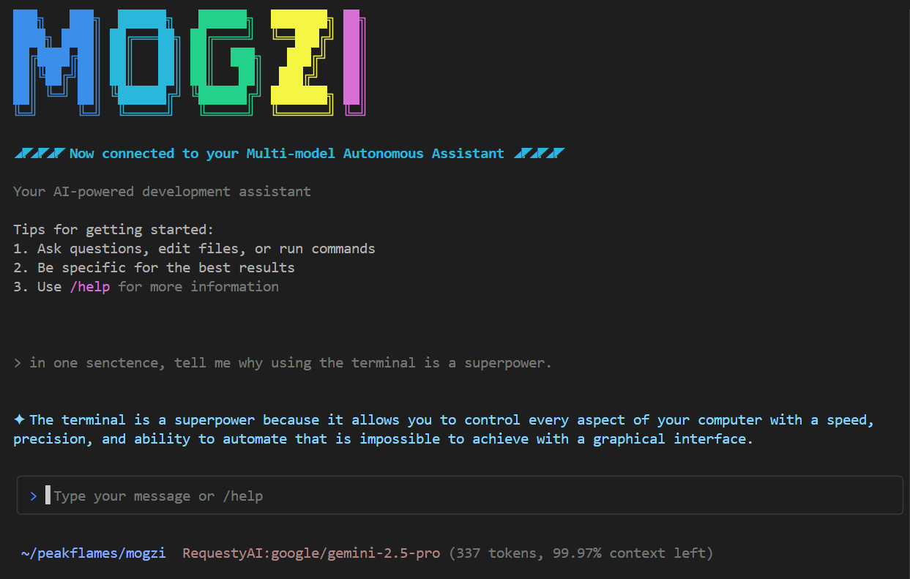

# Mogzi

[](https://github.com/peakflames/mogzi/actions/workflows/build.yml) 



A Multi-model autonomous assistant right in your terminal or CI/CD pipeline and open to multiple API providers and AI models

Perform engineering research, full coding tasks, and multiple workflow with either natural language or shell scripts 👈

_Please note that this project is still in the alpha stage and being actively developed. I welcome contribution from the community [per this guidance](CONTRIBUTING.md)._

## Features ✨

- Cross-platform support (Windows, MacOS, Linux)
- Interactive chat interface with streaming AI responses
- Chat history persistence with session management
- Profile-based configuration for easy switching between providers and models
  - Currently supports the OpenAI-compatible APIs enabling numerous provides like Requesty.ai, Supernova, etc.
   - For now, the `best` results are with models having excellect tool and instruction following like those from Anthropic and the new Kimi models. 
- Control file system access via tool appproval (`readonly` or `all`)

**Planned:**

- MCP-Support (coming soon)
- Non-Interactive Chat/Workflows
  - Pipe support for integrating with shell workflows

### Examples 💡

```bash
# Start an interactive chat using your default profile as defined by your `mogzi.config.json`
mogzi

# Start an interactive chat using a profile named 'sonnet' as defined by your `mogzi.config.json`
mogzi --profile sonnet

# List available sessions (shows most recent 10 by default, can be configed in `mogzi.config.json`)
mogzi session list

# Continues an interactive chat session named 'rainbow_unicorn'
mogzi chat --session rainbow_unicorn
```

## Getting Started ✅

### Step 1: Obtain the API details about an OpenAI-Compatiable

1. Obtain the API details about an OpenAI-Compatiable Provider (e.g. [Requesty AI](https://www.requesty.ai/), etc.)
   - Base URL
   - API Key
   - Desired Model Id
  
### Step 2: Download Mogzi executable

Download the latest release following the steps below.

For Windows:

- Download mogzi.exe and moves it to your WindowsApp directory
```sh
Start-BitsTransfer -Source https://github.com/peakflames/mogzi/releases/latest/download/mogzi-win-x64.exe -Destination mogzi.exe; move -Force mogzi.exe $env:USERPROFILE\\AppData\\Local\\Microsoft\\WindowsApps
```

For MacOS (sudo):

- Download mogzi and moves it to your `/usr/local/bin`

```sh
sudo curl -L -o mogzi https://github.com/peakflames/mogzi/releases/latest/download/mogzi-osx-x64 && sudo chmod +x mogzi && sudo mv -f mogzi /usr/local/bin
```

For Linux (sudo)

- Download mogzi and moves it to your `/usr/local/bin`

```sh
sudo curl -L -o mogzi https://github.com/peakflames/mogzi/releases/latest/download/mogzi-linux-x64 && sudo chmod +x mogzi && sudo mv -f mogzi /usr/local/bin
```

### Step 3: Create your mogzi.config.json in your home directory

In your home directory, create a configuration file (`mogzi.config.json`) with your API provider details:

```json
{
    "mogziConfig": {
        "sessionListLimit": 10,
        "apiProviders": [
            {
                "name": "MyCompanyProvider",
                "type": "OpenAI-Compatible",
                "apiKey": "example-key",
                "baseUrl": "https://litellm.mycompany.com"
            },
            {
                "name": "RequestyAI",
                "type": "OpenAI-Compatible",
                "apiKey": "example-key",
                "baseUrl": "https://router.requesty.ai/v1"
            },
            {
                "name": "Deepseek",
                "type": "OpenAI-Compatible",
                "apiKey": "example-key",
                "baseUrl": "https://api.deepseek.com"
            }
        ],
        "profiles": [
            {
                "default": true,
                "name": "Default",
                "apiProvider": "MyCompanyProvider",
                "modelId": "03-mini"
            },
            {
                "name": "Sonnet",
                "apiProvider": "RequestyAI",
                "modelId": "vertex/anthropic/claude-3-7-sonnet"
            },
            {
                "name": "Gemini",
                "apiProvider": "RequestyAI",
                "modelId": "google/gemini-2.5-pro"
            },
            {
                "name": "V3",
                "apiProvider": "Deepseek",
                "modelId": "deepseek-chat"
            }
        ]
    }
}
```

### Step 4: Open a Terminal and chat

1. Open you favorite Terminal app
2. Start an interactive chat

```sh
$ mogzi
```


### Configuration Schema ⚙️

The application uses a JSON configuration file with the following structure:

- **apiProviders**: List of available API providers
  - **name**: Unique identifier for the provider
  - **type**: Provider type (OpenAI-Compatible at this time, more to come)
  - **apiKey**: Your API key for the provider
  - **baseUrl**: Base URL for the API (for OpenAI-Compatible providers)

- **profiles**: List of available profiles
  - **default**: Whether this is the default profile (true/false)
  - **name**: Profile name
  - **apiProvider**: Name of the API provider to use (must match a provider name)
  - **modelId**: Model ID to use for chat completion

### Tool Approval 🔒

Mogzi includes a tool approval feature to provide control over file system operations. This setting can be configured in your `mogzi.config.json` file or overridden at runtime with a command-line argument.

**Modes:**

*   `readonly`: (Default) Mogzi will be prevented from performing any write operations or shell commands.
*   `all`: Mogzi is pre-approved to perform any file system operation or shell commands without asking for confirmation. (i.e. YOLO mode)


**Configuration:**

To set the default tool approval mode, add the `tool_approvals` property to your `mogzi.config.json`:

```json
{
    "mogziConfig": {
        "tool_approvals": "all",
    }
}
```

**Command-Line Override:**

You can override the configuration file setting using the `--tool-approvals` or `-ta` argument:

```bash
mogzi "Create a new file" -ta all
```

## Tools

**File System Operations**
- `list_directory` - Browse directory contents
- `read_text_file` - Read text files with pagination support
- `read_image_file` - Read and analyze image files
- `read_pdf_file` - Extract text from PDF documents

**File System Operations**
- `write_file` - Create or overwrite files (requires `--tool-approvals all`)
- `replace_in_file` - Make targeted text replacements in files (requires `--tool-approvals all`)
- `apply_code_patch` - Apply unified diff patches (requires `--tool-approvals all`)

**Code Analysis & Search**
- `search_file_content` - Search file contents with regex patterns
- `generate_code_patch` - Create diff patches
- `preview_patch_application` - Preview patch changes

**System Operations**
- `execute_command` - Run shell commands (requires `--tool-approvals all`)
- `attempt_completion` - Signal task completion

### Upcoming Tools
- `list_code_definition_names` - Extract code structure and definitions
- `mcp_tools` - Model Context Protocol support for external integrations


## Contributing 🤝

To contribute to the project, start with our [Contributing Guide](CONTRIBUTING.md) to learn the basics. You can also join our [Discord](https://discord.gg/tHMYPCyY) to chat with other contributors in the `#contributors` channel.

## Copyright ©️

Copyright (c) 2025 Todd Schavey

This work is licensed under the Creative Commons Attribution-NonCommercial 4.0 International License.
To view a copy of this license, visit http://creativecommons.org/licenses/by-nc/4.0/ or send a letter
to Creative Commons, PO Box 1866, Mountain View, CA 94042, USA.

## Acknowledgements

- [Cline](https://github.com/cline/cline)
- [Gemini CLI](https://github.com/google-gemini/gemini-cli)
- [Microsoft.Extensions.AI](https://learn.microsoft.com/en-us/dotnet/ai/microsoft-extensions-ai)
- [Spectre.Console](https://github.com/spectreconsole/spectre.console)
