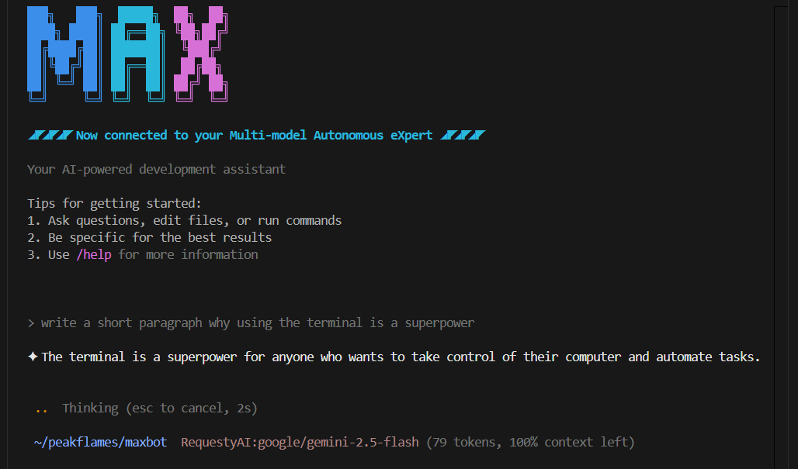

# MAX

[](https://github.com/peakflames/maxbot/actions/workflows/build.yml)



A Multi-model Autonomous eXpert (Max) right in your terminal or CI/CD pipeline and open to multiple API providers and AI models

Perform engineering research, full coding tasks, and multiple workflow with either natural language or shell scripts 👈

## Features ✨

- Supports both `interactive chat` and `non-tnteractive` interface with streaming AI responses
- Currently supports the OpenAI-compatible APIs enabling numerous provides like Requesty.ai, Openrouter.ai, Supernova, Cerebras, Deepseek, and more.
   - For now, the `best` results are with models having excellect tool and instruction following like those form Anthropic, Google, and OpenAI models.
- Profile-based configuration for easy switching between providers and models
- Cross-platform support (Windows, MacOS, Linux)
- Control file system access via tool appproval (`readonly` or `all`)
- Chat history persistence to continue conversations across sessions (coming soon)
- Session management to list and load previous chat sessions (coming soon)
- MCP-Support (coming soon)

### Examples 💡

```bash
# Start a rich interactive chat
max

# Switch to using your profile named 'sonnet'
max --profile sonnet

# Translate a README.md to portugese in one shot
cat README.md | max run -p "Translate to portugese"

# (coming soon) Run a no non-interactive nworkflow prompt
max run -p workflows/generate-release-notes.md
```

## Prerequisites ✅

Before running the application, ensure you have:

- Access to at least one supported API provider
- Configuration file set up with your API providers and profiles

## Setup 🛠️

1. Download the latest release following the steps below.

   For Windows:

   - Download loads max.exe and moves it to your WindowsApp directory
   ```sh
   Start-BitsTransfer -Source https://github.com/peakflames/maxbot/releases/latest/download/max-win-x64.exe -Destination max.exe; move -Force max.exe $env:USERPROFILE\\AppData\\Local\\Microsoft\\WindowsApps
   ```

    For MacOS (sudo):

    - Download loads max and moves it to your `/usr/local/bin`
  
    ```sh
    sudo curl -L -o max https://github.com/peakflames/maxbot/releases/latest/download/max-osx-x64 && sudo chmod +x max && sudo mv -f max /usr/local/bin
    ```

    For Linux (sudo)

    - Download loads max and moves it to your `/usr/local/bin`

    ```sh
    sudo curl -L -o max https://github.com/peakflames/maxbot/releases/latest/download/max-linux-x64 && sudo chmod +x max && sudo mv -f max /usr/local/bin
    ```

2. In your home directory, create a configuration file (`maxbot.config.json`) with your API provider details:

   ```json
   {
       "maxbotConfig": {
           "apiProviders": [
               {
                    "name": "MyCompanyProvider",
                    "type": "OpenAI-Compatible",
                    "apiKey": "example-key",
                    "baseUrl": "https://litellm.mycompany.com"
                },
                {
                    "name": "RequestyAI",
                    "type": "OpenAI-Compatible",
                    "apiKey": "example-key",
                    "baseUrl": "https://router.requesty.ai/v1"
                },
                {
                    "name": "Deepseek",
                    "type": "OpenAI-Compatible",
                    "apiKey": "example-key",
                    "baseUrl": "https://api.deepseek.com"
                }
           ],
           "profiles": [
               {
                   "default": true,
                   "name": "Default",
                   "apiProvider": "MyCompanyProvider",
                   "modelId": "03-mini"
               },
               {
                   "name": "Sonnet",
                   "apiProvider": "RequestyAI",
                   "modelId": "vertex/anthropic/claude-3-7-sonnet"
               },
               {
                    "name": "Gemini",
                    "apiProvider": "RequestyAI",
                    "modelId": "google/gemini-2.5-pro"
                },
                {
                    "name": "V3",
                    "apiProvider": "Deepseek",
                    "modelId": "deepseek-chat"
                }
           ]
       }
   }
   ```

### Configuration Schema ⚙️

The application uses a JSON configuration file with the following structure:

- **apiProviders**: List of available API providers
  - **name**: Unique identifier for the provider
  - **type**: Provider type (OpenAI-Compatible at this time, more to come)
  - **apiKey**: Your API key for the provider
  - **baseUrl**: Base URL for the API (for OpenAI-Compatible providers)

- **profiles**: List of available profiles
  - **default**: Whether this is the default profile (true/false)
  - **name**: Profile name
  - **apiProvider**: Name of the API provider to use (must match a provider name)
  - **modelId**: Model ID to use for chat completion

### Tool Approval 🔒

MaxBot includes a tool approval feature to provide control over file system operations. This setting can be configured in your `maxbot.config.json` file or overridden at runtime with a command-line argument.

**Configuration:**

To set the default tool approval mode, add the `tool_approvals` property to your `maxbot.config.json`:

```json
{
    "maxbotConfig": {
        "tool_approvals": "all",
        "apiProviders": [ ... ],
        "profiles": [ ... ]
    }
}
```

**Command-Line Override:**

You can override the configuration file setting using the `--tool-approvals` or `-ta` argument:

```bash
max "Create a new file" -ta all
```

**Modes:**

*   `readonly`: (Default) MaxBot will ask for your permission before performing any write operations (e.g., creating or modifying files).
*   `all`: MaxBot is pre-approved to perform any file system operation without asking for confirmation.


## Available Assistant Tools 🛠️

MaxBot is equipped with a powerful set of tools to interact with your local system. Here is a summary of the currently implemented tools:

| Tool Name           | Status | Notes                                                              | Safety/Security Features                                                                                                                            |
| ------------------- | ------ | ------------------------------------------------------------------ | --------------------------------------------------------------------------------------------------------------------------------------------------- |
| `list_directory`    | ✅ | Lists files and directories in a specified path. Supports glob patterns and .gitignore filtering. | Read-only operation. Constrained to the working directory. Respects .gitignore patterns by default.                                                |
| `read_text_file`    | ✅ | Reads the content of text files with optional line range support for large files. | Read-only operation. Constrained to the working directory. Supports pagination for large files.                                                    |
| `read_image_file`   | ✅ | Reads and analyzes image files (PNG, JPEG, GIF, BMP, WebP).       | Read-only operation. Constrained to the working directory. Returns base64-encoded image data for AI analysis.                                      |
| `read_pdf_file`     | ✅ | Extracts text content from PDF files.                             | Read-only operation. Constrained to the working directory. Extracts readable text from PDF documents.                                              |
| `write_file`        | ✅ | Creates a new file or overwrites an existing one with content.     | - Requires `--tool-approvals all`.<br>- Constrained to the working directory.<br>- Uses atomic writes with verification.<br>- Respects read-only file attributes. |
| `replace_in_file`           | ✅ | Replaces specific text within files with precise context matching. | - Requires `--tool-approvals all`.<br>- Constrained to the working directory.<br>- Uses atomic operations with backups.<br>- Requires exact text matching for safety. |
| `apply_code_patch`  | ✅ | Applies Git-style unified diff patches for precise code changes.   | - Requires `--tool-approvals all`.<br>- Constrained to the working directory.<br>- Uses fuzzy matching for robust patch application.                |
| `generate_code_patch` | ✅ | Creates unified diff patches showing changes between content.       | Read-only operation. Generates patches without modifying files.                                                                                     |
| `preview_patch_application` | ✅ | Previews what changes a patch would make without applying them.     | Read-only operation. Safe preview of potential changes.                                                                                             |
| `execute_command`   | ✅ | Executes shell commands with cross-platform support.              | - Requires `--tool-approvals all` by default.<br>- Cross-platform aware (uses `cmd`, `zsh`, `bash` appropriately).<br>- Non-interactive commands only. |
| `search_file_content` | ✅ | Regex-based search across file contents with glob filtering.       | Read-only operation. Constrained to the working directory. Supports pattern matching and file filtering.                                           |
| `attempt_completion` | ✅ | Signals task completion and presents results to the user.          | Read-only operation. Provides structured completion feedback and optional demonstration commands.                                                    |

### Tool Categories

**File System Operations (Read-Only)**
- `list_directory` - Browse directory contents
- `read_text_file` - Read text files with pagination support
- `read_image_file` - Read and analyze image files
- `read_pdf_file` - Extract text from PDF documents

**File System Operations (Write - Requires `--tool-approvals all`)**
- `write_file` - Create or overwrite files
- `replace_in_file` - Make targeted text replacements in files
- `apply_code_patch` - Apply unified diff patches

**Code Analysis & Search**
- `search_file_content` - Search file contents with regex patterns
- `generate_code_patch` - Create diff patches
- `preview_patch_application` - Preview patch changes

**System Operations**
- `execute_command` - Run shell commands (requires approval)
- `attempt_completion` - Signal task completion

### Upcoming Tools
- `list_code_definition_names` - Extract code structure and definitions
- `mcp_tools` - Model Context Protocol support for external integrations

## Contributing 🤝

Contributions are welcome! Please read the [developer guidelines](.clinerules/developer_guidelines.md) for more information on how to build the project and run tests.

## Copyright ©️

Copyright (c) 2025 Todd Schavey

This work is licensed under the Creative Commons Attribution-NonCommercial 4.0 International License.
To view a copy of this license, visit http://creativecommons.org/licenses/by-nc/4.0/ or send a letter
to Creative Commons, PO Box 1866, Mountain View, CA 94042, USA.

## Acknowledgements

- [Cline](https://github.com/cline/cline)
- [Gemini CLI](https://github.com/google-gemini/gemini-cli)
- [Microsoft.Extensions.AI](https://learn.microsoft.com/en-us/dotnet/ai/microsoft-extensions-ai)
- [Spectre.Console](https://github.com/spectreconsole/spectre.console)
