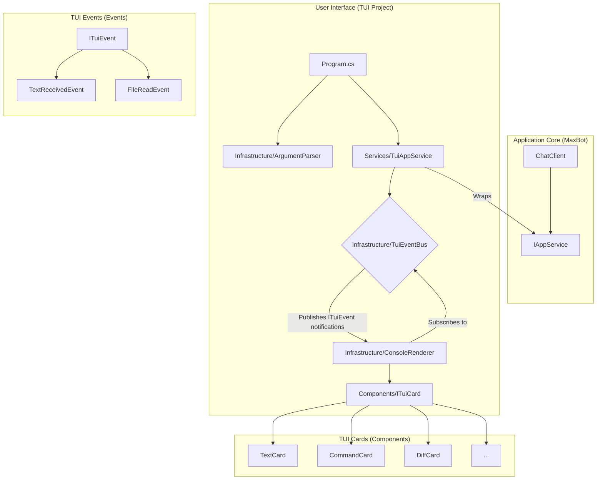
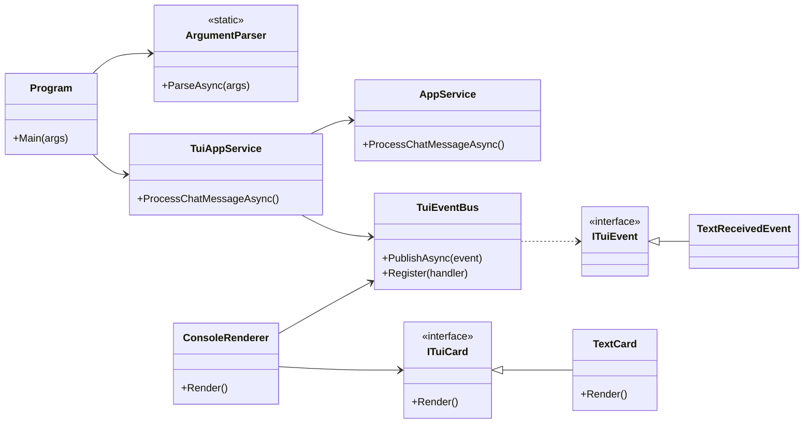

# TUI Architecture and Design

## 1. Introduction

This document provides the architectural and design specification for the MaxBot Terminal User Interface (TUI). It details the proposed architecture, component design, and technology stack required to implement the features and requirements defined in the `concept_of_operations.md` and `tool_requirements.md`.

## 2. Proposed Architecture

The TUI will be built upon a **strictly decoupled, event-driven architecture**. The core `MaxBot` library will contain **zero UI dependencies** and will be completely unaware of any user interface.

The `TUI` project will contain its own UI-specific service (`TuiAppService`) that wraps the core `IAppService`. This service will be responsible for orchestrating calls to the core logic and publishing UI-specific events.

This approach ensures a clean separation of concerns, making the `MaxBot` library reusable across different frontends (TUI, Web API, Blazor, etc.) and enhancing testability.

### 2.1. Architectural Diagram



### 2.2. Data Flow

1.  The `TuiAppService` in the `TUI` project calls the core `IAppService.ProcessChatMessageAsync` method.
2.  The `TuiAppService` iterates over the `IAsyncEnumerable<ChatResponseUpdate>` stream returned by the core service.
3.  For each update received from the core, the `TuiAppService` creates and publishes a specific, strongly-typed TUI event (e.g., `TextReceivedEvent`, `ToolCallEvent`) to the `TuiEventBus`.
4.  The `ConsoleRenderer`, also in the `TUI` project, subscribes to these events.
5.  Upon receiving an event, the `ConsoleRenderer`'s handler instantiates the appropriate `ITuiCard` (e.g., `TextCard`, `CommandCard`) and passes the event data to it.
6.  The card uses the data to render itself to the console using `Spectre.Console` components. This flow ensures the `MaxBot` core remains completely decoupled from the UI.

## 3. Component Design

### 3.1. Core Components

-   **`Program.cs`**: The main entry point of the TUI application. It is responsible for parsing command-line arguments, initializing the application services, and starting the main application loop.
-   **`Infrastructure/ArgumentParser`**: A static class responsible for parsing command-line arguments using a manual parsing approach. It defines the available options and provides help and version information.
-   **`Infrastructure/ConsoleRenderer`**: A class responsible for managing the overall TUI layout. It initializes `Spectre.Console`, sets up the main layout regions, and handles the subscription to and processing of UI events.
-   **`Infrastructure/TuiEventBus`**: A lightweight, in-memory event bus that provides type-safe pub/sub functionality.
-   **`Events/ITuiEvent`**: A base interface that all TUI events must implement.
-   **`Components/ITuiCard`**: An interface that defines the contract for all renderable TUI cards. It has a single `Render()` method.
-   **Card Implementations (`Components/`)**: A series of classes that implement `ITuiCard`. Each card is responsible for rendering a specific type of content.
-   **`Services/TuiAppService`**: A wrapper around the core `IAppService` that orchestrates calls to the core logic and publishes UI-specific events.

### 3.2. Event System Design

The event system uses a simple, type-safe approach that avoids reflection and maintains AOT compatibility:

```csharp
public interface ITuiEvent
{
    DateTime Timestamp { get; }
}

public interface ITuiEventBus
{
    void Publish<T>(T eventData) where T : ITuiEvent;
    void Subscribe<T>(Action<T> handler) where T : ITuiEvent;
}

// Example event implementation
public class FileReadEvent : ITuiEvent
{
    public DateTime Timestamp { get; init; } = DateTime.UtcNow;
    public string FilePath { get; init; }
    public string Content { get; init; }
    public int LineCount { get; init; }
}
```

This design ensures:
- **Type Safety**: All events implement `ITuiEvent` and handlers are strongly typed
- **Performance**: Direct method calls without reflection overhead
- **AOT Compatibility**: No dynamic type discovery or runtime code generation
- **Simplicity**: Minimal API surface that's easy to understand and maintain

### 3.3. Class Diagram



## 4. Technology Stack

-   **Primary TUI Library**: **`Spectre.Console`** will be used for its rich set of components, including layouts, tables, trees, and live displays. This will form the foundation of the TUI.
-   **Markdown Rendering**: **`Spectre.Console.Markdig`** will be integrated to parse and render markdown-formatted text received from the LLM, allowing for richly formatted chat messages.
-   **Syntax Highlighting**: **`Spectre.Console.Extensions.Markup`** will be used to render code blocks with language-appropriate syntax highlighting, improving the readability of file contents and code snippets.

This combination of technologies will enable the rapid development of a robust, feature-rich, and visually appealing TUI that meets all the specified requirements.
