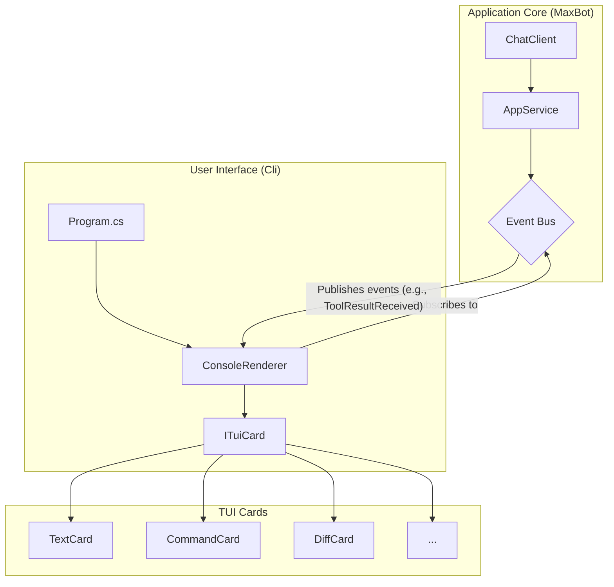
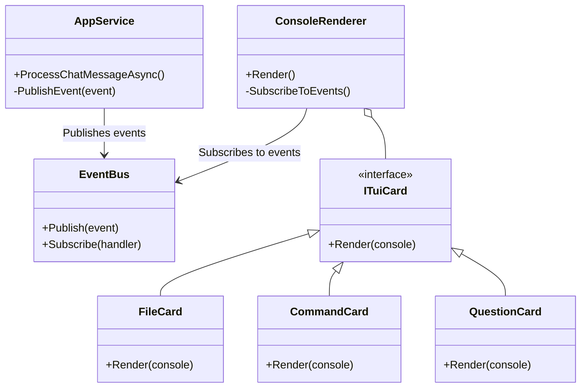

# TUI Architecture and Design

## 1. Introduction

This document provides the architectural and design specification for the MaxBot Terminal User Interface (TUI). It details the proposed architecture, component design, and technology stack required to implement the features and requirements defined in the `concept_of_operations.md` and `tool_requirements.md`.

## 2. Proposed Architecture

The TUI will be built upon an event-driven, decoupled architecture. The core application logic will remain independent of the UI. The UI will be managed by a central `ConsoleRenderer` class, which subscribes to events published by the `AppService` and translates them into TUI updates.

This approach ensures a clean separation of concerns, enhances testability, and allows the UI to be updated or even replaced without affecting the core business logic.

### 2.1. Architectural Diagram

### 2.2. Data Flow

1.  The `AppService` executes its workflow, processing user input and calling AI tools via the `ChatClient`.
2.  As the `ChatClient` receives responses or tool outputs, the `AppService` publishes specific, strongly-typed events (e.g., `FileReadEvent`, `CommandStatusChangedEvent`, `QuestionPosedEvent`) to a central event bus.
3.  The `ConsoleRenderer`, running in the `Cli` project, subscribes to these specific event types.
4.  Upon receiving an event, the `ConsoleRenderer`'s corresponding handler is invoked.
5.  The handler instantiates the appropriate `ITuiCard` (e.g., `FileCard`, `CommandCard`) and passes the strongly-typed event data to it.
6.  The card uses the data to render itself to the console using `Spectre.Console` components. This refined flow ensures better type safety and decouples the renderer from the specifics of tool execution.

## 3. Component Design

### 3.1. Core Components

-   **`ConsoleRenderer`**: A singleton class responsible for managing the overall TUI layout. It initializes `Spectre.Console`, sets up the main layout regions (e.g., conversation history, input prompt), and handles the subscription to and processing of UI events.
-   **`ITuiCard`**: An interface that defines the contract for all renderable TUI cards. It will have a single method, `Render(IAnsiConsole console)`, which contains the logic for drawing the card to the screen.
-   **Card Implementations**: A series of classes that implement `ITuiCard`. These cards are designed for reusability. For instance, a single `FileCard` could be responsible for rendering the output of `read_file`, `list_files`, and `write_to_file`, adapting its presentation (e.g., showing a text preview vs. a file tree) based on the specific event data it receives. This approach promotes code reuse while maintaining presentation flexibility.

### 3.2. Class Diagram

## 4. Technology Stack

-   **Primary TUI Library**: **`Spectre.Console`** will be used for its rich set of components, including layouts, tables, trees, and live displays. This will form the foundation of the TUI.
-   **Markdown Rendering**: **`Spectre.Console.Markdig`** will be integrated to parse and render markdown-formatted text received from the LLM, allowing for richly formatted chat messages.
-   **Syntax Highlighting**: **`Spectre.Console.Extensions.Markup`** will be used to render code blocks with language-appropriate syntax highlighting, improving the readability of file contents and code snippets.

This combination of technologies will enable the rapid development of a robust, feature-rich, and visually appealing TUI that meets all the specified requirements.
