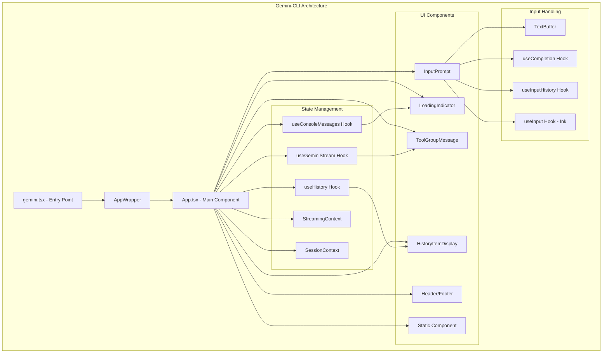
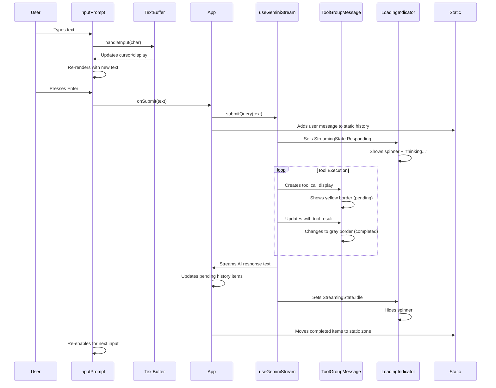
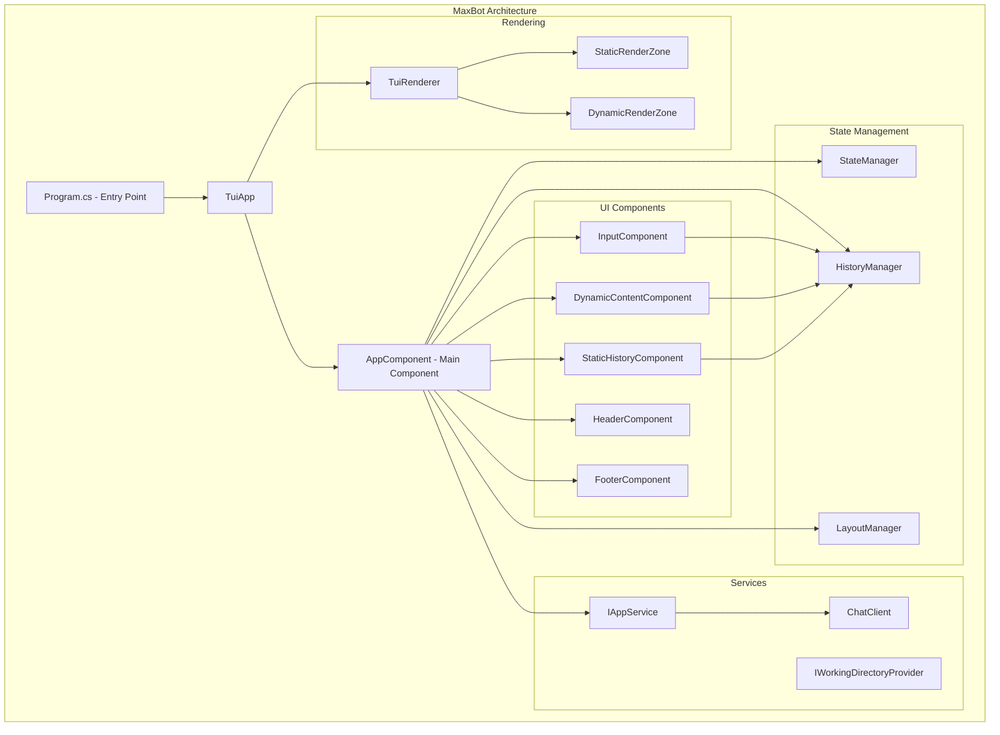
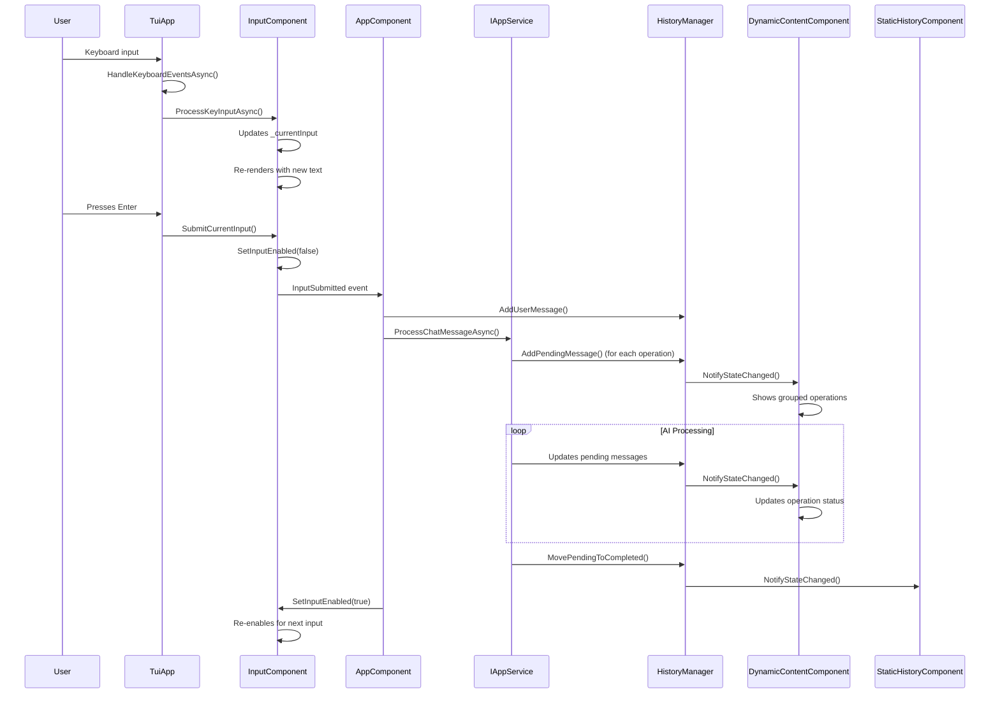

# TUI Architecture Implementation Comparison: Gemini-CLI vs MaxBot

**Generated:** 2025-06-28 11:03:18 UTC  
**Comparison Type:** Terminal User Interface (TUI) Implementation Analysis  
**Source Projects:** Gemini-CLI (TypeScript/React+Ink) vs MaxBot (C#/.NET/Spectre.Console)

## Executive Summary

This analysis compares two terminal user interface implementations for AI chat applications: the mature Gemini-CLI built with TypeScript and React+Ink, and the prototype MaxBot built with C# and Spectre.Console. While both applications share similar architectural patterns and user experience goals, they differ significantly in implementation sophistication, visual polish, and real-time interaction capabilities.

## Gemini-CLI TUI Implementation Analysis

### Architecture Overview
The Gemini-CLI uses **React with Ink** (a React renderer for CLI applications) to create a sophisticated terminal user interface. The architecture follows React patterns with hooks, contexts, and component composition.

### Key Components and Structure

**Main Entry Point:**
- `gemini.tsx` - Main entry point that renders the `AppWrapper` component using Ink's `render()` function
- Handles memory management, sandbox setup, authentication, and non-interactive mode

**Core App Component (`App.tsx`):**
- Central orchestrator component managing all UI state and interactions
- Uses React hooks extensively for state management and side effects
- Manages multiple dialog states (theme, auth, editor settings)
- Handles keyboard input through Ink's `useInput` hook

**Key UI Components:**
1. **InputPrompt** - Sophisticated input handling with autocomplete, history, shell mode
2. **ToolGroupMessage** - Displays AI tool calls with borders and status indicators
3. **LoadingIndicator** - Shows AI thinking/processing state with spinner and elapsed time
4. **Header/Footer** - Static information display
5. **HistoryItemDisplay** - Renders chat history items

### User Input Flow and UI Dynamics (Detailed and Extensive)

**Input Handling Flow:**
1. User types in `InputPrompt` component which has a rounded border (blue for normal mode, yellow for shell mode)
2. Input uses `TextBuffer` for advanced text editing with multi-line support, cursor positioning
3. Real-time autocomplete suggestions appear below input in a separate bordered box
4. Command history navigation with Ctrl+P/Ctrl+N or arrow keys
5. Shell mode toggle with `!` character changes prompt color and behavior

**AI Response Flow:**
1. When user submits input, `InputPrompt` border remains visible but input is cleared
2. `LoadingIndicator` appears with animated spinner and "thinking" message
3. During tool execution, `ToolGroupMessage` components appear with:
   - Rounded border (yellow for pending, gray for completed)
   - Individual tool status indicators
   - Tool confirmation dialogs when approval needed
4. AI text responses stream in real-time in `GeminiMessage` components
5. Static content is rendered once and never re-rendered (using Ink's `Static` component)

**Visual Presentation Details:**
- **InputPrompt**: Rounded border box with `> ` prompt prefix, placeholder text in gray
- **ToolGroupMessage**: Rounded border containing multiple tool calls, each with status icons
- **LoadingIndicator**: Spinner animation with elapsed time counter and cancel hint
- **Static vs Dynamic Zones**: Static content (header, completed history) vs dynamic (pending items, input)

### Component Diagram (Detailed and Extensive)

### Sequence Diagram User Input Flow (Detailed and Extensive)

## MaxBot TUI Implementation Analysis

### Architecture Overview
MaxBot uses **Spectre.Console** with a custom TUI framework built on top of it. The architecture follows a component-based approach with dependency injection and explicit state management.

### Key Components and Structure

**Main Entry Point:**
- `Program.cs` - Sets up dependency injection, creates `TuiApp`, and registers components
- `TuiApp.cs` - Main application orchestrator managing component lifecycle and keyboard events

**Core App Component (`AppComponent.cs`):**
- Central component that composes other UI components using a grid layout
- Handles input submission events and processes user input through `IAppService`
- Uses `LayoutManager` to calculate static and dynamic zones

**Key UI Components:**
1. **InputComponent** - Input handling with command history and responsive design
2. **DynamicContentComponent** - Displays pending operations grouped by type
3. **StaticHistoryComponent** - Shows completed chat history
4. **HeaderComponent/FooterComponent** - Static information display

### User Input Flow and UI Dynamics (Detailed and Extensive)

**Input Handling Flow:**
1. User types in `InputComponent` which renders as a rounded border panel with title
2. Input state managed internally with `_currentInput` string and command history
3. Keyboard events handled in `TuiApp.HandleKeyboardEventsAsync()` with polling approach
4. Command history navigation changes input text and resets history index
5. Input submission triggers event that processes through `AppService`

**AI Response Flow:**
1. When user submits, `InputComponent` is disabled and shows "Processing..." state
2. `DynamicContentComponent` shows pending operations grouped by type (🔧 Tool, 🔍 Analysis, etc.)
3. Operations display with green bullet points and truncated text for narrow terminals
4. Completed responses move from pending to completed history
5. Static and dynamic zones are separated with explicit layout management

**Visual Presentation Details:**
- **InputComponent**: Panel with rounded border, title shows processing state and help hints
- **DynamicContentComponent**: Panel showing grouped operations with emoji icons and status
- **Layout**: Grid-based with explicit static and dynamic zones using `LayoutManager`
- **Responsive Design**: Components adapt content based on terminal width

### Component Diagram (Detailed and Extensive)

### Sequence Diagram User Input Flow (Detailed and Extensive)

## Similarities Between Gemini-CLI and MaxBot

### 1. **Architectural Patterns**
- Both use component-based architecture with clear separation of concerns
- Both implement static vs dynamic content zones (Gemini uses Ink's `Static`, MaxBot uses explicit zones)
- Both use dependency injection for service management
- Both have central app components that orchestrate other components

### 2. **Input Handling**
- Both have dedicated input components with command history navigation
- Both support up/down arrow keys for history navigation
- Both clear input after submission and disable during processing
- Both show visual feedback for input state (enabled/disabled)

### 3. **State Management**
- Both maintain chat history with completed and pending messages
- Both use event-driven updates when state changes
- Both separate user messages from assistant responses
- Both handle real-time updates during AI processing

### 4. **Visual Design**
- Both use bordered panels for input areas
- Both show processing/loading states during AI operations
- Both have header and footer components for status information
- Both implement responsive design based on terminal width

### 5. **User Experience Flow**
- Both follow the same basic flow: input → processing → response → ready for next input
- Both show pending operations during AI processing
- Both move completed operations to static history
- Both provide visual feedback for current application state

## Key Differences Between Gemini-CLI and MaxBot

### 1. **UI Framework and Rendering**
- **Gemini-CLI**: Uses React + Ink with virtual DOM and React hooks
- **MaxBot**: Uses Spectre.Console with custom TUI framework and manual rendering

### 2. **Input Sophistication**
- **Gemini-CLI**: Advanced `TextBuffer` with multi-line editing, cursor positioning, external editor support
- **MaxBot**: Simple string-based input with basic character handling

### 3. **Tool Call Display**
- **Gemini-CLI**: Sophisticated `ToolGroupMessage` with individual tool status, confirmation dialogs, bordered groups
- **MaxBot**: Simple grouped operations with emoji icons and bullet points

### 4. **Loading/Processing Indicators**
- **Gemini-CLI**: Animated spinner, elapsed time counter, "thinking" messages, cancel option
- **MaxBot**: Static "Processing..." text with no animation or progress indication

### 5. **Keyboard Event Handling**
- **Gemini-CLI**: React's `useInput` hook with comprehensive key binding support
- **MaxBot**: Polling-based keyboard handling with basic key processing

### 6. **State Reactivity**
- **Gemini-CLI**: React's reactive state updates with automatic re-rendering
- **MaxBot**: Manual state change notifications with explicit render triggers

### 7. **Visual Polish**
- **Gemini-CLI**: Rich visual feedback, color coding, animations, context-aware borders
- **MaxBot**: Basic panels and text formatting with minimal visual feedback

### 8. **Real-time Updates**
- **Gemini-CLI**: Streaming text updates, real-time tool execution feedback
- **MaxBot**: Batch updates when operations complete

## Recommendations for Improving MaxBot UI

### 1. **Enhanced Input Component**
Based on Spectre.Console documentation, implement:
- Multi-line text input using `TextPrompt` with custom validation
- Cursor positioning and text selection capabilities
- Auto-completion support using Spectre's suggestion features

### 2. **Animated Loading Indicators**
- Use Spectre.Console's `Status` widget for animated spinners
- Implement progress bars for long-running operations
- Add elapsed time display using `Live` rendering

### 3. **Rich Tool Call Display**
- Create bordered panels for each tool call using `Panel` with dynamic border colors
- Use `Table` components to show tool parameters and results
- Implement confirmation dialogs using Spectre's prompt system

### 4. **Improved Keyboard Handling**
- Replace polling with proper console input handling
- Implement comprehensive key bindings (Ctrl+C, Ctrl+L, etc.)
- Add support for complex key combinations

### 5. **Real-time Streaming Updates**
- Use Spectre.Console's `Live` widget for real-time content updates
- Implement streaming text display for AI responses
- Add visual indicators for active vs completed operations

### 6. **Enhanced Visual Design**
- Use Spectre's color system for consistent theming
- Implement dynamic border colors based on component state
- Add visual hierarchy with proper spacing and alignment

### 7. **Layout Management Improvements**
- Implement proper responsive design using Spectre's layout system
- Add dynamic height allocation based on content
- Improve static vs dynamic zone separation

## Conclusion

While MaxBot successfully implements the core architectural patterns found in Gemini-CLI, it lacks the visual sophistication and real-time interaction capabilities that make Gemini-CLI's user experience compelling. The primary gaps are in input handling sophistication, animated feedback, and real-time streaming updates. However, MaxBot's foundation using Spectre.Console provides a solid base for implementing these improvements, and the component-based architecture aligns well with modern UI development practices.

The recommended improvements focus on leveraging Spectre.Console's advanced features to bridge the gap in user experience while maintaining MaxBot's clean architectural approach.
