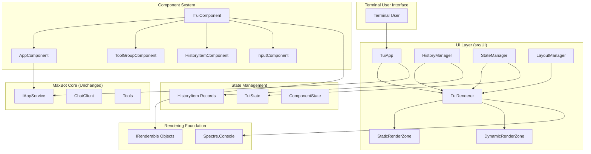
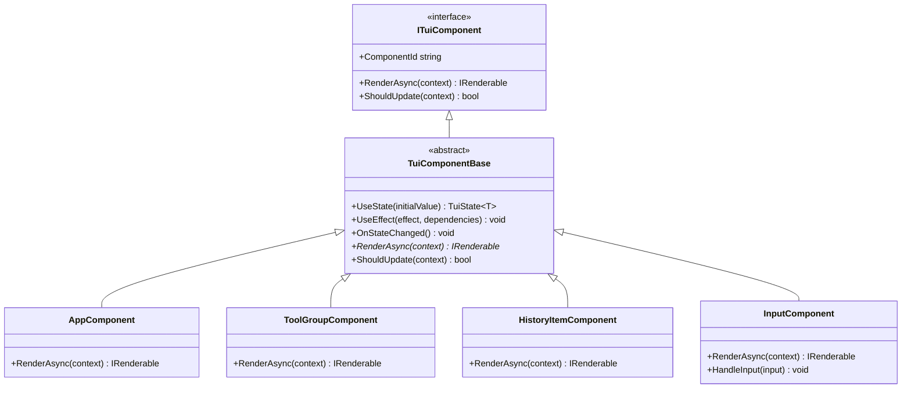

# UI Architecture and Design

## 1. Introduction

This document provides the architectural and design specification for the MaxBot Component-Based User Interface (UI). This represents a fresh start approach inspired by the Gemini-CLI architecture, implemented in C# with idiomatic patterns. The UI provides a sophisticated terminal-based interface with component composition, state management, and performance optimization.

## 2. Architectural Philosophy

The UI is built upon a **component-based, state-driven architecture** with the following core principles:

1. **Component Composition** - UI elements are composable components similar to React
2. **State-Driven Rendering** - UI automatically updates when state changes
3. **History-Based State Management** - Everything is a HistoryItem with immutable state
4. **Performance Optimization** - Static vs dynamic rendering zones prevent unnecessary re-renders
5. **Clean Separation** - UI layer is completely decoupled from MaxBot core logic

## 3. Core Architecture

### 3.1. Architectural Diagram



### 3.2. Data Flow

1. **User Input** → `InputComponent` → `HistoryManager.AddPending()`
2. **State Change** → `StateManager.NotifyChange()` → `TuiRenderer.ScheduleRender()`
3. **Render Cycle** → Components render to `IRenderable` → `Spectre.Console` output
4. **MaxBot Integration** → `AppComponent` calls `IAppService` → Results become `HistoryItem`s
5. **Completion** → Pending items move to completed history → Static render zone

## 4. Component System Design

### 4.1. Core Interfaces

```csharp
public interface ITuiComponent
{
    Task<IRenderable> RenderAsync(RenderContext context);
    bool ShouldUpdate(RenderContext context);
    string ComponentId { get; }
}

public abstract class TuiComponentBase : ITuiComponent
{
    protected TuiState<T> UseState<T>(T initialValue);
    protected void UseEffect(Func<Task> effect, object[] dependencies);
    protected void OnStateChanged();
    
    public abstract Task<IRenderable> RenderAsync(RenderContext context);
    public virtual bool ShouldUpdate(RenderContext context) => true;
    public string ComponentId { get; } = Guid.NewGuid().ToString();
}
```

### 4.2. Component Hierarchy



## 5. State Management System

### 5.1. History-Based State

```csharp
// Core history system - immutable records
public abstract record HistoryItem(int Id, DateTime Timestamp);

public record UserHistoryItem(
    int Id, 
    DateTime Timestamp, 
    string Text
) : HistoryItem(Id, Timestamp);

public record ToolGroupHistoryItem(
    int Id, 
    DateTime Timestamp, 
    IReadOnlyList<ToolCall> Tools,
    ToolGroupStatus Status
) : HistoryItem(Id, Timestamp);

public record GeminiHistoryItem(
    int Id, 
    DateTime Timestamp, 
    string Content,
    bool IsStreaming
) : HistoryItem(Id, Timestamp);

public record InfoHistoryItem(
    int Id, 
    DateTime Timestamp, 
    string Message,
    InfoLevel Level
) : HistoryItem(Id, Timestamp);
```

### 5.2. Reactive State Management

```csharp
public class TuiState<T> : INotifyPropertyChanged
{
    private T _value;
    private readonly StateManager _stateManager;
    
    public T Value 
    { 
        get => _value; 
        set 
        { 
            if (!EqualityComparer<T>.Default.Equals(_value, value))
            {
                _value = value; 
                OnPropertyChanged();
                _stateManager.NotifyStateChanged();
            }
        }
    }
    
    public event PropertyChangedEventHandler? PropertyChanged;
    
    protected virtual void OnPropertyChanged([CallerMemberName] string? propertyName = null)
    {
        PropertyChanged?.Invoke(this, new PropertyChangedEventArgs(propertyName));
    }
}

public class StateManager
{
    private readonly ConcurrentQueue<StateChange> _pendingChanges = new();
    private readonly Timer _renderTimer;
    
    public bool HasPendingChanges => !_pendingChanges.IsEmpty;
    
    public void NotifyStateChanged()
    {
        _pendingChanges.Enqueue(new StateChange(DateTime.UtcNow));
        ScheduleRender();
    }
    
    private void ScheduleRender()
    {
        // Debounce rapid state changes
        _renderTimer.Change(TimeSpan.FromMilliseconds(16), Timeout.InfiniteTimeSpan);
    }
}
```

### 5.3. History Management

```csharp
public class HistoryManager
{
    private readonly ObservableCollection<HistoryItem> _completedHistory = new();
    private readonly ObservableCollection<HistoryItem> _pendingItems = new();
    private int _nextId = 1;
    
    public IReadOnlyList<HistoryItem> CompletedHistory => _completedHistory;
    public IReadOnlyList<HistoryItem> PendingItems => _pendingItems;
    
    public void AddCompleted(HistoryItem item)
    {
        _completedHistory.Add(item with { Id = _nextId++ });
        NotifyStaticZoneChanged();
    }
    
    public void AddPending(HistoryItem item)
    {
        _pendingItems.Add(item with { Id = _nextId++ });
        NotifyDynamicZoneChanged();
    }
    
    public void MovePendingToCompleted(int itemId)
    {
        var item = _pendingItems.FirstOrDefault(i => i.Id == itemId);
        if (item != null)
        {
            _pendingItems.Remove(item);
            _completedHistory.Add(item);
            NotifyBothZonesChanged();
        }
    }
}
```

## 6. Rendering System

### 6.1. Rendering Engine

```csharp
public class TuiRenderer
{
    private readonly StaticRenderZone _staticZone;
    private readonly DynamicRenderZone _dynamicZone;
    private readonly LayoutManager _layoutManager;
    private readonly StateManager _stateManager;
    private readonly IAnsiConsole _console;
    
    public async Task RenderAsync()
    {
        if (!_stateManager.HasPendingChanges) return;
        
        var terminalSize = new TerminalSize(_console.Profile.Width, _console.Profile.Height);
        var layout = _layoutManager.CalculateLayout(terminalSize);
        
        // Only re-render zones that have changes
        if (_stateManager.HasStaticChanges)
        {
            await _staticZone.RenderAsync(layout.StaticConstraints);
        }
        
        if (_stateManager.HasDynamicChanges)
        {
            await _dynamicZone.RenderAsync(layout.DynamicConstraints);
        }
        
        _stateManager.ClearPendingChanges();
    }
}
```

### 6.2. Static vs Dynamic Rendering

```csharp
public class StaticRenderZone
{
    private readonly List<ITuiComponent> _staticComponents = new();
    private IRenderable? _lastRendered;
    
    public async Task RenderAsync(LayoutConstraints constraints)
    {
        var renderables = new List<IRenderable>();
        
        foreach (var component in _staticComponents)
        {
            var context = new RenderContext(constraints, isStatic: true);
            renderables.Add(await component.RenderAsync(context));
        }
        
        var combined = new Rows(renderables);
        
        // Only render if content changed
        if (!RenderableEquals(_lastRendered, combined))
        {
            _console.Write(combined);
            _lastRendered = combined;
        }
    }
}

public class DynamicRenderZone
{
    private readonly List<ITuiComponent> _dynamicComponents = new();
    
    public async Task RenderAsync(LayoutConstraints constraints)
    {
        var renderables = new List<IRenderable>();
        
        foreach (var component in _dynamicComponents)
        {
            if (component.ShouldUpdate(new RenderContext(constraints, isStatic: false)))
            {
                renderables.Add(await component.RenderAsync(new RenderContext(constraints, isStatic: false)));
            }
        }
        
        var combined = new Rows(renderables);
        
        // Always render dynamic zone (for animations, progress, etc.)
        _console.Write(combined);
    }
}
```

## 7. Layout Management

### 7.1. Layout System

```csharp
public class LayoutManager
{
    public LayoutResult CalculateLayout(TerminalSize terminalSize)
    {
        var reservedHeight = CalculateReservedHeight(); // Header, footer, etc.
        var availableHeight = terminalSize.Height - reservedHeight;
        
        // Distribute height between static and dynamic zones
        var staticHeight = Math.Min(availableHeight * 0.7f, GetStaticContentHeight());
        var dynamicHeight = availableHeight - staticHeight;
        
        return new LayoutResult(
            StaticConstraints: new LayoutConstraints(
                MaxHeight: (int)staticHeight,
                MaxWidth: terminalSize.Width,
                CanExpand: false
            ),
            DynamicConstraints: new LayoutConstraints(
                MaxHeight: (int)dynamicHeight,
                MaxWidth: terminalSize.Width,
                CanExpand: true
            )
        );
    }
    
    public ComponentConstraints DistributeHeightAmongComponents(
        IReadOnlyList<ITuiComponent> components, 
        int availableHeight)
    {
        // Sophisticated height distribution algorithm
        var fixedHeightComponents = components.Where(c => c.HasFixedHeight).ToList();
        var flexibleComponents = components.Except(fixedHeightComponents).ToList();
        
        var usedHeight = fixedHeightComponents.Sum(c => c.GetFixedHeight());
        var remainingHeight = availableHeight - usedHeight;
        var heightPerFlexible = remainingHeight / Math.Max(1, flexibleComponents.Count);
        
        return new ComponentConstraints(
            FixedComponents: fixedHeightComponents.ToDictionary(c => c.ComponentId, c => c.GetFixedHeight()),
            FlexibleComponents: flexibleComponents.ToDictionary(c => c.ComponentId, _ => heightPerFlexible)
        );
    }
}
```

## 8. Tool Integration

### 8.1. Tool Status Management

```csharp
public enum ToolStatus
{
    Pending,
    Executing,
    Success,
    Error,
    Confirming,
    Canceled
}

public record ToolCall(
    string CallId,
    string Name,
    string Description,
    ToolStatus Status,
    string? ResultDisplay = null,
    ConfirmationDetails? ConfirmationDetails = null,
    bool RenderOutputAsMarkdown = true
);

public class ToolGroupComponent : TuiComponentBase
{
    private readonly TuiState<IReadOnlyList<ToolCall>> _tools;
    private readonly TuiState<ToolGroupStatus> _groupStatus;
    
    public override async Task<IRenderable> RenderAsync(RenderContext context)
    {
        var borderColor = GetBorderColor(_groupStatus.Value);
        var panel = new Panel()
            .Border(BoxBorder.Rounded)
            .BorderColor(borderColor)
            .Header($"Tool Execution ({_tools.Value.Count} tools)");
        
        var availableHeightPerTool = context.Constraints.MaxHeight / Math.Max(1, _tools.Value.Count);
        
        foreach (var tool in _tools.Value)
        {
            var toolComponent = new ToolComponent(tool);
            var toolContext = context.WithConstraints(
                context.Constraints with { MaxHeight = availableHeightPerTool }
            );
            
            panel.Add(await toolComponent.RenderAsync(toolContext));
        }
        
        return panel;
    }
    
    private Color GetBorderColor(ToolGroupStatus status) => status switch
    {
        ToolGroupStatus.Pending => Color.Yellow,
        ToolGroupStatus.Executing => Color.Blue,
        ToolGroupStatus.Success => Color.Green,
        ToolGroupStatus.Error => Color.Red,
        ToolGroupStatus.PartialSuccess => Color.Orange,
        _ => Color.Grey
    };
}
```

## 9. Performance Considerations

### 9.1. Rendering Optimization

- **Static Zone Caching** - Completed history items never re-render
- **Component Memoization** - Components only re-render when their state changes
- **Debounced Updates** - Rapid state changes are batched
- **Height-Aware Rendering** - Components adapt to available space
- **Lazy Loading** - Large content is truncated with expand options

### 9.2. Memory Management

- **Immutable State** - History items are immutable records
- **Weak References** - Event subscriptions use weak references
- **Disposal Patterns** - Components implement IDisposable for cleanup
- **Bounded Collections** - History has configurable size limits

## 10. Technology Stack

### 10.1. Core Dependencies

```xml
<PackageReference Include="Spectre.Console" Version="0.49.1" />
<PackageReference Include="Microsoft.Extensions.DependencyInjection" Version="8.0.0" />
<PackageReference Include="System.ComponentModel" Version="8.0.0" />
```

### 10.2. Optional Dependencies

```xml
<!-- For advanced reactive patterns -->
<PackageReference Include="System.Reactive" Version="6.0.0" />

<!-- For hosting and configuration -->
<PackageReference Include="Microsoft.Extensions.Hosting" Version="8.0.0" />
```

## 11. Integration with MaxBot Core

### 11.1. Service Integration

```csharp
public class AppComponent : TuiComponentBase
{
    private readonly IAppService _appService;
    private readonly HistoryManager _historyManager;
    private readonly TuiState<bool> _isProcessing;
    
    public AppComponent(IAppService appService, HistoryManager historyManager)
    {
        _appService = appService;
        _historyManager = historyManager;
        _isProcessing = UseState(false);
    }
    
    public async Task ProcessUserInput(string input)
    {
        // Add user message to history
        _historyManager.AddCompleted(new UserHistoryItem(0, DateTime.UtcNow, input));
        
        _isProcessing.Value = true;
        
        try
        {
            // Stream response from MaxBot core
            await foreach (var update in _appService.ProcessChatMessageAsync(input, CancellationToken.None))
            {
                var historyItem = ConvertUpdateToHistoryItem(update);
                
                if (update.IsComplete)
                    _historyManager.AddCompleted(historyItem);
                else
                    _historyManager.AddPending(historyItem);
            }
        }
        finally
        {
            _isProcessing.Value = false;
        }
    }
}
```

## 12. Testing Strategy

### 12.1. Component Testing

```csharp
[Test]
public async Task ToolGroupComponent_RendersPendingTools()
{
    // Arrange
    var tools = new List<ToolCall>
    {
        new("1", "read_file", "Reading config.json", ToolStatus.Pending),
        new("2", "write_file", "Writing output.txt", ToolStatus.Executing)
    };
    
    var component = new ToolGroupComponent(tools);
    var context = new RenderContext(new LayoutConstraints(100, 80, true), false);
    
    // Act
    var result = await component.RenderAsync(context);
    
    // Assert
    var panel = Assert.IsType<Panel>(result);
    Assert.Equal(Color.Yellow, panel.Border.Color); // Pending status
    Assert.Contains("Tool Execution (2 tools)", panel.Header.Text);
}
```

### 12.2. Integration Testing

```csharp
[Test]
public async Task HistoryManager_MovePendingToCompleted_UpdatesBothCollections()
{
    // Arrange
    var historyManager = new HistoryManager();
    var pendingItem = new UserHistoryItem(1, DateTime.UtcNow, "test input");
    
    // Act
    historyManager.AddPending(pendingItem);
    historyManager.MovePendingToCompleted(pendingItem.Id);
    
    // Assert
    Assert.Empty(historyManager.PendingItems);
    Assert.Single(historyManager.CompletedHistory);
    Assert.Equal(pendingItem.Text, ((UserHistoryItem)historyManager.CompletedHistory[0]).Text);
}
```

## 13. Future Extensibility

### 13.1. Plugin Architecture

The component system is designed for extensibility:

- **Custom Components** - New component types can be added easily
- **Component Registry** - Dynamic component discovery and registration
- **Theme System** - Pluggable themes and styling
- **Layout Strategies** - Alternative layout algorithms

### 13.2. Advanced Features

- **Animation Support** - Smooth transitions and loading animations
- **Accessibility** - Screen reader support and keyboard navigation
- **Internationalization** - Multi-language support
- **Configuration** - User-customizable UI preferences

---

*This architecture provides a solid foundation for a sophisticated terminal UI while maintaining the performance and user experience standards established by modern CLI tools like Gemini-CLI.*
