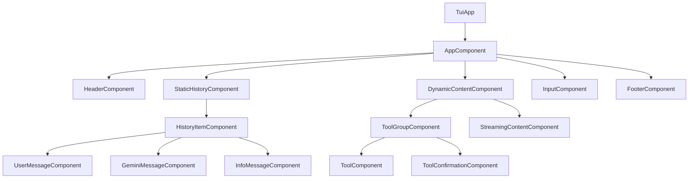

# UI Component Requirements

## 1. Introduction

This document defines the detailed requirements for each component in the MaxBot Component-Based User Interface (UI). Each component specification includes functional requirements, interface definitions, behavior specifications, and acceptance criteria.

## 2. Component Overview

### 2.1. Component Hierarchy



### 2.2. Component Categories

**Core Infrastructure:**
- `TuiApp` - Application entry point and lifecycle management
- `AppComponent` - Main application container and orchestration
- `TuiRenderer` - Rendering engine and optimization

**Layout Components:**
- `HeaderComponent` - Application title and status
- `StaticHistoryComponent` - Completed conversation history
- `DynamicContentComponent` - Active/pending operations
- `InputComponent` - User input and interaction
- `FooterComponent` - Status indicators and help

**Content Components:**
- `HistoryItemComponent` - Individual conversation items
- `ToolGroupComponent` - Grouped tool execution display
- `ToolComponent` - Individual tool status and output
- `StreamingContentComponent` - Real-time content updates

## 3. Core Infrastructure Components

### 3.1. TuiApp Component

**Purpose:** Application entry point, dependency injection setup, and lifecycle management.

**Requirements:**

**REQ-UI-APP-001:** Application Initialization
- MUST initialize dependency injection container
- MUST configure all required services and components
- MUST handle configuration loading and validation
- MUST establish connection to MaxBot core services

**REQ-UI-APP-002:** Lifecycle Management
- MUST provide graceful startup sequence
- MUST handle shutdown signals (Ctrl+C, SIGTERM)
- MUST cleanup resources on exit
- MUST persist user preferences on shutdown

**REQ-UI-APP-003:** Error Handling
- MUST catch and handle unhandled exceptions
- MUST provide meaningful error messages to users
- MUST attempt graceful degradation on component failures
- MUST log errors for debugging purposes

**Interface Definition:**
```csharp
public class TuiApp
{
    public async Task<int> RunAsync(string[] args, CancellationToken cancellationToken);
    public void ConfigureServices(IServiceCollection services);
    public void HandleShutdown();
}
```

**Acceptance Criteria:**
- Application starts within 500ms on typical hardware
- All components are properly initialized before first render
- Graceful shutdown completes within 2 seconds
- Configuration errors are clearly reported to user

### 3.2. AppComponent

**Purpose:** Main application container that orchestrates all UI components and manages application state.

**Requirements:**

**REQ-UI-APPCOMP-001:** Component Orchestration
- MUST manage the lifecycle of all child components
- MUST coordinate state changes between components
- MUST handle component communication and events
- MUST provide consistent layout and rendering coordination

**REQ-UI-APPCOMP-002:** State Management Integration
- MUST integrate with HistoryManager for conversation state
- MUST coordinate with StateManager for UI state changes
- MUST handle MaxBot service integration
- MUST manage component-specific state isolation

**REQ-UI-APPCOMP-003:** Layout Management
- MUST calculate and distribute available screen space
- MUST handle terminal resize events
- MUST maintain responsive layout across different terminal sizes
- MUST provide overflow handling for content that exceeds available space

**Interface Definition:**
```csharp
public class AppComponent : TuiComponentBase
{
    public AppComponent(IAppService appService, HistoryManager historyManager, 
                       StateManager stateManager, LayoutManager layoutManager);
    
    public override async Task<IRenderable> RenderAsync(RenderContext context);
    public async Task ProcessUserInput(string input);
    public void HandleTerminalResize(TerminalSize newSize);
}
```

**Acceptance Criteria:**
- Renders complete UI layout within 16ms (60 FPS target)
- Handles terminal resize without visual artifacts
- Maintains state consistency across all child components
- Processes user input with < 50ms latency

### 3.3. TuiRenderer

**Purpose:** Rendering engine that optimizes UI updates and manages static vs dynamic content zones.

**Requirements:**

**REQ-UI-RENDER-001:** Rendering Optimization
- MUST implement static zone caching to prevent unnecessary re-renders
- MUST only update dynamic zones when state changes occur
- MUST debounce rapid state changes to prevent flickering
- MUST maintain 60 FPS rendering performance for animations

**REQ-UI-RENDER-002:** Zone Management
- MUST separate static (completed) and dynamic (active) content zones
- MUST efficiently move content between zones when operations complete
- MUST handle zone overflow with appropriate scrolling behavior
- MUST maintain visual consistency between zone transitions

**REQ-UI-RENDER-003:** Performance Monitoring
- MUST track rendering performance metrics
- MUST detect and handle performance degradation
- MUST provide fallback rendering modes for low-performance scenarios
- MUST optimize memory usage for large conversation histories

**Interface Definition:**
```csharp
public class TuiRenderer
{
    public async Task RenderAsync();
    public void ScheduleRender();
    public void InvalidateStaticZone();
    public void InvalidateDynamicZone();
    public RenderingMetrics GetPerformanceMetrics();
}
```

**Acceptance Criteria:**
- Static zone content never re-renders after completion
- Dynamic zone updates maintain smooth 60 FPS animation
- Memory usage remains stable with 1000+ history items
- Rendering latency stays below 16ms per frame

## 4. Layout Components

### 4.1. HeaderComponent

**Purpose:** Display application title, status information, and system indicators.

**Requirements:**

**REQ-UI-HEADER-001:** Title and Branding
- MUST display "MaxBot" application title
- MUST show current version information
- MUST indicate connection status to MaxBot services
- MUST provide visual branding consistent with application identity

**REQ-UI-HEADER-002:** Status Indicators
- MUST show current operation status (idle, processing, error)
- MUST display active tool count when tools are executing
- MUST indicate configuration status (API keys, settings)
- MUST show session information (duration, message count)

**REQ-UI-HEADER-003:** Responsive Design
- MUST adapt content to available terminal width
- MUST prioritize critical information in narrow terminals
- MUST maintain readability across different terminal sizes
- MUST handle graceful truncation of non-essential information

**Interface Definition:**
```csharp
public class HeaderComponent : TuiComponentBase
{
    public HeaderComponent(IAppService appService, SessionManager sessionManager);
    public override async Task<IRenderable> RenderAsync(RenderContext context);
    public void UpdateStatus(ApplicationStatus status);
}
```

**Acceptance Criteria:**
- Header renders consistently across terminal widths 80-200 columns
- Status updates appear within 100ms of state changes
- Critical information remains visible in minimum 80-column terminals
- Visual hierarchy clearly distinguishes different information types

### 4.2. StaticHistoryComponent

**Purpose:** Display completed conversation history with efficient rendering and scrolling.

**Requirements:**

**REQ-UI-HISTORY-001:** Content Display
- MUST render completed conversation items in chronological order
- MUST support rich text formatting (markdown, code blocks, etc.)
- MUST maintain consistent visual hierarchy for different message types
- MUST preserve formatting and layout of historical content

**REQ-UI-HISTORY-002:** Scrolling and Navigation
- MUST provide smooth scrolling through conversation history
- MUST support keyboard navigation (Page Up/Down, Home/End)
- MUST maintain scroll position during new content additions
- MUST provide visual indicators for scroll position and available content

**REQ-UI-HISTORY-003:** Performance Optimization
- MUST implement virtual scrolling for large conversation histories
- MUST cache rendered content to prevent re-computation
- MUST maintain responsive performance with 1000+ history items
- MUST efficiently handle memory management for long sessions

**Interface Definition:**
```csharp
public class StaticHistoryComponent : TuiComponentBase
{
    public StaticHistoryComponent(HistoryManager historyManager);
    public override async Task<IRenderable> RenderAsync(RenderContext context);
    public void ScrollToBottom();
    public void ScrollToTop();
    public void ScrollBy(int lines);
}
```

**Acceptance Criteria:**
- Renders 100+ history items without performance degradation
- Scrolling remains smooth with sub-16ms frame times
- Memory usage scales linearly with history size
- Content formatting is preserved accurately across renders

### 4.3. DynamicContentComponent

**Purpose:** Display active operations, streaming content, and pending tool executions.

**Requirements:**

**REQ-UI-DYNAMIC-001:** Real-time Updates
- MUST display streaming AI responses as they arrive
- MUST show tool execution progress in real-time
- MUST handle rapid state changes without visual artifacts
- MUST maintain smooth animations for status transitions

**REQ-UI-DYNAMIC-002:** Content Organization
- MUST group related operations (tool groups) visually
- MUST prioritize active operations in display hierarchy
- MUST handle multiple concurrent operations efficiently
- MUST provide clear visual separation between different operation types

**REQ-UI-DYNAMIC-003:** State Transitions
- MUST smoothly transition content from dynamic to static zones
- MUST handle operation completion without visual disruption
- MUST maintain content continuity during state changes
- MUST provide appropriate loading and completion indicators

**Interface Definition:**
```csharp
public class DynamicContentComponent : TuiComponentBase
{
    public DynamicContentComponent(HistoryManager historyManager, StateManager stateManager);
    public override async Task<IRenderable> RenderAsync(RenderContext context);
    public void AddPendingContent(HistoryItem item);
    public void UpdateStreamingContent(string content);
}
```

**Acceptance Criteria:**
- Streaming content updates appear within 50ms of data arrival
- Multiple concurrent operations display without interference
- State transitions complete smoothly without flickering
- Content organization remains clear with up to 10 concurrent operations

### 4.4. InputComponent

**Purpose:** Handle user input, command history, and interaction controls.

**Requirements:**

**REQ-UI-INPUT-001:** Text Input Handling
- MUST support multi-line text input with word wrapping
- MUST handle special characters and Unicode input correctly
- MUST provide real-time input validation and feedback
- MUST support paste operations for large content blocks

**REQ-UI-INPUT-002:** Command History
- MUST maintain history of previous user inputs
- MUST provide navigation through command history (↑/↓ arrows)
- MUST persist command history across application sessions
- MUST support search and filtering of command history

**REQ-UI-INPUT-003:** Interactive Features
- MUST provide auto-completion for common commands and patterns
- MUST show input hints and suggestions contextually
- MUST handle keyboard shortcuts for common operations
- MUST provide clear visual feedback for input state changes

**REQ-UI-INPUT-004:** State Management
- MUST disable input during AI processing to prevent conflicts
- MUST provide clear visual indication of input availability
- MUST handle tool confirmation prompts appropriately
- MUST maintain input focus and cursor position correctly

**Interface Definition:**
```csharp
public class InputComponent : TuiComponentBase
{
    public InputComponent(CommandHistoryService historyService);
    public override async Task<IRenderable> RenderAsync(RenderContext context);
    public void HandleKeyInput(ConsoleKeyInfo keyInfo);
    public void SetInputState(InputState state);
    public event EventHandler<string> InputSubmitted;
}
```

**Acceptance Criteria:**
- Input responsiveness remains under 50ms for all keystrokes
- Command history navigation works smoothly with 100+ previous commands
- Multi-line input handles up to 10,000 characters without performance issues
- Auto-completion suggestions appear within 200ms of trigger

### 4.5. FooterComponent

**Purpose:** Display status indicators, help information, and system metrics.

**Requirements:**

**REQ-UI-FOOTER-001:** Status Information
- MUST show current application state (ready, processing, error)
- MUST display active tool count and execution status
- MUST indicate keyboard shortcuts and available actions
- MUST show session statistics (messages, tokens, duration)

**REQ-UI-FOOTER-002:** Help Integration
- MUST provide contextual help based on current application state
- MUST show relevant keyboard shortcuts for current context
- MUST indicate available commands and operations
- MUST provide quick access to detailed help information

**REQ-UI-FOOTER-003:** Performance Metrics
- MUST display memory usage when in debug mode
- MUST show rendering performance metrics when requested
- MUST indicate network connectivity and service status
- MUST provide system resource utilization information

**Interface Definition:**
```csharp
public class FooterComponent : TuiComponentBase
{
    public FooterComponent(SessionManager sessionManager, PerformanceMonitor monitor);
    public override async Task<IRenderable> RenderAsync(RenderContext context);
    public void UpdateMetrics(PerformanceMetrics metrics);
    public void SetHelpContext(HelpContext context);
}
```

**Acceptance Criteria:**
- Status updates appear within 100ms of state changes
- Help information is contextually relevant and accurate
- Performance metrics update smoothly without affecting UI performance
- Footer content adapts appropriately to terminal width constraints

## 5. Content Components

### 5.1. HistoryItemComponent

**Purpose:** Render individual conversation items with appropriate formatting and styling.

**Requirements:**

**REQ-UI-HISTITEM-001:** Message Type Support
- MUST render user messages with distinct visual styling
- MUST render AI responses with appropriate formatting
- MUST render system messages (info, error, warning) with clear indicators
- MUST render tool execution results with structured display

**REQ-UI-HISTITEM-002:** Content Formatting
- MUST support markdown rendering for rich text content
- MUST handle code blocks with syntax highlighting
- MUST render tables, lists, and other structured content appropriately
- MUST maintain consistent typography and spacing

**REQ-UI-HISTITEM-003:** Interactive Features
- MUST support content expansion/collapse for long messages
- MUST provide copy-to-clipboard functionality for code blocks
- MUST handle content overflow with appropriate truncation
- MUST support content search and highlighting

**Interface Definition:**
```csharp
public class HistoryItemComponent : TuiComponentBase
{
    public HistoryItemComponent(HistoryItem item, FormattingService formatter);
    public override async Task<IRenderable> RenderAsync(RenderContext context);
    public void ToggleExpansion();
    public void CopyContent();
}
```

**Acceptance Criteria:**
- All message types render with distinct, recognizable styling
- Markdown content renders accurately with proper formatting
- Long content can be expanded/collapsed smoothly
- Copy operations complete successfully for all content types

### 5.2. ToolGroupComponent

**Purpose:** Display grouped tool executions with status tracking and progress visualization.

**Requirements:**

**REQ-UI-TOOLGROUP-001:** Group Visualization
- MUST display all tools in a group with consistent visual container
- MUST show group-level status (pending, executing, completed, error)
- MUST provide clear visual hierarchy between group and individual tools
- MUST handle dynamic addition and removal of tools from groups

**REQ-UI-TOOLGROUP-002:** Status Tracking
- MUST show real-time status for each tool in the group
- MUST provide progress indicators for long-running operations
- MUST display completion status with appropriate visual feedback
- MUST handle error states with clear error messaging

**REQ-UI-TOOLGROUP-003:** Interactive Features
- MUST support tool confirmation workflows when required
- MUST provide expand/collapse functionality for tool details
- MUST handle tool cancellation and retry operations
- MUST support tool output viewing and interaction

**Interface Definition:**
```csharp
public class ToolGroupComponent : TuiComponentBase
{
    public ToolGroupComponent(ToolGroupHistoryItem toolGroup);
    public override async Task<IRenderable> RenderAsync(RenderContext context);
    public void UpdateToolStatus(string toolId, ToolStatus status);
    public void HandleToolConfirmation(string toolId, bool confirmed);
}
```

**Acceptance Criteria:**
- Tool groups render with clear visual boundaries and hierarchy
- Status updates appear within 100ms of tool state changes
- Confirmation workflows provide clear user guidance
- Error states are clearly communicated with actionable information

### 5.3. ToolComponent

**Purpose:** Display individual tool execution with status, progress, and output.

**Requirements:**

**REQ-UI-TOOL-001:** Status Visualization
- MUST display tool name and description clearly
- MUST show current execution status with appropriate icons/colors
- MUST provide progress indication for long-running operations
- MUST handle status transitions smoothly with visual feedback

**REQ-UI-TOOL-002:** Output Display
- MUST render tool output with appropriate formatting
- MUST handle different output types (text, structured data, errors)
- MUST support output truncation with expansion options
- MUST provide syntax highlighting for code output

**REQ-UI-TOOL-003:** Interactive Features
- MUST support tool confirmation prompts when required
- MUST provide tool cancellation capabilities
- MUST handle tool retry operations
- MUST support output copying and export

**Interface Definition:**
```csharp
public class ToolComponent : TuiComponentBase
{
    public ToolComponent(ToolCall toolCall);
    public override async Task<IRenderable> RenderAsync(RenderContext context);
    public void UpdateStatus(ToolStatus status);
    public void UpdateOutput(string output);
    public void RequestConfirmation(ConfirmationDetails details);
}
```

**Acceptance Criteria:**
- Tool status changes are visually apparent within 50ms
- Output formatting is appropriate for content type
- Confirmation prompts are clear and actionable
- Long outputs can be expanded/collapsed efficiently

### 5.4. StreamingContentComponent

**Purpose:** Handle real-time streaming content updates with smooth rendering.

**Requirements:**

**REQ-UI-STREAM-001:** Real-time Updates
- MUST display streaming content as it arrives
- MUST maintain smooth rendering during rapid updates
- MUST handle partial content updates efficiently
- MUST provide appropriate buffering for high-frequency updates

**REQ-UI-STREAM-002:** Content Management
- MUST handle content formatting during streaming
- MUST support incremental markdown rendering
- MUST manage content overflow during streaming
- MUST maintain scroll position appropriately during updates

**REQ-UI-STREAM-003:** Performance Optimization
- MUST prevent excessive re-rendering during streaming
- MUST handle large content streams without performance degradation
- MUST provide appropriate throttling for high-frequency updates
- MUST maintain responsive UI during intensive streaming operations

**Interface Definition:**
```csharp
public class StreamingContentComponent : TuiComponentBase
{
    public StreamingContentComponent();
    public override async Task<IRenderable> RenderAsync(RenderContext context);
    public void AppendContent(string content);
    public void CompleteStream();
    public void HandleStreamError(Exception error);
}
```

**Acceptance Criteria:**
- Streaming content appears within 50ms of data arrival
- UI remains responsive during high-frequency content updates
- Content formatting is maintained during streaming
- Stream completion transitions smoothly to static content

## 6. Supporting Infrastructure

### 6.1. State Management Requirements

**REQ-UI-STATE-001:** TuiState<T> Implementation
- MUST provide type-safe state management for components
- MUST implement INotifyPropertyChanged for automatic UI updates
- MUST support state validation and error handling
- MUST provide thread-safe state access and modification

**REQ-UI-STATE-002:** StateManager Implementation
- MUST coordinate state changes across all components
- MUST provide debounced update notifications
- MUST handle state change batching for performance
- MUST support state rollback for error recovery

**REQ-UI-STATE-003:** HistoryManager Implementation
- MUST manage conversation history with efficient storage
- MUST support moving items between pending and completed states
- MUST provide history search and filtering capabilities
- MUST handle history persistence and restoration

### 6.2. Layout Management Requirements

**REQ-UI-LAYOUT-001:** LayoutManager Implementation
- MUST calculate optimal space distribution for components
- MUST handle terminal resize events gracefully
- MUST provide responsive layout strategies
- MUST support custom layout configurations

**REQ-UI-LAYOUT-002:** Constraint System
- MUST provide flexible constraint specification for components
- MUST handle constraint conflicts and resolution
- MUST support dynamic constraint updates
- MUST maintain layout stability during constraint changes

### 6.3. Performance Requirements

**REQ-UI-PERF-001:** Rendering Performance
- MUST maintain 60 FPS rendering for animations
- MUST complete static renders within 16ms
- MUST handle 1000+ history items without degradation
- MUST optimize memory usage for long-running sessions

**REQ-UI-PERF-002:** Memory Management
- MUST implement efficient memory usage patterns
- MUST provide garbage collection optimization
- MUST handle large content without memory leaks
- MUST support configurable memory limits

**REQ-UI-PERF-003:** Responsiveness
- MUST respond to user input within 50ms
- MUST update UI state within 100ms of changes
- MUST maintain responsiveness during intensive operations
- MUST provide appropriate feedback for long-running operations

## 7. Testing Requirements

### 7.1. Component Testing

**REQ-UI-TEST-001:** Unit Testing
- MUST provide unit tests for all component render methods
- MUST test component state management and updates
- MUST verify component interface contracts
- MUST achieve 90%+ code coverage for component logic

**REQ-UI-TEST-002:** Integration Testing
- MUST test component interaction and communication
- MUST verify state management integration
- MUST test layout and rendering integration
- MUST validate performance characteristics

**REQ-UI-TEST-003:** Visual Testing
- MUST provide snapshot testing for component output
- MUST verify visual consistency across terminal sizes
- MUST test responsive layout behavior
- MUST validate accessibility and usability

### 7.2. Performance Testing

**REQ-UI-PERFTEST-001:** Load Testing
- MUST test performance with large conversation histories
- MUST verify rendering performance under load
- MUST test memory usage with extended sessions
- MUST validate responsiveness during intensive operations

**REQ-UI-PERFTEST-002:** Stress Testing
- MUST test component behavior under extreme conditions
- MUST verify graceful degradation under resource constraints
- MUST test error recovery and resilience
- MUST validate system stability during stress conditions

---

*These component requirements provide the detailed specifications needed to implement a robust, performant, and user-friendly terminal UI that meets the high standards expected for professional development tools.*
