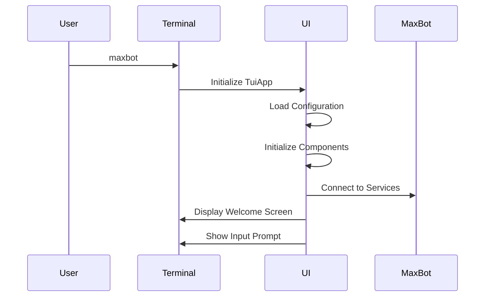
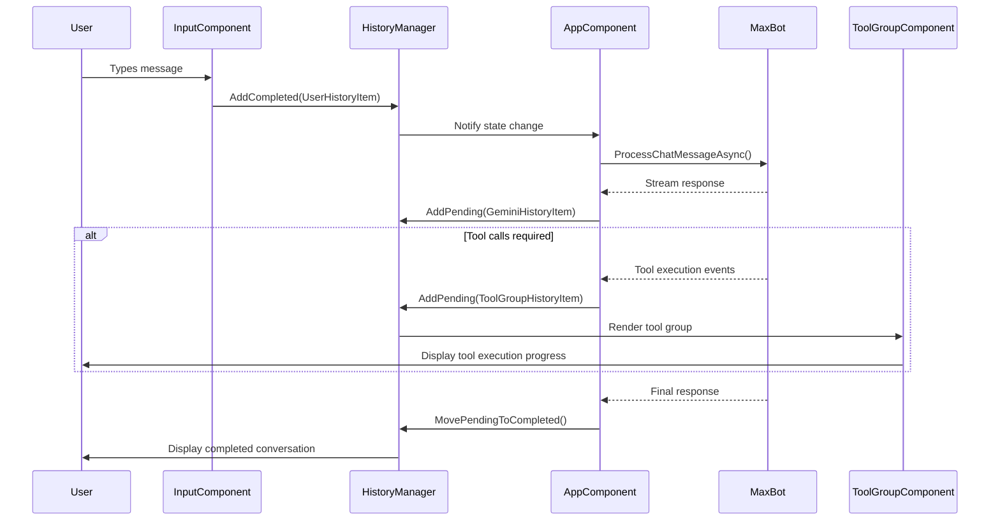

# UI Concept of Operations

## 1. Introduction

This document describes the operational concept for the MaxBot Component-Based User Interface (UI). It defines how users interact with the system, how the UI behaves during different operational scenarios, and the overall user experience flow.

## 2. Operational Overview

### 2.1. System Purpose

The MaxBot UI provides a sophisticated terminal-based interface that:
- Displays AI chat conversations with rich formatting
- Groups and visualizes tool executions in real-time
- Provides interactive controls for user input and system management
- Maintains conversation history with efficient rendering
- Supports complex workflows with tool confirmations and status tracking

### 2.2. User Personas

**Primary User: Software Developer**
- Uses MaxBot for code assistance, file operations, and development tasks
- Expects responsive, informative UI with clear tool execution feedback
- Values efficiency and minimal interruption to workflow

**Secondary User: System Administrator**
- Uses MaxBot for system management and automation tasks
- Requires clear visibility into tool execution and system state
- Needs reliable confirmation workflows for destructive operations

## 3. User Interface Flow

### 3.1. Application Startup



**Startup Sequence:**
1. User launches `maxbot` command in terminal
2. UI initializes component system and state management
3. Welcome screen displays with system status
4. Input prompt appears ready for user interaction

### 3.2. Basic Chat Interaction



## 4. Component Behavior

### 4.1. History Display

**Static History Zone:**
- Displays completed conversation items
- Never re-renders once content is finalized
- Scrollable when content exceeds available height
- Supports rich formatting (markdown, code blocks, etc.)

**Dynamic Pending Zone:**
- Shows active/pending operations
- Updates in real-time as operations progress
- Handles streaming content and animations
- Automatically moves completed items to static zone

### 4.2. Tool Execution Visualization

**Tool Group Display:**
```
┌─ Tool Execution (3 tools) ─────────────────────┐
│ ✓ read_file Reading config.json               │
│ ⊷ write_file Writing updated config           │
│ ○ execute_command Running tests                │
└────────────────────────────────────────────────┘
```

**Status Indicators:**
- `○` Pending - Tool queued for execution
- `⊷` Executing - Tool currently running (animated)
- `✓` Success - Tool completed successfully
- `✗` Error - Tool failed with error
- `?` Confirming - Waiting for user approval
- `-` Canceled - Tool execution was canceled

**Border Colors:**
- **Yellow** - Tools pending or executing
- **Green** - All tools completed successfully
- **Red** - One or more tools failed
- **Orange** - Mixed success/failure state
- **Blue** - User confirmation required

### 4.3. Input Component

**Features:**
- Multi-line input support with word wrapping
- Command history navigation (↑/↓ arrows)
- Auto-completion for common commands
- Real-time input validation
- Paste support for large content

**Input States:**
- **Active** - Ready for user input (green cursor)
- **Processing** - AI is responding (disabled with spinner)
- **Confirming** - Waiting for tool approval (yellow highlight)

## 5. Operational Scenarios

### 5.1. Simple Query Response

**Scenario:** User asks a question that requires no tools

```
User Input: "What is the difference between async and await in C#?"

┌─ Chat History ──────────────────────────────────┐
│ 👤 What is the difference between async and     │
│    await in C#?                                 │
│                                                 │
│ 🤖 The `async` and `await` keywords work        │
│    together to enable asynchronous programming  │
│    in C#...                                     │
│                                                 │
│    [Detailed explanation with code examples]    │
└─────────────────────────────────────────────────┘

> _
```

### 5.2. File Operation Workflow

**Scenario:** User requests file modifications

```
User Input: "Update the README.md file to include installation instructions"

┌─ Chat History ──────────────────────────────────┐
│ 👤 Update the README.md file to include         │
│    installation instructions                    │
│                                                 │
│ 🤖 I'll help you update the README.md file.     │
│    Let me first read the current content and    │
│    then add installation instructions.          │
└─────────────────────────────────────────────────┘

┌─ Tool Execution (2 tools) ─────────────────────┐
│ ✓ read_file Reading README.md                  │
│ ⊷ write_file Updating README.md with install   │
└────────────────────────────────────────────────┘

> _
```

### 5.3. Tool Confirmation Workflow

**Scenario:** Destructive operation requires confirmation

```
User Input: "Delete all .tmp files in the project"

┌─ Tool Execution (1 tool) ──────────────────────┐
│ ? execute_command Delete temporary files       │
│                                                │
│   Command: find . -name "*.tmp" -delete       │
│   This will permanently delete 15 files       │
│                                                │
│   Continue? [y/N]: _                          │
└────────────────────────────────────────────────┘
```

### 5.4. Error Handling

**Scenario:** Tool execution fails

```
┌─ Tool Execution (2 tools) ─────────────────────┐
│ ✓ read_file Reading config.json               │
│ ✗ write_file Failed to write config.json      │
│                                                │
│   Error: Permission denied                     │
│   The file may be read-only or you may lack   │
│   write permissions to this directory.        │
└────────────────────────────────────────────────┘

🤖 I encountered an error while trying to write
   to config.json. The file appears to be read-only.
   Would you like me to try a different approach?

> _
```

### 5.5. Complex Multi-Tool Workflow

**Scenario:** Code refactoring with multiple steps

```
User Input: "Refactor the UserService class to use dependency injection"

┌─ Chat History ──────────────────────────────────┐
│ 👤 Refactor the UserService class to use        │
│    dependency injection                         │
│                                                 │
│ 🤖 I'll refactor the UserService class to use   │
│    dependency injection. This will involve      │
│    several steps...                             │
└─────────────────────────────────────────────────┘

┌─ Tool Execution (5 tools) ─────────────────────┐
│ ✓ read_file Reading UserService.cs             │
│ ✓ read_file Reading IUserRepository.cs         │
│ ✓ generate_code_patch Creating DI refactor     │
│ ⊷ apply_code_patch Applying changes            │
│ ○ write_file Updating Program.cs for DI        │
└────────────────────────────────────────────────┘

> _
```

## 6. Layout and Responsive Design

### 6.1. Terminal Size Adaptation

**Large Terminal (120x40):**
```
┌─ MaxBot ─────────────────────────────────────────────────────────────────────────────────────────────────────┐
│                                                                                                                 │
│ ┌─ Chat History ─────────────────────────────────────────────────────────────────────────────────────────────┐ │
│ │ [Conversation content with full width for readability]                                                     │ │
│ │                                                                                                             │ │
│ └─────────────────────────────────────────────────────────────────────────────────────────────────────────────┘ │
│                                                                                                                 │
│ ┌─ Tool Execution (3 tools) ─────────────────────────────────────────────────────────────────────────────────┐ │
│ │ ✓ read_file Reading large_file.json                                                                        │ │
│ │ ⊷ process_data Processing 10,000 records...                                                                │ │
│ │ ○ write_file Writing results to output.csv                                                                 │ │
│ └─────────────────────────────────────────────────────────────────────────────────────────────────────────────┘ │
│                                                                                                                 │
│ > Enter your message: _                                                                                        │
└─────────────────────────────────────────────────────────────────────────────────────────────────────────────────┘
```

**Small Terminal (80x24):**
```
┌─ MaxBot ─────────────────────────────────────────────────────────────────────┐
│ ┌─ Chat History ─────────────────────────────────────────────────────────────┐ │
│ │ 👤 Refactor UserService                                                   │ │
│ │ 🤖 I'll refactor the class to use DI...                                   │ │
│ └───────────────────────────────────────────────────────────────────────────┘ │
│                                                                               │
│ ┌─ Tools (3) ───────────────────────────────────────────────────────────────┐ │
│ │ ✓ read_file UserService.cs                                                │ │
│ │ ⊷ apply_patch Refactoring...                                              │ │
│ │ ○ write_file Program.cs                                                   │ │
│ └───────────────────────────────────────────────────────────────────────────┘ │
│                                                                               │
│ > _                                                                           │
└───────────────────────────────────────────────────────────────────────────────┘
```

### 6.2. Height Distribution

**Height Allocation Strategy:**
- **Header**: Fixed 3 lines (title, status, separator)
- **Static History**: 60-70% of remaining height (scrollable)
- **Dynamic Content**: 20-30% of remaining height (tool execution, streaming)
- **Input Area**: Fixed 3-5 lines (prompt, input, help text)
- **Footer**: Fixed 1 line (status indicators)

**Overflow Handling:**
- History content scrolls automatically when exceeding available height
- Tool execution area truncates with "show more" option
- Long tool outputs are collapsed with expand/collapse controls
- Input area supports multi-line with scroll for very long inputs

## 7. Performance Characteristics

### 7.1. Rendering Performance

**Target Metrics:**
- **Startup Time**: < 500ms from command to ready prompt
- **Input Responsiveness**: < 50ms from keypress to display
- **Tool Update Frequency**: 60 FPS for smooth animations
- **Memory Usage**: < 100MB for typical sessions
- **History Capacity**: 1000+ conversation items without degradation

### 7.2. Optimization Strategies

**Static Zone Optimization:**
- Completed history items never re-render
- Content is cached as pre-rendered Spectre.Console objects
- Only new items trigger static zone updates

**Dynamic Zone Optimization:**
- Only components with state changes re-render
- Debounced updates prevent excessive re-rendering
- Animation frames are optimized for terminal refresh rates

## 8. Error Recovery and Resilience

### 8.1. Component Failure Handling

**Rendering Errors:**
- Individual component failures don't crash the entire UI
- Error boundaries catch and display component-specific errors
- Graceful degradation to simpler rendering when complex layouts fail

**State Corruption Recovery:**
- State validation on critical operations
- Automatic state reset for corrupted components
- Backup state preservation for recovery scenarios

### 8.2. Network and Service Failures

**MaxBot Service Disconnection:**
- UI continues to function with cached data
- Clear indication of connection status
- Automatic reconnection attempts with exponential backoff
- Offline mode with limited functionality

**Tool Execution Failures:**
- Individual tool failures don't affect other tools in the group
- Clear error messaging with suggested remediation
- Retry mechanisms for transient failures
- Graceful handling of timeout scenarios

## 9. Accessibility and Usability

### 9.1. Keyboard Navigation

**Input Controls:**
- `Tab` / `Shift+Tab`: Navigate between UI sections
- `Ctrl+C`: Cancel current operation
- `Ctrl+D`: Exit application
- `↑` / `↓`: Navigate command history
- `Page Up` / `Page Down`: Scroll history content

**Tool Confirmation:**
- `Y` / `Enter`: Confirm tool execution
- `N` / `Escape`: Cancel tool execution
- `?`: Show detailed tool information

### 9.2. Visual Accessibility

**Color Usage:**
- Status information is conveyed through both color and symbols
- High contrast color scheme for readability
- Colorblind-friendly status indicators
- Optional monochrome mode for accessibility

**Text Formatting:**
- Clear typography hierarchy
- Adequate spacing between elements
- Consistent indentation and alignment
- Readable font sizing within terminal constraints

## 10. Configuration and Customization

### 10.1. User Preferences

**Display Options:**
- Theme selection (dark, light, high contrast)
- Animation enable/disable
- Verbose vs. compact tool display
- History retention limits

**Behavior Options:**
- Auto-confirmation for safe operations
- Tool execution timeout settings
- Input history size
- Scroll behavior preferences

### 10.2. Advanced Configuration

**Layout Customization:**
- Adjustable height distribution ratios
- Component visibility toggles
- Custom status indicators
- Personalized keyboard shortcuts

---

*This concept of operations provides the foundation for implementing a user-centered, efficient, and robust terminal UI that enhances the MaxBot user experience while maintaining professional standards for CLI applications.*
