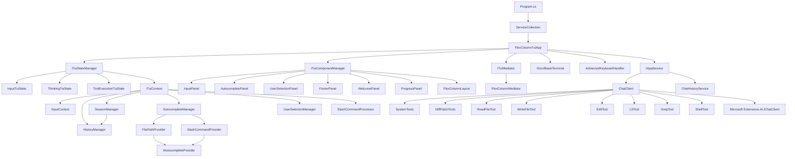
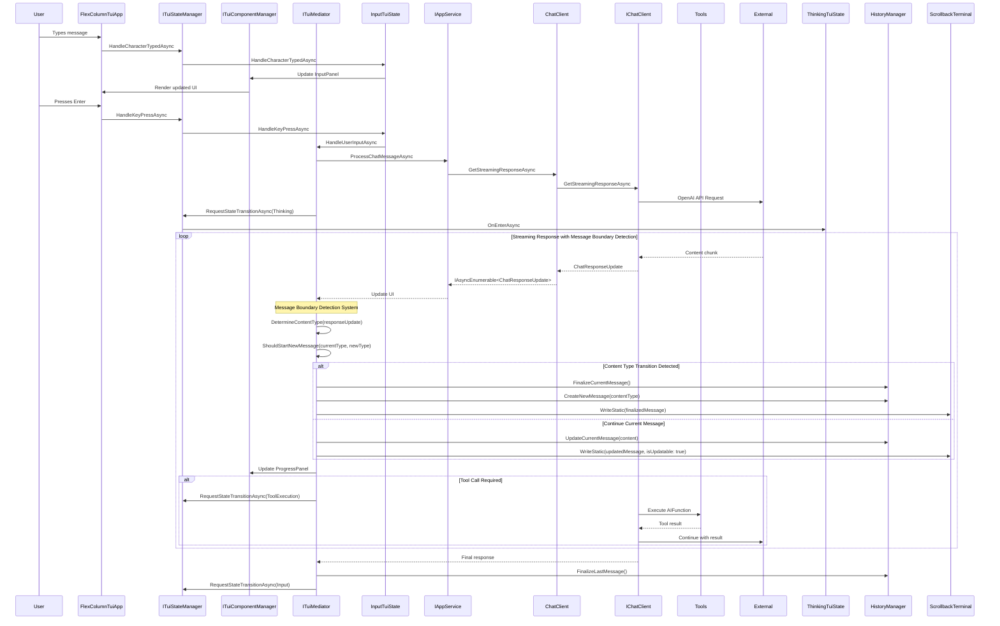
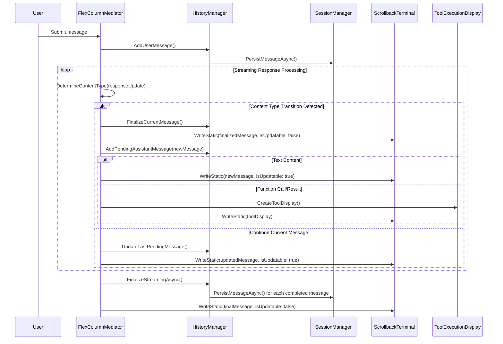
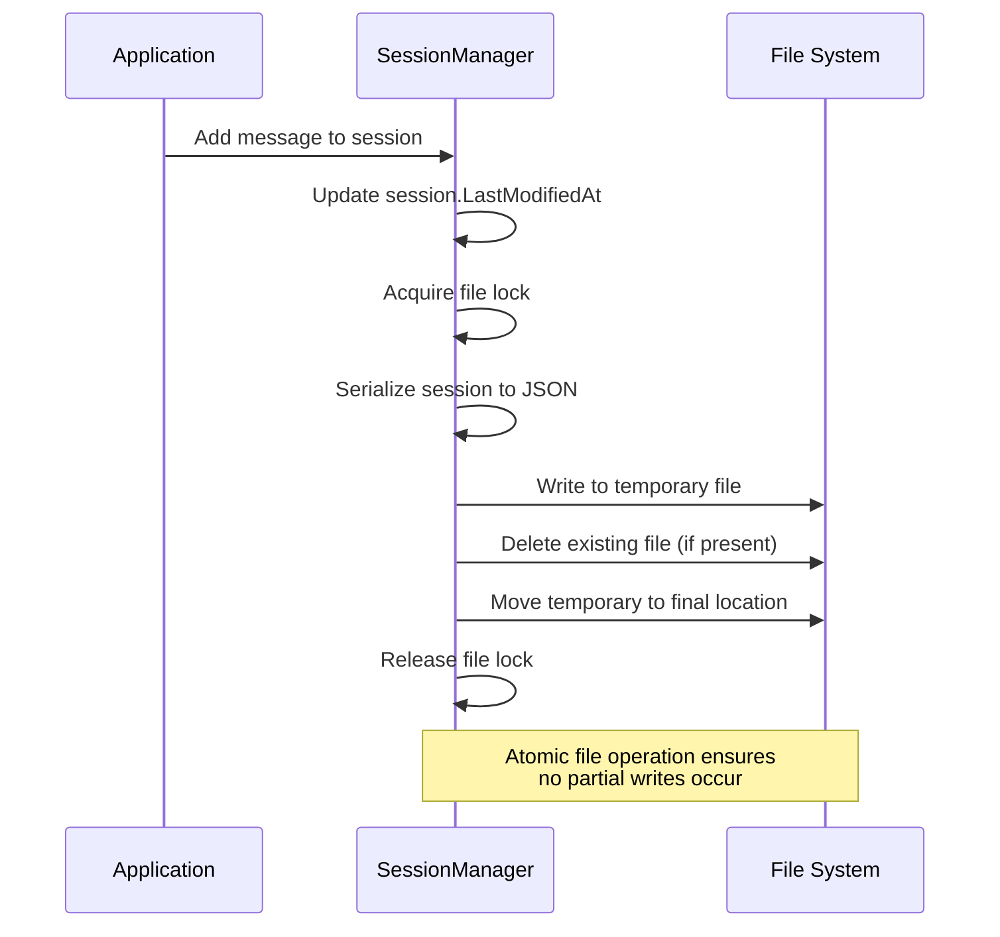
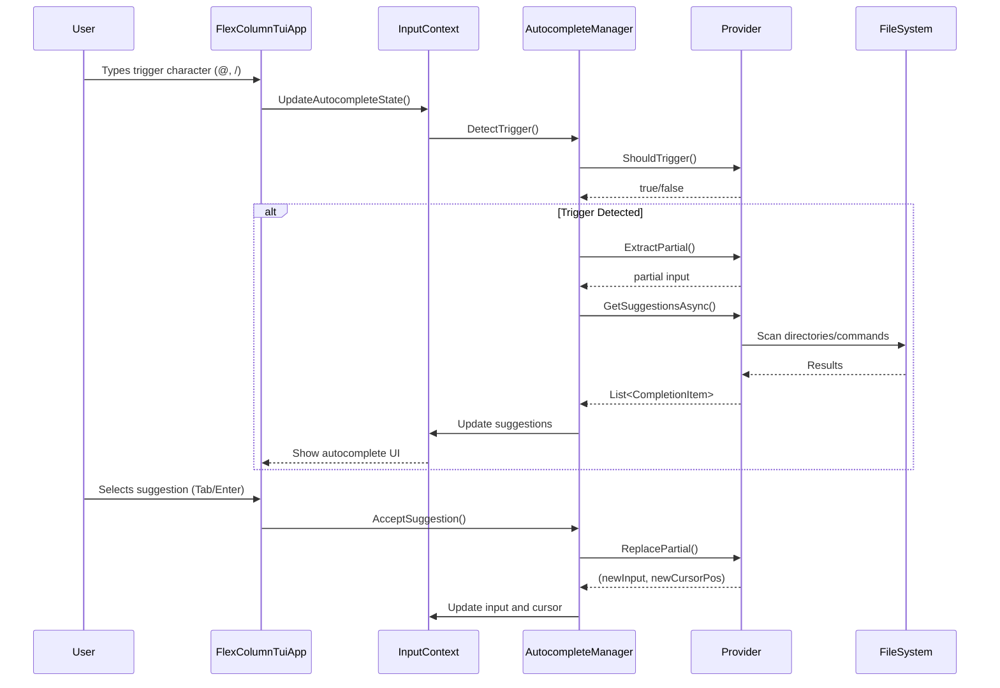
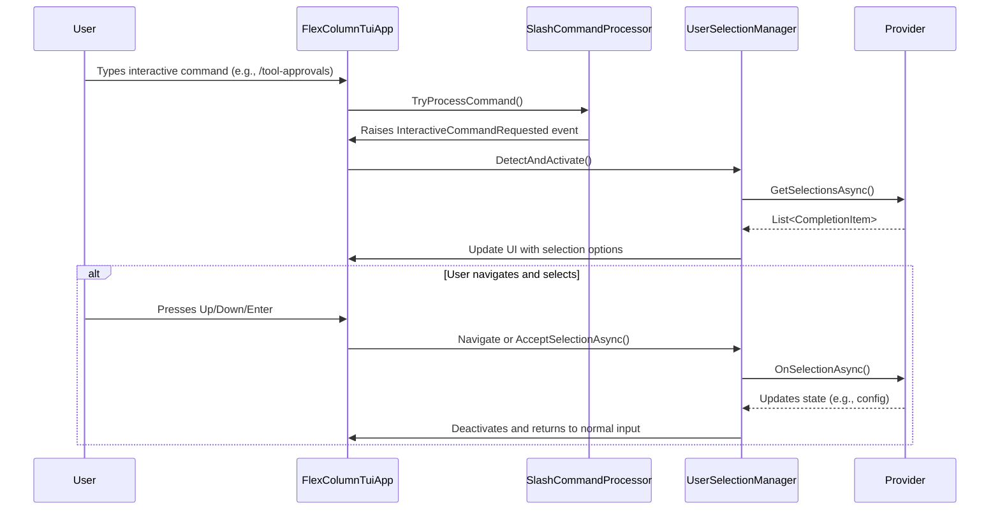
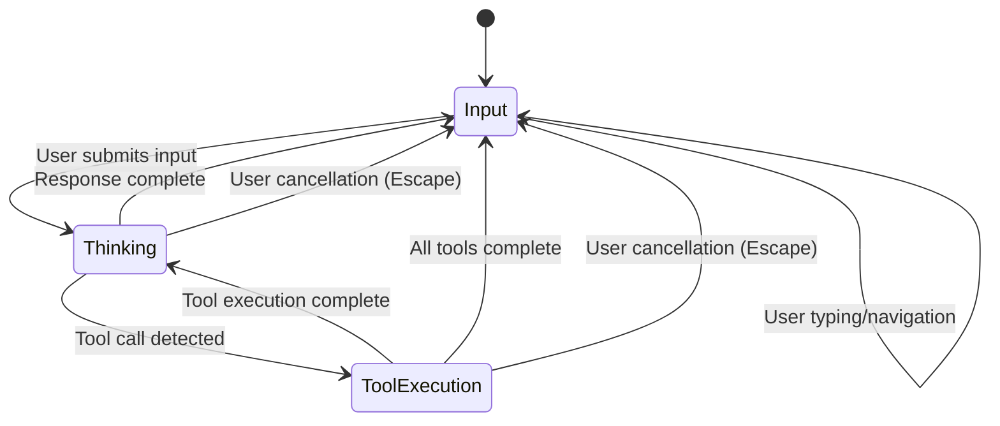

# Mogzi CLI Architecture

## Solution Structure

**Project Organization:**
- **Mogzi** - Core domain, services, and business logic library
- **Mogzi.TUI** - Text User Interface application (main executable)
- **Mogzi.PawPrints** - Terminal interface abstraction library
- **Mogzi.Tests** - Unit and integration tests

**Technology Stack:**
- .NET 9 with C# for cross-platform development and AOT compilation
- Spectre.Console for rich terminal UI rendering
- Microsoft.Extensions.AI for AI model integration and function calling
- FluentResults for functional error handling
- OpenAI SDK for AI service integration
- SharpToken for token counting and metrics
- Microsoft.Extensions.DependencyInjection for service registration

## Core Architecture

**Component Hierarchy:**


**Data Flow Architecture:**


## Service Layer Architecture

**Dependency Injection Pattern:**
```csharp
// Service registration in ServiceConfiguration.cs
public static void ConfigureServices(IServiceCollection services)
{
    // Add logging - file logging only to keep UI clean
    services.AddLogging(builder =>
    {
        builder.AddProvider(new FileLoggerProvider(LogLevel.Warning));
        builder.SetMinimumLevel(LogLevel.Warning);
    });

    // Add Spectre.Console
    services.AddSingleton<IAnsiConsole>(AnsiConsole.Console);

    // Add core services
    services.AddSingleton<IWorkingDirectoryProvider, DefaultWorkingDirectoryProvider>();
    
    // Create ChatClient with error handling
    var chatClientResult = ChatClient.Create(
        "mogzi.config.json",
        null, // Use default profile
        null,
        "chat",
        (details, color) => {},
        false
    );

    if (chatClientResult.IsSuccess)
    {
        services.AddSingleton(chatClientResult.Value);
    }
    else
    {
        throw new InvalidOperationException($"Failed to create ChatClient: {string.Join(", ", chatClientResult.Errors.Select(e => e.Message))}");
    }

    services.AddSingleton<IAppService, AppService>();
    services.AddSingleton<HistoryManager>();
    services.AddSingleton<StateManager>();

    // Add autocomplete services
    services.AddSingleton<AutocompleteManager>();
    services.AddSingleton<IAutocompleteProvider, FilePathProvider>();
    services.AddSingleton<IAutocompleteProvider, SlashCommandProvider>();

    // Add TUI infrastructure components
    services.AddSingleton<FlexColumnTuiApp>();
    services.AddSingleton<IScrollbackTerminal, ScrollbackTerminal>();
}
```

**Service Lifecycle Management:**
- **Singleton Services**: All core services use singleton lifetime for shared state
- **Factory Pattern**: ChatClient.Create() factory method with comprehensive error handling
- **Interface Segregation**: Clean abstractions (IAppService, IScrollbackTerminal, IWorkingDirectoryProvider)
- **Service Validation**: ChatClient creation validates configuration before service registration
- **Error Propagation**: Service registration failures throw InvalidOperationException with detailed error messages

**Service Dependencies:**
```csharp
// IAppService implementation with constructor injection
public class AppService : IAppService
{
    private readonly ChatClient _chatClient;
    private readonly ChatHistoryService _chatHistoryService;

    public AppService(ChatClient chatClient)
    {
        _chatClient = chatClient;
        _chatHistoryService = new ChatHistoryService(); // Direct instantiation
    }
}
```

**Error Handling Architecture:**
- **FluentResults Pattern**: Used throughout for functional error handling without exceptions
- **Result<T> Returns**: ChatClient.Create() returns Result<ChatClient> for safe initialization
- **Exception Boundaries**: Try-catch blocks in tool implementations with structured error responses
- **Service Validation**: Configuration validation during service registration prevents runtime failures
- **Graceful Degradation**: Services handle missing dependencies and configuration errors appropriately

## Domain Layer Architecture

**Configuration Management:**
```csharp
// JSON serialization with source generation for AOT compatibility
[JsonSerializable(typeof(ApplicationConfigurationRoot))]
public partial class ApplicationConfigurationContext : JsonSerializerContext

// Hierarchical configuration structure
ApplicationConfigurationRoot -> ApplicationConfiguration -> ApiProvider[], Profile[]
```

**Domain Entities:**
- **ApplicationConfiguration**: Central configuration with API providers, profiles, and tool approvals
- **ApiProvider**: External service configuration (OpenAI, custom endpoints)
- **Profile**: User-specific model and provider combinations
- **ChatHistory**: Message persistence and session management
- **Session**: Represents a single chat session, including its metadata, history, and usage metrics
- **SessionUsageMetrics**: Real-time token usage tracking per session with Cline-inspired display
- **ApiMetrics**: Global token counting and usage tracking

## Session Management Architecture

**Session Entity Design:**
```csharp
// Domain entity representing a chat session with attachment support
public class Session
{
    public Guid Id { get; set; } // UUIDv7 for time-ordered generation
    public string Name { get; set; } // User-friendly name, defaults to creation timestamp
    public DateTime CreatedAt { get; set; }
    public DateTime LastModifiedAt { get; set; }
    public List<SerializableChatMessage> History { get; set; } = [];
    public string InitialPrompt { get; set; } = string.Empty;
}

// Enhanced serializable chat message with function call/result support
public class SerializableChatMessage
{
    public string Role { get; set; } = string.Empty;
    public string Content { get; set; } = string.Empty;
    public string? AuthorName { get; set; }
    public string? MessageId { get; set; }
    public List<AttachmentMetadata> Attachments { get; set; } = [];
    public List<FunctionCall> FunctionCalls { get; set; } = [];
    public List<FunctionResult> FunctionResults { get; set; } = [];
    
    // Factory method for converting from Microsoft.Extensions.AI.ChatMessage
    public static SerializableChatMessage FromChatMessage(ChatMessage message, int messageIndex = 0)
    {
        // Handles text content, attachments, and function calls/results from message.Contents
        // Processes ImageContent, DataContent, TextContent, FunctionCallContent, and FunctionResultContent types
        // Generates attachment metadata with content hashing
        // Preserves function call/result data for tool execution replay
    }
}

// Function call metadata for tool execution persistence
public class FunctionCall
{
    public string CallId { get; set; } = string.Empty;
    public string Name { get; set; } = string.Empty;
    public Dictionary<string, object?> Arguments { get; set; } = [];
}

// Function result metadata for tool execution persistence
public class FunctionResult
{
    public string CallId { get; set; } = string.Empty;
    public object? Result { get; set; }
}

// Attachment metadata for session persistence
public class AttachmentMetadata
{
    public string OriginalFileName { get; set; } = string.Empty;
    public string StoredFileName { get; set; } = string.Empty; // {msg-index}-{hash}.{ext}
    public string ContentType { get; set; } = string.Empty;
    public string ContentHash { get; set; } = string.Empty; // SHA256 hash for integrity
    public long FileSizeBytes { get; set; }
    public int MessageIndex { get; set; } // Index of message in session history
}
```

## Message Boundary Detection System

**Streaming Response Architecture:**
The Message Boundary Detection System creates separate ChatMessage objects for different content types to ensure proper message sequencing in scrollback history and chat persistence. This system addresses the challenge of maintaining clean UI boundaries while preserving complete chat history for AI context.

```csharp
// Content type classification for message boundary detection
private enum ContentType
{
    None,           // No content or unknown
    Text,           // Regular assistant text response
    FunctionCall,   // Tool invocation
    FunctionResult  // Tool execution result
}

// Message boundary decision logic
private static bool ShouldStartNewMessage(ContentType currentType, ContentType newType, ChatMessage? currentMessage)
{
    // Always start a new message if we don't have one
    if (currentMessage == null) return true;
    
    // Start new message when content type changes
    // This creates boundaries between: Text → Tool → Text sequences
    if (currentType != newType) return true;
    
    // For function calls/results, always create separate messages
    // This ensures each tool invocation and result is a distinct history entry
    if (newType is ContentType.FunctionCall or ContentType.FunctionResult) return true;
    
    // Continue with current message for same content type
    return false;
}
```

**Pending/Completed Message Architecture:**
```csharp
// HistoryManager with deferred persistence for streaming
public class HistoryManager
{
    private readonly List<ChatMessage> _completedMessages = [];
    private readonly List<ChatMessage> _pendingMessages = [];
    
    // Adds assistant message to pending during streaming (not persisted)
    public void AddPendingAssistantMessage(ChatMessage message);
    
    // Updates last pending message during streaming updates (not persisted)
    public void UpdateLastPendingMessage(ChatMessage message);
    
    // Finalizes streaming by moving pending to completed and persisting
    public async Task FinalizeStreamingAsync()
    {
        var pendingToMove = _pendingMessages.ToList();
        _pendingMessages.Clear();
        
        foreach (var message in pendingToMove)
        {
            _completedMessages.Add(message);
            await PersistMessageAsync(message);
        }
    }
    
    // Gets all messages (completed + pending) for UI display during streaming
    public List<ChatMessage> GetAllMessagesForDisplay();
    
    // Gets current chat history for AI processing (includes pending)
    public List<ChatMessage> GetCurrentChatHistory();
}
```

**Streaming Workflow with Message Boundaries:**


**Session Loading and Tool Execution Display:**
```csharp
// Enhanced RenderMessage method for loaded sessions
private IRenderable RenderMessage(ChatMessage message)
{
    var components = new List<IRenderable>();

    // Handle text content
    if (!string.IsNullOrEmpty(message.Text))
    {
        // Render text with role-based styling
        components.Add(CreateTextRenderable(message));
    }

    // Handle function calls and results for tool execution display
    if (message.Contents != null && message.Contents.Count > 0)
    {
        foreach (var content in message.Contents)
        {
            if (content is FunctionCallContent functionCall)
            {
                // Create tool display for function call
                var toolDisplay = ToolExecutionDisplay.CreateToolDisplay(
                    functionCall.Name ?? "Unknown Tool",
                    ToolExecutionStatus.Success,
                    GetToolDescription(functionCall),
                    diff: null,
                    result: null
                );
                components.Add(toolDisplay);
            }
            else if (content is FunctionResultContent functionResult)
            {
                // Parse tool result and create enhanced display
                var toolResponseParser = _serviceProvider.GetRequiredService<ToolResponseParser>();
                var result = functionResult.Result?.ToString() ?? "";
                var toolName = ExtractToolNameFromResult(result) ?? "Tool";
                var toolInfo = toolResponseParser.ParseToolResponse(toolName, result);

                var toolDisplay = ToolExecutionDisplay.CreateToolDisplay(
                    toolInfo.ToolName,
                    toolInfo.Status,
                    toolInfo.Description,
                    diff: null,
                    result: toolInfo.Summary ?? result
                );
                components.Add(toolDisplay);
            }
        }
    }

    // Return appropriate renderable based on content
    return components.Count switch
    {
        0 => new Text(string.Empty),
        1 => components[0],
        _ => new Rows(components)
    };
}
```

**Key Architectural Benefits:**
- **Clean Message Boundaries**: Separate messages for text, function calls, and results maintain UI clarity
- **Complete History Preservation**: All content types preserved for AI context and session replay
- **Deferred Persistence**: Only final, consolidated messages are persisted to prevent streaming artifacts
- **Tool Execution Replay**: Function calls and results are properly displayed when sessions are loaded
- **UI Consistency**: Same tool execution display components used for live and loaded sessions
- **Performance Optimization**: Pending messages avoid unnecessary I/O during streaming

**Directory-Based Storage Architecture:**
```
~/.mogzi/chats/
└── {session-uuid}/
    ├── session.json          # Session metadata + text content + attachment metadata
    └── attachments/
        ├── {msg-index}-{attachment-hash}.png
        ├── {msg-index}-{attachment-hash}.pdf
        └── {msg-index}-{attachment-hash}.txt
```

**SessionManager Service:**
```csharp
// Service responsible for session lifecycle management with attachment support
public class SessionManager
{
    private readonly string _sessionsPath;
    private readonly ILogger<SessionManager> _logger;
    private readonly SemaphoreSlim _fileLock = new(1, 1);
    private Session _currentSession;
    
    // Directory-based session creation
    public async Task CreateNewSessionAsync()
    {
        var sessionId = Guid.CreateVersion7();
        var sessionDir = Path.Combine(_sessionsPath, sessionId.ToString());
        var attachmentsDir = Path.Combine(sessionDir, "attachments");
        
        Directory.CreateDirectory(sessionDir);
        Directory.CreateDirectory(attachmentsDir);
        
        _currentSession = new Session
        {
            Id = sessionId,
            Name = DateTime.UtcNow.ToString("yyyy-MM-dd HH:mm:ss"),
            CreatedAt = DateTime.UtcNow,
            LastModifiedAt = DateTime.UtcNow
        };
        
        await SaveCurrentSessionAsync();
    }
    
    // Atomic file operations with concurrency control
    public async Task SaveCurrentSessionAsync()
    {
        await _fileLock.WaitAsync();
        try
        {
            _currentSession.LastModifiedAt = DateTime.UtcNow;
            var json = JsonSerializer.Serialize(_currentSession, _jsonOptions);
            
            var sessionDir = Path.Combine(_sessionsPath, _currentSession.Id.ToString());
            var tempPath = Path.Combine(sessionDir, "session.tmp");
            var finalPath = Path.Combine(sessionDir, "session.json");
            
            await File.WriteAllTextAsync(tempPath, json);
            if (File.Exists(finalPath))
                File.Delete(finalPath);
            File.Move(tempPath, finalPath);
        }
        finally
        {
            _fileLock.Release();
        }
    }
    
    // Attachment handling with content-based hashing
    public async Task<AttachmentMetadata> SaveAttachmentAsync(
        byte[] content, 
        string originalFileName, 
        string contentType, 
        int messageIndex)
    {
        var contentHash = ComputeSHA256Hash(content);
        var extension = Path.GetExtension(originalFileName);
        var storedFileName = $"{messageIndex}-{contentHash}{extension}";
        
        var sessionDir = Path.Combine(_sessionsPath, _currentSession.Id.ToString());
        var attachmentsDir = Path.Combine(sessionDir, "attachments");
        var attachmentPath = Path.Combine(attachmentsDir, storedFileName);
        
        // Only write if file doesn't exist (deduplication)
        if (!File.Exists(attachmentPath))
        {
            await File.WriteAllBytesAsync(attachmentPath, content);
        }
        
        return new AttachmentMetadata
        {
            OriginalFileName = originalFileName,
            StoredFileName = storedFileName,
            ContentType = contentType,
            ContentHash = contentHash,
            FileSizeBytes = content.Length,
            MessageIndex = messageIndex
        };
    }
    
    // Load attachment content
    public async Task<byte[]> LoadAttachmentAsync(AttachmentMetadata metadata)
    {
        var sessionDir = Path.Combine(_sessionsPath, _currentSession.Id.ToString());
        var attachmentPath = Path.Combine(sessionDir, "attachments", metadata.StoredFileName);
        
        if (!File.Exists(attachmentPath))
            throw new FileNotFoundException($"Attachment not found: {metadata.StoredFileName}");
            
        return await File.ReadAllBytesAsync(attachmentPath);
    }
    
    private static string ComputeSHA256Hash(byte[] content)
    {
        using var sha256 = SHA256.Create();
        var hashBytes = sha256.ComputeHash(content);
        return Convert.ToHexString(hashBytes).ToLowerInvariant();
    }
}
```

**Concurrency Control Architecture:**
- **File Locking**: SemaphoreSlim ensures only one thread can access the session file at a time
- **Atomic File Operations**: Two-phase write with temporary files prevents partial writes or corruption
- **Cross-Process Locking**: FileShare.None during file operations prevents multiple processes from modifying the same file
- **Error Recovery**: Corrupted session detection with backup preservation

**Session Persistence Flow:**


**Performance Optimization:**
- **Asynchronous I/O**: All file operations use non-blocking async methods
- **Minimal Serialization**: Only changed fields are updated before serialization
- **Efficient JSON**: System.Text.Json with source generation for AOT compatibility
- **Prioritizing Reliability**: Atomic writes ensure data integrity even if performance impact occurs

**Working Directory Security:**
- **IWorkingDirectoryProvider**: Abstraction for secure path operations
- **DefaultWorkingDirectoryProvider**: Implementation with security boundaries
- **Path Validation**: All file operations validated against working directory

## Tool Architecture

**Tool Registration Pattern:**
```csharp
// Individual tool classes with AIFunction factory pattern
public class ReadTextFileTool
{
    private readonly ApplicationConfiguration _config;
    private readonly Action<string, ConsoleColor>? _llmResponseDetailsCallback;
    private readonly IWorkingDirectoryProvider _workingDirectoryProvider;

    public AIFunction GetTool()
    {
        return AIFunctionFactory.Create(
            ReadTextFile,
            new AIFunctionFactoryOptions
            {
                Name = "read_text_file",
                Description = "Reads and returns the content of a text file from the local filesystem..."
            });
    }
}

// Centralized tool registration in ChatClient constructor
var allTools = new List<AITool>();
allTools.AddRange(SystemTools.GetTools().Cast<AITool>());
allTools.AddRange(DiffPatchTools.GetTools().Cast<AITool>());
allTools.Add(ReadTextFileTool.GetTool());
allTools.Add(ReadImageFileTool.GetTool());
allTools.Add(WriteFileTool.GetTool());
allTools.Add(EditTool.GetTool());
allTools.Add(LSTool.GetTool());
allTools.Add(GrepTool.GetTool());
allTools.Add(ShellTool.GetTool());

ChatOptions = new ChatOptions { Tools = allTools };
```

**Tool Security Model:**
```csharp
// Working directory validation in every file tool
private bool IsPathInWorkingDirectory(string absolutePath, string workingDirectory)
{
    try
    {
        var normalizedAbsolutePath = Path.GetFullPath(absolutePath);
        var normalizedWorkingDirectory = Path.GetFullPath(workingDirectory);

        // Platform-specific case sensitivity handling
        return normalizedAbsolutePath.StartsWith(normalizedWorkingDirectory, 
            RuntimeInformation.IsOSPlatform(OSPlatform.Windows) ? 
                StringComparison.OrdinalIgnoreCase : StringComparison.Ordinal);
    }
    catch { return false; }
}

// Tool approval checking
if (requiresApproval && _config.ToolApprovals.Equals("readonly", StringComparison.OrdinalIgnoreCase))
{
    return "Execution of this command requires approval. Please run with --tool-approvals all...";
}
```

**Tool Implementation Pattern:**
- **Constructor Injection**: ApplicationConfiguration, callback delegates, and IWorkingDirectoryProvider
- **Parameter Validation**: ValidateParameters() method with comprehensive input checking
- **Security Boundaries**: IsPathInWorkingDirectory() and HasReadPermission() validation
- **Structured Responses**: XML-formatted responses with status, error handling, and metadata
- **Error Handling**: Try-catch blocks with specific exception types and debug information
- **Callback Integration**: Optional llmResponseDetailsCallback for UI feedback

**Tool Response Format:**
```xml
<tool_response tool_name="read_text_file">
    <notes>Successfully read text file path/to/file.txt
Total lines: 150
Content size: 4567 characters</notes>
    <result status="SUCCESS" absolute_path="/full/path/to/file.txt" sha256_checksum="abc123..." />
    <content_on_disk>actual file content here</content_on_disk>
</tool_response>

<!-- Error response format -->
<tool_response tool_name="read_text_file">
    <result status="FAILED" />
    <error>File not found: /path/to/missing/file.txt</error>
</tool_response>
```

**Available Tools:**
- **SystemTools**: execute_command (with platform detection), attempt_completion (task completion)
- **DiffPatchTools**: generate_code_patch, apply_code_patch, preview_patch_application
- **ReadTextFileTool**: Secure file reading with range support (offset/limit parameters)
- **ReadImageFileTool**: Image file reading with base64 encoding
- **WriteFileTool**: File creation and modification with backup and validation
- **EditTool**: In-place file editing with search/replace operations
- **LSTool**: Directory listing and file system exploration with filtering
- **GrepTool**: Text search across files with regex support
- **ShellTool**: Command execution with cross-platform shell detection

**Tool Security Architecture:**
- **Path Validation**: All file operations validate paths are within working directory
- **Permission Checking**: File access permissions validated before operations
- **Input Sanitization**: Parameter validation prevents injection attacks
- **Error Message Security**: Generic error messages prevent information disclosure
- **Approval System**: Two-tier approval system (readonly/all) for operation control
- **Debug Mode**: Conditional detailed error information for development

## Integration Architecture

**AI Service Integration:**
```csharp
// Microsoft.Extensions.AI abstraction layer
IChatClient chatClient = new OpenAIClient(credentials, options)
    .GetChatClient(modelId)
    .AsIChatClient()
    .AsBuilder()
    .ConfigureOptions(options => options.MaxOutputTokens = 16000)
    .UseFunctionInvocation()
    .Build();
```

**Cross-Platform Support:**
- **Platform Detection**: Runtime.InteropServices.RuntimeInformation for OS-specific behavior
- **Shell Selection**: Automatic shell detection (PowerShell/Zsh/Bash)
- **Path Handling**: Cross-platform path operations with proper separators

**Configuration Loading:**
- **JSON Configuration**: File-based configuration with validation
- **Environment Integration**: System information injection (username, hostname, working directory)
- **Profile Management**: Multiple AI provider and model configurations

## Autocomplete Architecture

**Provider Pattern with Trigger-Based System:**
```csharp
// Core autocomplete interface with provider pattern
public interface IAutocompleteProvider
{
    AutocompleteType Type { get; }
    char TriggerCharacter { get; }
    bool ShouldTrigger(string input, int cursorPosition);
    string ExtractPartial(string input, int cursorPosition);
    Task<List<CompletionItem>> GetSuggestionsAsync(string partialInput);
    (string newInput, int newCursorPos) ReplacePartial(string input, int cursorPos, string completion);
}

// Autocomplete coordination service
public class AutocompleteManager
{
    public IAutocompleteProvider? DetectTrigger(string input, int cursorPosition);
    public async Task UpdateSuggestionsAsync(InputContext context);
    public void AcceptSuggestion(InputContext context);
}
```

**Autocomplete Flow Architecture:**


**Input Context State Management:**
```csharp
// Unified input state with autocomplete integration
public class InputContext
{
    public string CurrentInput { get; set; }
    public int CursorPosition { get; set; }
    public InputState State { get; set; } // Normal, Autocomplete
    public AutocompleteType ActiveAutocompleteType { get; set; }
    public IAutocompleteProvider? ActiveProvider { get; set; }
    public List<CompletionItem> CompletionItems { get; set; }
    public bool ShowSuggestions { get; set; }
    public int SelectedSuggestionIndex { get; set; }
}
```

**Provider Implementations:**

**FilePathProvider Architecture:**
- **Security-First Design**: All file operations validated within working directory boundaries
- **Async File System Operations**: Non-blocking directory scanning with Task<List<CompletionItem>>
- **Performance Optimization**: Results limited to 20 items, sorted by type (directories first)
- **Cross-Platform Path Handling**: Normalized forward slashes, relative path calculation
- **Trigger Logic**: '@' character detection with word boundary validation
- **Smart Path Extraction**: Handles partial paths, directory separators, and cursor positioning

```csharp
// FilePathProvider security and performance patterns
private bool IsWithinWorkingDirectory(string path, string workingDir)
{
    var fullPath = Path.GetFullPath(path);
    var fullWorkingDir = Path.GetFullPath(workingDir);
    return fullPath.StartsWith(fullWorkingDir, StringComparison.OrdinalIgnoreCase);
}

// Efficient file system scanning with limits
var directories = Directory.GetDirectories(searchDirectory)
    .Where(dir => string.IsNullOrEmpty(searchPattern) || 
                 Path.GetFileName(dir).StartsWith(searchPattern, StringComparison.OrdinalIgnoreCase))
    .Take(20);
```

**SlashCommandProvider Architecture:**
- **Command Registry Integration**: Leverages existing SlashCommandProcessor for command enumeration
- **Trigger Detection**: '/' character at word boundaries using InputUtils helper methods
- **Command Metadata**: Provides descriptions and usage information for each command
- **Text Replacement**: Smart command replacement with automatic space insertion

**Terminal UI Integration:**
```csharp
// Composite UI rendering with autocomplete overlay
private IRenderable CreateInputWithAutocomplete(InputContext context)
{
    var inputPanel = CreateFlexInputComponent(context.CurrentInput);
    
    if (!context.ShowSuggestions || context.Suggestions.Count == 0)
        return inputPanel;

    var suggestionItems = context.Suggestions.Select((suggestion, index) => 
    {
        var isSelected = index == context.SelectedSuggestionIndex;
        var style = isSelected ? "[blue on white]" : "[dim]";
        var prefix = isSelected ? ">" : " ";
        return new Markup($"{style}{prefix} {suggestion}[/]");
    }).ToArray();

    var suggestionsPanel = new Panel(new Rows(suggestionItems))
        .Border(BoxBorder.Rounded)
        .BorderColor(Color.Blue);

    return new Rows(inputPanel, suggestionsPanel);
}
```

**Keyboard Event Integration:**
- **Event-Driven Architecture**: Integrates with AdvancedKeyboardHandler's event system
- **Priority Handling**: Autocomplete navigation (Up/Down/Tab/Enter/Escape) takes precedence over normal input
- **State-Aware Processing**: Different key behaviors based on InputState (Normal vs Autocomplete)
- **Graceful Cancellation**: Escape key clears autocomplete state and returns to normal input

**Error Handling and Resilience:**
- **Provider Isolation**: Exceptions in one provider don't affect others or crash the application
- **Graceful Degradation**: Failed autocomplete operations clear state and continue normal input
- **Comprehensive Logging**: Debug-level logging for troubleshooting without UI disruption
- **Memory Management**: Autocomplete state cleared when not needed to prevent memory leaks

**Extensibility Architecture:**
- **Plugin Pattern**: New autocomplete types can be added by implementing IAutocompleteProvider
- **Dependency Injection**: Providers automatically discovered and registered through DI container
- **Type Safety**: AutocompleteType enum ensures type-safe provider identification
- **Metadata Support**: CompletionItem includes type, description, and extensible metadata

**Performance Characteristics:**
- **Non-Blocking Operations**: All file system and command enumeration operations are async
- **Efficient Text Processing**: String operations optimized for cursor position tracking
- **Minimal UI Updates**: Only updates autocomplete UI when suggestions change
- **Resource Limits**: Built-in limits prevent excessive memory usage or long operations

## User Selection Architecture

**Provider Pattern for Interactive Commands:**
```csharp
// Core interface for commands requiring user selection
public interface IUserSelectionProvider
{
    string Command { get; }
    string Description { get; }
    Task<List<CompletionItem>> GetSelectionsAsync();
    Task OnSelectionAsync(string selection);
}

// Manager for orchestrating the selection process
public class UserSelectionManager
{
    public bool IsSelectionModeActive { get; }
    public void DetectAndActivate(string input);
    public async Task UpdateSelectionsAsync();
    public async Task AcceptSelectionAsync();
    public void Deactivate();
}
```

**User Selection Flow Architecture:**


**Input Context State Management:**
- The `InputState` enum is extended with a `UserSelection` state to differentiate between normal input, autocomplete, and interactive command selection.
- The `FlexColumnTuiApp`'s rendering and keyboard handling logic changes based on this state, ensuring that arrow keys navigate the selection list and Enter confirms the choice.

## State Management Architecture

**State Pattern Implementation:**
```csharp
// Core state interface with lifecycle management
public interface ITuiState
{
    string Name { get; }
    IRenderable RenderDynamicContent(ITuiContext context);
    Task HandleKeyPressAsync(ITuiContext context, KeyPressEventArgs e);
    Task HandleCharacterTypedAsync(ITuiContext context, CharacterTypedEventArgs e);
    Task OnEnterAsync(ITuiContext context, ITuiState? previousState);
    Task OnExitAsync(ITuiContext context, ITuiState? nextState);
}

// State manager for coordinating transitions
public interface ITuiStateManager
{
    ChatState CurrentStateType { get; }
    ITuiState? CurrentState { get; }
    Task RequestStateTransitionAsync(ChatState newState);
    Task InitializeAsync(ITuiContext context);
    IRenderable RenderDynamicContent();
    Task HandleKeyPressAsync(KeyPressEventArgs e);
    Task HandleCharacterTypedAsync(CharacterTypedEventArgs e);
}
```

**State Implementations:**
- **InputTuiState**: Handles normal input, autocomplete, user selection, command history navigation
- **ThinkingTuiState**: Manages AI processing state with cancellation support and progress indication
- **ToolExecutionTuiState**: Handles tool execution display, progress updates, and result presentation

**TUI Context Architecture:**
```csharp
// Shared context providing services and state to all components
public interface ITuiContext
{
    // Core services
    IServiceProvider ServiceProvider { get; }
    ILogger Logger { get; }
    IScrollbackTerminal ScrollbackTerminal { get; }
    IAppService AppService { get; }
    IWorkingDirectoryProvider WorkingDirectoryProvider { get; }
    
    // State management
    InputContext InputContext { get; }
    HistoryManager HistoryManager { get; }
    AutocompleteManager AutocompleteManager { get; }
    UserSelectionManager UserSelectionManager { get; }
    SlashCommandProcessor SlashCommandProcessor { get; }
    ToolResponseParser ToolResponseParser { get; }
    ITuiStateManager StateManager { get; }
    
    // Application state
    List<string> CommandHistory { get; }
    int CommandHistoryIndex { get; set; }
    string CurrentToolName { get; set; }
    string ToolProgress { get; set; }
    CancellationTokenSource? AiOperationCts { get; set; }
    DateTime? AiOperationStartTime { get; set; }
    
    // State transition coordination
    Task RequestStateTransitionAsync(ChatState newState);
}
```

**State Transition Flow:**


**Application State:**
- **ChatState Enum**: Input, Thinking, ToolExecution states with clear transitions
- **TuiStateManager**: Centralized state coordination with async state transitions
- **HistoryManager**: Chat session persistence and loading with message management
- **Event-Driven Updates**: Real-time UI updates via IAsyncEnumerable and state notifications

**Terminal State Management:**
- **ScrollbackTerminal**: Static content rendering with dynamic updates
- **Cursor Management**: Hide/show cursor during operations
- **Content Clearing**: Efficient dynamic content updates without full redraws

## Component Architecture

**Component System Design:**
```csharp
// Base component interface for modular UI elements
public interface ITuiComponent
{
    string Name { get; }
    bool IsVisible { get; set; }
    IRenderable Render(IRenderContext context);
    Task<bool> HandleInputAsync(IRenderContext context, object inputEvent);
    Task InitializeAsync(IRenderContext context);
    Task DisposeAsync();
}

// Component manager for lifecycle and coordination
public interface ITuiComponentManager
{
    IReadOnlyDictionary<string, ITuiComponent> Components { get; }
    ITuiLayout? CurrentLayout { get; set; }
    void RegisterComponent(ITuiComponent component);
    bool UnregisterComponent(string componentName);
    ITuiComponent? GetComponent(string componentName);
    T? GetComponent<T>(string componentName) where T : class, ITuiComponent;
    IRenderable RenderLayout(IRenderContext context);
    Task<bool> BroadcastInputAsync(object inputEvent, IRenderContext context);
    Task InitializeComponentsAsync(IRenderContext context);
    Task DisposeComponentsAsync();
    void SetComponentVisibility(string componentName, bool isVisible);
    void UpdateComponentVisibility(ChatState currentState, IRenderContext context);
}

// Concrete implementation with comprehensive lifecycle management
public class TuiComponentManager : ITuiComponentManager
{
    private readonly Dictionary<string, ITuiComponent> _components = new();
    private readonly ILogger<TuiComponentManager> _logger;

    // Implementation handles component registration, validation, rendering,
    // input distribution, and visibility management with robust error handling
}
```

**Render Context Architecture:**
```csharp
// Provides rendering context and services for components
public interface IRenderContext
{
    ITuiContext TuiContext { get; }
    ChatState CurrentState { get; }
    ILogger Logger { get; }
    IServiceProvider ServiceProvider { get; }
    IThemeInfo? ThemeInfo { get; }
    IRenderingUtilities RenderingUtilities { get; }
}

// Concrete implementation with primary constructor pattern
public class RenderContext(
    ITuiContext tuiContext,
    ChatState currentState,
    ILogger logger,
    IServiceProvider serviceProvider,
    IRenderingUtilities renderingUtilities,
    IThemeInfo? themeInfo = null) : IRenderContext
{
    public ITuiContext TuiContext { get; } = tuiContext ?? throw new ArgumentNullException(nameof(tuiContext));
    public ChatState CurrentState { get; } = currentState;
    public ILogger Logger { get; } = logger ?? throw new ArgumentNullException(nameof(logger));
    public IServiceProvider ServiceProvider { get; } = serviceProvider ?? throw new ArgumentNullException(nameof(serviceProvider));
    public IThemeInfo? ThemeInfo { get; } = themeInfo;
    public IRenderingUtilities RenderingUtilities { get; } = renderingUtilities ?? throw new ArgumentNullException(nameof(renderingUtilities));
}

// Rendering utilities for consistent component styling
public interface IRenderingUtilities
{
    string FormatDisplayPath(string fullPath);
    string FormatModelInfo(IAppService appService);
    string FormatTokenUsage(IAppService appService, IEnumerable<ChatMessage> chatHistory);
    IRenderable RenderMessage(ChatMessage message);
}

// Concrete implementation with comprehensive formatting logic
public class RenderingUtilities(ILogger<RenderingUtilities> logger) : IRenderingUtilities
{
    private readonly ILogger<RenderingUtilities> _logger = logger ?? throw new ArgumentNullException(nameof(logger));

    // Implementation includes path formatting, model info display,
    // token usage calculation, and message rendering with error handling
}
```

**Component Implementations:**
- **InputPanel**: Handles the main input area with cursor positioning, text display, and input validation
  ```csharp
  public class InputPanel : ITuiComponent
  {
      // Renders input field with cursor positioning and placeholder text
      // Supports different input states (normal, autocomplete, selection)
  }
  ```

- **AutocompletePanel**: Displays autocomplete suggestions with selection highlighting and navigation
  ```csharp
  public class AutocompletePanel : ITuiComponent
  {
      // Renders suggestion list with highlighting for selected items
      // Integrates with SlashCommandProcessor for command descriptions
  }
  ```

- **UserSelectionPanel**: Shows interactive selection options for user commands with navigation
  ```csharp
  public class UserSelectionPanel : ITuiComponent
  {
      // Renders selection options with highlighting and descriptions
      // Supports keyboard navigation and selection confirmation
  }
  ```

- **FooterPanel**: Displays status information including directory, model, and token usage
  ```csharp
  public class FooterPanel : ITuiComponent
  {
      // Renders status bar with working directory, model info, and token usage
      // Uses RenderingUtilities for consistent formatting
  }
  ```

- **WelcomePanel**: Shows welcome message and branding with colorful ASCII art
  ```csharp
  public class WelcomePanel : ITuiComponent
  {
      // Renders multi-color ASCII logo and welcome message
      // Provides getting started tips and command information
  }
  ```

- **ProgressPanel**: Displays animated progress indicators for AI operations and tool execution
  ```csharp
  public class ProgressPanel : ITuiComponent
  {
      // Renders animated spinner with operation status and duration
      // Supports different states (thinking, tool execution)
      // Includes cancellation instructions
  }
  ```

**Layout System:**
```csharp
// Layout interface for component arrangement
public interface ITuiLayout
{
    string Name { get; }
    IEnumerable<string> GetRequiredComponents();
    IRenderable Compose(IReadOnlyDictionary<string, ITuiComponent> components, IRenderContext context);
    bool ValidateComponents(IReadOnlyDictionary<string, ITuiComponent> availableComponents);
}

// FlexColumnLayout implementation for vertical component stacking
public class FlexColumnLayout : ITuiLayout
{
    public string Name => "FlexColumnLayout";

    public IEnumerable<string> GetRequiredComponents()
    {
        return
        [
            "InputPanel",
            "AutocompletePanel", 
            "UserSelectionPanel",
            "ProgressPanel",
            "FooterPanel",
            "WelcomePanel"
        ];
    }

    public IRenderable Compose(IReadOnlyDictionary<string, ITuiComponent> components, IRenderContext context)
    {
        // Determines which components to show based on current state
        // Arranges components in vertical columns with flexible sizing
        // Handles component spacing and conditional visibility
        // Returns a composed Spectre.Console Renderable
    }
}
```

**Mediator Pattern Integration:**
```csharp
// Mediator for coordinating complex component interactions
public interface ITuiMediator
{
    string Name { get; }
    Task HandleUserInputAsync(string input, ITuiContext context);
    Task HandleKeyPressAsync(KeyPressEventArgs e, ITuiContext context);
    Task HandleCharacterTypedAsync(CharacterTypedEventArgs e, ITuiContext context);
    Task HandleStateChangeAsync(ChatState newState, ChatState previousState, ITuiContext context);
    Task HandleToolExecutionAsync(string toolName, string progress, ITuiContext context);
    Task NotifyComponentAsync(string componentName, object eventData, ITuiContext context);
    void RegisterComponent(ITuiComponent component);
    void UnregisterComponent(ITuiComponent component);
}

// FlexColumnMediator implementation with comprehensive workflow coordination
public class FlexColumnMediator(ILogger<FlexColumnMediator> logger) : ITuiMediator
{
    private readonly Dictionary<string, ITuiComponent> _registeredComponents = [];
    private readonly ILogger<FlexColumnMediator> _logger = logger ?? throw new ArgumentNullException(nameof(logger));

    public string Name => "FlexColumnMediator";

    // Implementation handles user input processing, AI response streaming,
    // tool execution coordination, and component notifications
    // Manages complex workflows like environment context generation,
    // AI processing, and tool execution with error handling
}
```

**Component Lifecycle Management:**
- **Registration**: Components registered with manager during application startup via DI container
  ```csharp
  // In ServiceConfiguration.cs
  services.AddSingleton<InputPanel>();
  services.AddSingleton<AutocompletePanel>();
  services.AddSingleton<UserSelectionPanel>();
  services.AddSingleton<ProgressPanel>();
  services.AddSingleton<FooterPanel>();
  services.AddSingleton<WelcomePanel>();
  
  // Component manager and mediator configured with factory pattern
  services.AddSingleton<ITuiComponentManager>(serviceProvider =>
  {
      var componentManager = new TuiComponentManager(logger);
      // Register all components and set layout
      componentManager.RegisterComponent(serviceProvider.GetRequiredService<InputPanel>());
      // ... other components
      componentManager.CurrentLayout = serviceProvider.GetRequiredService<ITuiLayout>();
      return componentManager;
  });
  
  services.AddSingleton<ITuiMediator>(serviceProvider =>
  {
      var mediator = new FlexColumnMediator(logger);
      // Register components with mediator
      mediator.RegisterComponent(serviceProvider.GetRequiredService<InputPanel>());
      // ... other components
      return mediator;
  });
  ```

- **Initialization**: Components initialized with render context and dependencies
  ```csharp
  // In TuiComponentManager.cs
  public async Task InitializeComponentsAsync(IRenderContext context)
  {
      foreach (var component in _components.Values)
      {
          await component.InitializeAsync(context);
      }
  }
  ```

- **Visibility Management**: Component visibility updated based on application state
  ```csharp
  // In TuiComponentManager.cs
  public void UpdateComponentVisibility(ChatState currentState, IRenderContext context)
  {
      switch (currentState)
      {
          case ChatState.Input:
              SetComponentVisibility("InputPanel", true);
              SetComponentVisibility("ProgressPanel", false);
              // Additional visibility logic based on input context
              break;
          case ChatState.Thinking:
          case ChatState.ToolExecution:
              SetComponentVisibility("InputPanel", false);
              SetComponentVisibility("ProgressPanel", true);
              break;
      }
  }
  ```

- **Input Distribution**: Input events broadcast to relevant components
  ```csharp
  // In TuiComponentManager.cs
  public async Task<bool> BroadcastInputAsync(object inputEvent, IRenderContext context)
  {
      foreach (var component in _components.Values.Where(c => c.IsVisible))
      {
          if (await component.HandleInputAsync(context, inputEvent))
          {
              return true; // Input handled, stop propagation
          }
      }
      return false; // Input not handled by any component
  }
  ```

- **Disposal**: Components properly disposed during application shutdown
  ```csharp
  // In TuiComponentManager.cs
  public async Task DisposeComponentsAsync()
  {
      foreach (var component in _components.Values)
      {
          await component.DisposeAsync();
      }
      _components.Clear();
  }
  ```

**Theme and Styling:**
```csharp
// Theme information for consistent component styling
public interface IThemeInfo
{
    Color PrimaryColor { get; }
    Color SecondaryColor { get; }
    Color AccentColor { get; }
    BoxBorder BorderStyle { get; }
}

// Default theme implementation
public class DefaultThemeInfo : IThemeInfo
{
    public Color PrimaryColor => Color.Blue;
    public Color SecondaryColor => Color.Grey23;
    public Color AccentColor => Color.Green;
    public BoxBorder BorderStyle => BoxBorder.Rounded;
}
```

**Component Communication Patterns:**
- **Event Broadcasting**: Input events distributed to all relevant components with priority handling
- **Mediator Coordination**: Complex workflows coordinated through mediator pattern with clear responsibilities
- **State-Based Visibility**: Component visibility managed based on application state with explicit rules
- **Render Context Sharing**: Shared context provides consistent access to services and utilities
- **Async Operations**: All component operations support async/await patterns with proper cancellation
- **Service Provider Integration**: Components access shared services through DI container
- **Error Isolation**: Component errors are isolated and logged without affecting other components

## Diff/Patch Architecture

**Unified Diff System:**
```csharp
// Domain models for diff representation
public class UnifiedDiff
{
    public string OriginalFile { get; set; }
    public string ModifiedFile { get; set; }
    public List<DiffHunk> Hunks { get; set; }
}

public class DiffHunk
{
    public int OriginalStart { get; set; }
    public int OriginalCount { get; set; }
    public int ModifiedStart { get; set; }
    public int ModifiedCount { get; set; }
    public List<DiffLine> Lines { get; set; }
}
```

**Patch Application Strategies:**
- **PatchApplicator**: Exact line matching for precise patch application
- **FuzzyPatchApplicator**: Fuzzy matching with configurable strategies for resilient patching
- **Strategy Pattern**: Multiple fuzzy matching implementations (LineOffsetStrategy, WhitespaceNormalizationStrategy)

**Fuzzy Matching Architecture:**
```csharp
public interface IFuzzyMatchingStrategy
{
    FuzzyMatchResult FindBestMatch(List<string> fileLines, List<DiffLine> hunkLines, int preferredLocation);
}

// Longest Common Subsequence algorithm for fuzzy matching
public class LongestCommonSubsequence
{
    public static LcsResult<T> Calculate<T>(IList<T> sequence1, IList<T> sequence2, IEqualityComparer<T>? comparer = null)
}
```

**Key Architectural Patterns:**
- **Dependency Injection**: Service-oriented design with Microsoft.Extensions.DI
- **Streaming Architecture**: IAsyncEnumerable<ChatResponseUpdate> for real-time updates
- **Factory Pattern**: ChatClient creation with comprehensive error handling
- **Repository Pattern**: ChatHistoryService for session persistence
- **Strategy Pattern**: Multiple fuzzy matching strategies for diff operations
- **Command Pattern**: Tool execution with structured request/response
- **Observer Pattern**: Event-driven keyboard handling and UI updates
- **Functional Error Handling**: FluentResults throughout the application
- **Algorithm Pattern**: LCS algorithm implementation for fuzzy patch matching
