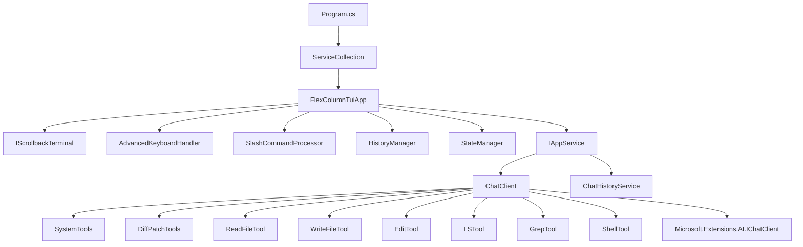
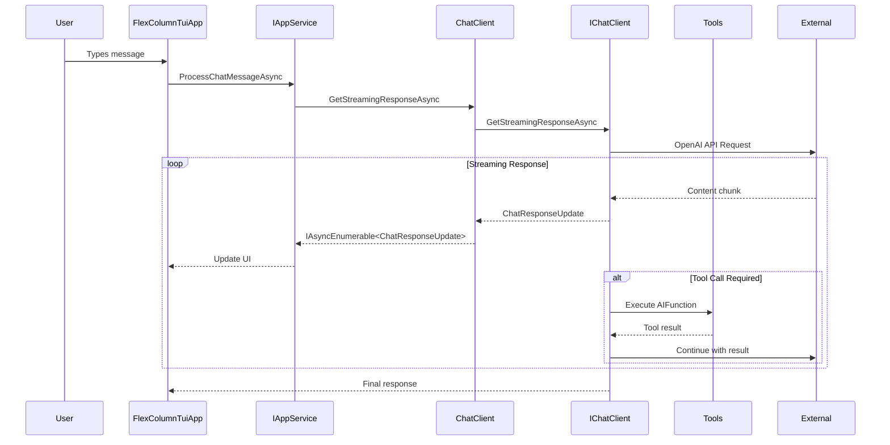

# MaxBot CLI Architecture

## Solution Structure

**Project Organization:**
- **MaxBot** - Core domain, services, and business logic library
- **MaxBot.TUI** - Text User Interface application (main executable)
- **MaxBot.PawPrints** - Terminal interface abstraction library
- **MaxBot.Tests** - Unit and integration tests

**Technology Stack:**
- .NET 9 with C# for cross-platform development and AOT compilation
- Spectre.Console for rich terminal UI rendering
- Microsoft.Extensions.AI for AI model integration and function calling
- FluentResults for functional error handling
- OpenAI SDK for AI service integration
- SharpToken for token counting and metrics
- Microsoft.Extensions.DependencyInjection for service registration

## Core Architecture

**Component Hierarchy:**


**Data Flow Architecture:**


## Service Layer Architecture

**Dependency Injection Pattern:**
```csharp
// Service registration in Program.cs
services.AddSingleton<IAnsiConsole>(AnsiConsole.Console);
services.AddSingleton<IWorkingDirectoryProvider, DefaultWorkingDirectoryProvider>();
services.AddSingleton<IAppService, AppService>();
services.AddSingleton<HistoryManager>();
services.AddSingleton<StateManager>();
services.AddSingleton<FlexColumnTuiApp>();
services.AddSingleton<IScrollbackTerminal, ScrollbackTerminal>();
```

**Service Lifecycle Management:**
- **Singleton Services**: Core application services, UI components, and state managers
- **Factory Pattern**: ChatClient creation with Result<T> pattern for error handling
- **Interface Segregation**: Clean abstractions (IAppService, IScrollbackTerminal, IWorkingDirectoryProvider)

**Error Handling Architecture:**
- **FluentResults Pattern**: Used throughout for functional error handling
- **Result<T> Returns**: ChatClient.Create() returns Result<ChatClient> for safe initialization
- **Exception Boundaries**: Try-catch blocks in tool implementations with structured error responses

## Domain Layer Architecture

**Configuration Management:**
```csharp
// JSON serialization with source generation for AOT compatibility
[JsonSerializable(typeof(MaxbotConfigurationRoot))]
public partial class MaxbotConfigurationContext : JsonSerializerContext

// Hierarchical configuration structure
MaxbotConfigurationRoot -> MaxbotConfiguration -> ApiProvider[], Profile[]
```

**Domain Entities:**
- **MaxbotConfiguration**: Central configuration with API providers, profiles, and tool approvals
- **ApiProvider**: External service configuration (OpenAI, custom endpoints)
- **Profile**: User-specific model and provider combinations
- **ChatHistory**: Message persistence and session management
- **ApiMetrics**: Token counting and usage tracking

**Working Directory Security:**
- **IWorkingDirectoryProvider**: Abstraction for secure path operations
- **DefaultWorkingDirectoryProvider**: Implementation with security boundaries
- **Path Validation**: All file operations validated against working directory

## Tool Architecture

**Tool Registration Pattern:**
```csharp
// Individual tool classes with AIFunction factory pattern
public AIFunction GetTool() => AIFunctionFactory.Create(MethodName, options);

// Centralized tool registration in ChatClient
var allTools = new List<AITool>();
allTools.AddRange(SystemTools.GetTools().Cast<AITool>());
allTools.Add(ReadFileTool.GetTool());
// ... other tools
```

**Tool Security Model:**
- **Tool Approval System**: readonly/all modes for security control
- **Working Directory Enforcement**: All file operations restricted to working directory
- **Parameter Validation**: Comprehensive input validation in each tool
- **Structured Responses**: XML-formatted tool responses with status and error handling

**Available Tools:**
- **SystemTools**: execute_command, attempt_completion
- **DiffPatchTools**: Unified diff generation and patch application
- **ReadFileTool**: Secure file reading with range support
- **WriteFileTool**: File creation and modification
- **EditTool**: In-place file editing
- **LSTool**: Directory listing and file system exploration
- **GrepTool**: Text search across files
- **ShellTool**: Command execution with platform detection

## Integration Architecture

**AI Service Integration:**
```csharp
// Microsoft.Extensions.AI abstraction layer
IChatClient chatClient = new OpenAIClient(credentials, options)
    .GetChatClient(modelId)
    .AsIChatClient()
    .AsBuilder()
    .ConfigureOptions(options => options.MaxOutputTokens = 16000)
    .UseFunctionInvocation()
    .Build();
```

**Cross-Platform Support:**
- **Platform Detection**: Runtime.InteropServices.RuntimeInformation for OS-specific behavior
- **Shell Selection**: Automatic shell detection (PowerShell/Zsh/Bash)
- **Path Handling**: Cross-platform path operations with proper separators

**Configuration Loading:**
- **JSON Configuration**: File-based configuration with validation
- **Environment Integration**: System information injection (username, hostname, working directory)
- **Profile Management**: Multiple AI provider and model configurations

## State Management Architecture

**Application State:**
- **ChatState Enum**: Input, Thinking, ToolExecution states
- **StateManager**: Centralized state coordination
- **HistoryManager**: Chat session persistence and loading
- **Event-Driven Updates**: Real-time UI updates via IAsyncEnumerable

**Terminal State Management:**
- **ScrollbackTerminal**: Static content rendering with dynamic updates
- **Cursor Management**: Hide/show cursor during operations
- **Content Clearing**: Efficient dynamic content updates without full redraws

## Diff/Patch Architecture

**Unified Diff System:**
```csharp
// Domain models for diff representation
public class UnifiedDiff
{
    public string OriginalFile { get; set; }
    public string ModifiedFile { get; set; }
    public List<DiffHunk> Hunks { get; set; }
}

public class DiffHunk
{
    public int OriginalStart { get; set; }
    public int OriginalCount { get; set; }
    public int ModifiedStart { get; set; }
    public int ModifiedCount { get; set; }
    public List<DiffLine> Lines { get; set; }
}
```

**Patch Application Strategies:**
- **PatchApplicator**: Exact line matching for precise patch application
- **FuzzyPatchApplicator**: Fuzzy matching with configurable strategies for resilient patching
- **Strategy Pattern**: Multiple fuzzy matching implementations (LineOffsetStrategy, WhitespaceNormalizationStrategy)

**Fuzzy Matching Architecture:**
```csharp
public interface IFuzzyMatchingStrategy
{
    FuzzyMatchResult FindBestMatch(List<string> fileLines, List<DiffLine> hunkLines, int preferredLocation);
}

// Longest Common Subsequence algorithm for fuzzy matching
public class LongestCommonSubsequence
{
    public static LcsResult<T> Calculate<T>(IList<T> sequence1, IList<T> sequence2, IEqualityComparer<T>? comparer = null)
}
```

**Key Architectural Patterns:**
- **Dependency Injection**: Service-oriented design with Microsoft.Extensions.DI
- **Streaming Architecture**: IAsyncEnumerable<ChatResponseUpdate> for real-time updates
- **Factory Pattern**: ChatClient creation with comprehensive error handling
- **Repository Pattern**: ChatHistoryService for session persistence
- **Strategy Pattern**: Multiple fuzzy matching strategies for diff operations
- **Command Pattern**: Tool execution with structured request/response
- **Observer Pattern**: Event-driven keyboard handling and UI updates
- **Functional Error Handling**: FluentResults throughout the application
- **Algorithm Pattern**: LCS algorithm implementation for fuzzy patch matching
