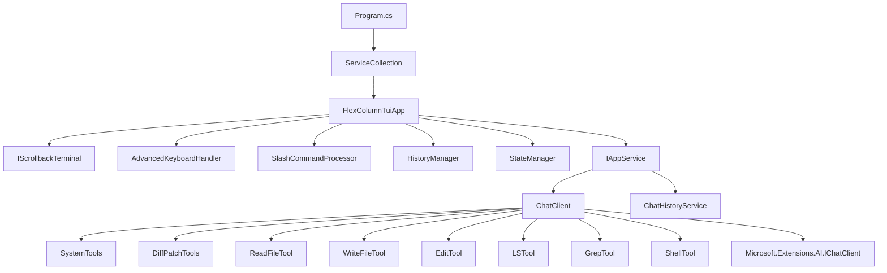
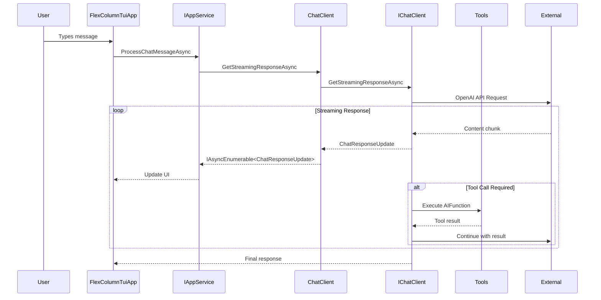

# MaxBot CLI Architecture

## Solution Structure

**Project Organization:**
- **MaxBot** - Core domain, services, and business logic library
- **MaxBot.TUI** - Text User Interface application (main executable)
- **MaxBot.PawPrints** - Terminal interface abstraction library
- **MaxBot.Tests** - Unit and integration tests

**Technology Stack:**
- .NET 9 with C# for cross-platform development and AOT compilation
- Spectre.Console for rich terminal UI rendering
- Microsoft.Extensions.AI for AI model integration and function calling
- FluentResults for functional error handling
- OpenAI SDK for AI service integration
- SharpToken for token counting and metrics
- Microsoft.Extensions.DependencyInjection for service registration

## Core Architecture

**Component Hierarchy:**


**Data Flow Architecture:**


## Service Layer Architecture

**Dependency Injection Pattern:**
```csharp
// Service registration in ServiceConfiguration.cs
public static void ConfigureServices(IServiceCollection services)
{
    // Add logging - file logging only to keep UI clean
    services.AddLogging(builder =>
    {
        builder.AddProvider(new FileLoggerProvider(LogLevel.Warning));
        builder.SetMinimumLevel(LogLevel.Warning);
    });

    // Add Spectre.Console
    services.AddSingleton<IAnsiConsole>(AnsiConsole.Console);

    // Add core services
    services.AddSingleton<IWorkingDirectoryProvider, DefaultWorkingDirectoryProvider>();
    
    // Create ChatClient with error handling
    var chatClientResult = ChatClient.Create(
        "maxbot.config.json",
        null, // Use default profile
        null,
        "chat",
        (details, color) => {},
        false
    );

    if (chatClientResult.IsSuccess)
    {
        services.AddSingleton(chatClientResult.Value);
    }
    else
    {
        throw new InvalidOperationException($"Failed to create ChatClient: {string.Join(", ", chatClientResult.Errors.Select(e => e.Message))}");
    }

    services.AddSingleton<IAppService, AppService>();
    services.AddSingleton<HistoryManager>();
    services.AddSingleton<StateManager>();

    // Add TUI infrastructure components
    services.AddSingleton<FlexColumnTuiApp>();
    services.AddSingleton<IScrollbackTerminal, ScrollbackTerminal>();
}
```

**Service Lifecycle Management:**
- **Singleton Services**: All core services use singleton lifetime for shared state
- **Factory Pattern**: ChatClient.Create() factory method with comprehensive error handling
- **Interface Segregation**: Clean abstractions (IAppService, IScrollbackTerminal, IWorkingDirectoryProvider)
- **Service Validation**: ChatClient creation validates configuration before service registration
- **Error Propagation**: Service registration failures throw InvalidOperationException with detailed error messages

**Service Dependencies:**
```csharp
// IAppService implementation with constructor injection
public class AppService : IAppService
{
    private readonly ChatClient _chatClient;
    private readonly ChatHistoryService _chatHistoryService;

    public AppService(ChatClient chatClient)
    {
        _chatClient = chatClient;
        _chatHistoryService = new ChatHistoryService(); // Direct instantiation
    }
}
```

**Error Handling Architecture:**
- **FluentResults Pattern**: Used throughout for functional error handling without exceptions
- **Result<T> Returns**: ChatClient.Create() returns Result<ChatClient> for safe initialization
- **Exception Boundaries**: Try-catch blocks in tool implementations with structured error responses
- **Service Validation**: Configuration validation during service registration prevents runtime failures
- **Graceful Degradation**: Services handle missing dependencies and configuration errors appropriately

## Domain Layer Architecture

**Configuration Management:**
```csharp
// JSON serialization with source generation for AOT compatibility
[JsonSerializable(typeof(MaxbotConfigurationRoot))]
public partial class MaxbotConfigurationContext : JsonSerializerContext

// Hierarchical configuration structure
MaxbotConfigurationRoot -> MaxbotConfiguration -> ApiProvider[], Profile[]
```

**Domain Entities:**
- **MaxbotConfiguration**: Central configuration with API providers, profiles, and tool approvals
- **ApiProvider**: External service configuration (OpenAI, custom endpoints)
- **Profile**: User-specific model and provider combinations
- **ChatHistory**: Message persistence and session management
- **ApiMetrics**: Token counting and usage tracking

**Working Directory Security:**
- **IWorkingDirectoryProvider**: Abstraction for secure path operations
- **DefaultWorkingDirectoryProvider**: Implementation with security boundaries
- **Path Validation**: All file operations validated against working directory

## Tool Architecture

**Tool Registration Pattern:**
```csharp
// Individual tool classes with AIFunction factory pattern
public class ReadTextFileTool
{
    private readonly MaxbotConfiguration _config;
    private readonly Action<string, ConsoleColor>? _llmResponseDetailsCallback;
    private readonly IWorkingDirectoryProvider _workingDirectoryProvider;

    public AIFunction GetTool()
    {
        return AIFunctionFactory.Create(
            ReadTextFile,
            new AIFunctionFactoryOptions
            {
                Name = "read_text_file",
                Description = "Reads and returns the content of a text file from the local filesystem..."
            });
    }
}

// Centralized tool registration in ChatClient constructor
var allTools = new List<AITool>();
allTools.AddRange(SystemTools.GetTools().Cast<AITool>());
allTools.AddRange(DiffPatchTools.GetTools().Cast<AITool>());
allTools.Add(ReadTextFileTool.GetTool());
allTools.Add(ReadImageFileTool.GetTool());
allTools.Add(WriteFileTool.GetTool());
allTools.Add(EditTool.GetTool());
allTools.Add(LSTool.GetTool());
allTools.Add(GrepTool.GetTool());
allTools.Add(ShellTool.GetTool());

ChatOptions = new ChatOptions { Tools = allTools };
```

**Tool Security Model:**
```csharp
// Working directory validation in every file tool
private bool IsPathInWorkingDirectory(string absolutePath, string workingDirectory)
{
    try
    {
        var normalizedAbsolutePath = Path.GetFullPath(absolutePath);
        var normalizedWorkingDirectory = Path.GetFullPath(workingDirectory);

        // Platform-specific case sensitivity handling
        return normalizedAbsolutePath.StartsWith(normalizedWorkingDirectory, 
            RuntimeInformation.IsOSPlatform(OSPlatform.Windows) ? 
                StringComparison.OrdinalIgnoreCase : StringComparison.Ordinal);
    }
    catch { return false; }
}

// Tool approval checking
if (requiresApproval && _config.ToolApprovals.Equals("readonly", StringComparison.OrdinalIgnoreCase))
{
    return "Execution of this command requires approval. Please run with --tool-approvals all...";
}
```

**Tool Implementation Pattern:**
- **Constructor Injection**: MaxbotConfiguration, callback delegates, and IWorkingDirectoryProvider
- **Parameter Validation**: ValidateParameters() method with comprehensive input checking
- **Security Boundaries**: IsPathInWorkingDirectory() and HasReadPermission() validation
- **Structured Responses**: XML-formatted responses with status, error handling, and metadata
- **Error Handling**: Try-catch blocks with specific exception types and debug information
- **Callback Integration**: Optional llmResponseDetailsCallback for UI feedback

**Tool Response Format:**
```xml
<tool_response tool_name="read_text_file">
    <notes>Successfully read text file path/to/file.txt
Total lines: 150
Content size: 4567 characters</notes>
    <result status="SUCCESS" absolute_path="/full/path/to/file.txt" sha256_checksum="abc123..." />
    <content_on_disk>actual file content here</content_on_disk>
</tool_response>

<!-- Error response format -->
<tool_response tool_name="read_text_file">
    <result status="FAILED" />
    <error>File not found: /path/to/missing/file.txt</error>
</tool_response>
```

**Available Tools:**
- **SystemTools**: execute_command (with platform detection), attempt_completion (task completion)
- **DiffPatchTools**: generate_code_patch, apply_code_patch, preview_patch_application
- **ReadTextFileTool**: Secure file reading with range support (offset/limit parameters)
- **ReadImageFileTool**: Image file reading with base64 encoding
- **WriteFileTool**: File creation and modification with backup and validation
- **EditTool**: In-place file editing with search/replace operations
- **LSTool**: Directory listing and file system exploration with filtering
- **GrepTool**: Text search across files with regex support
- **ShellTool**: Command execution with cross-platform shell detection

**Tool Security Architecture:**
- **Path Validation**: All file operations validate paths are within working directory
- **Permission Checking**: File access permissions validated before operations
- **Input Sanitization**: Parameter validation prevents injection attacks
- **Error Message Security**: Generic error messages prevent information disclosure
- **Approval System**: Two-tier approval system (readonly/all) for operation control
- **Debug Mode**: Conditional detailed error information for development

## Integration Architecture

**AI Service Integration:**
```csharp
// Microsoft.Extensions.AI abstraction layer
IChatClient chatClient = new OpenAIClient(credentials, options)
    .GetChatClient(modelId)
    .AsIChatClient()
    .AsBuilder()
    .ConfigureOptions(options => options.MaxOutputTokens = 16000)
    .UseFunctionInvocation()
    .Build();
```

**Cross-Platform Support:**
- **Platform Detection**: Runtime.InteropServices.RuntimeInformation for OS-specific behavior
- **Shell Selection**: Automatic shell detection (PowerShell/Zsh/Bash)
- **Path Handling**: Cross-platform path operations with proper separators

**Configuration Loading:**
- **JSON Configuration**: File-based configuration with validation
- **Environment Integration**: System information injection (username, hostname, working directory)
- **Profile Management**: Multiple AI provider and model configurations

## State Management Architecture

**Application State:**
- **ChatState Enum**: Input, Thinking, ToolExecution states
- **StateManager**: Centralized state coordination
- **HistoryManager**: Chat session persistence and loading
- **Event-Driven Updates**: Real-time UI updates via IAsyncEnumerable

**Terminal State Management:**
- **ScrollbackTerminal**: Static content rendering with dynamic updates
- **Cursor Management**: Hide/show cursor during operations
- **Content Clearing**: Efficient dynamic content updates without full redraws

## Diff/Patch Architecture

**Unified Diff System:**
```csharp
// Domain models for diff representation
public class UnifiedDiff
{
    public string OriginalFile { get; set; }
    public string ModifiedFile { get; set; }
    public List<DiffHunk> Hunks { get; set; }
}

public class DiffHunk
{
    public int OriginalStart { get; set; }
    public int OriginalCount { get; set; }
    public int ModifiedStart { get; set; }
    public int ModifiedCount { get; set; }
    public List<DiffLine> Lines { get; set; }
}
```

**Patch Application Strategies:**
- **PatchApplicator**: Exact line matching for precise patch application
- **FuzzyPatchApplicator**: Fuzzy matching with configurable strategies for resilient patching
- **Strategy Pattern**: Multiple fuzzy matching implementations (LineOffsetStrategy, WhitespaceNormalizationStrategy)

**Fuzzy Matching Architecture:**
```csharp
public interface IFuzzyMatchingStrategy
{
    FuzzyMatchResult FindBestMatch(List<string> fileLines, List<DiffLine> hunkLines, int preferredLocation);
}

// Longest Common Subsequence algorithm for fuzzy matching
public class LongestCommonSubsequence
{
    public static LcsResult<T> Calculate<T>(IList<T> sequence1, IList<T> sequence2, IEqualityComparer<T>? comparer = null)
}
```

**Key Architectural Patterns:**
- **Dependency Injection**: Service-oriented design with Microsoft.Extensions.DI
- **Streaming Architecture**: IAsyncEnumerable<ChatResponseUpdate> for real-time updates
- **Factory Pattern**: ChatClient creation with comprehensive error handling
- **Repository Pattern**: ChatHistoryService for session persistence
- **Strategy Pattern**: Multiple fuzzy matching strategies for diff operations
- **Command Pattern**: Tool execution with structured request/response
- **Observer Pattern**: Event-driven keyboard handling and UI updates
- **Functional Error Handling**: FluentResults throughout the application
- **Algorithm Pattern**: LCS algorithm implementation for fuzzy patch matching
