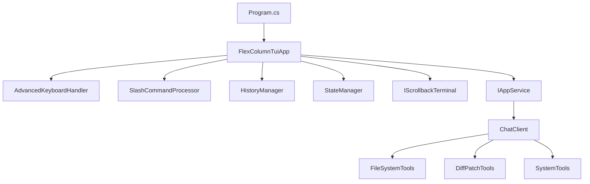
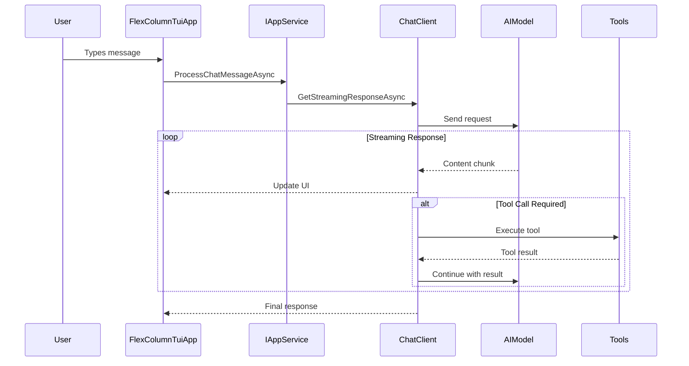

# MaxBot CLI Architecture

## Core Architecture

**Technology Stack:**
- .NET 9 with C# for cross-platform development
- Spectre.Console for rich terminal UI rendering
- Microsoft.Extensions.AI for AI model integration
- Dependency injection with Microsoft.Extensions.DependencyInjection

**Component Hierarchy:**

**Data Flow Architecture:**

**State Management:**
- ChatState enum for UI state (Input, Thinking, ToolExecution)
- HistoryManager for chat message persistence
- StateManager for application state coordination
- Event-driven architecture with custom keyboard handler

**Key Architectural Patterns:**
- **Dependency Injection**: Service-oriented design with DI container
- **Streaming Architecture**: IAsyncEnumerable for real-time updates
- **Event-Driven Input**: Custom AdvancedKeyboardHandler for keyboard events
- **Service Layer**: Clean separation between UI and business logic
- **Tool Integration**: Microsoft.Extensions.AI function calling system
