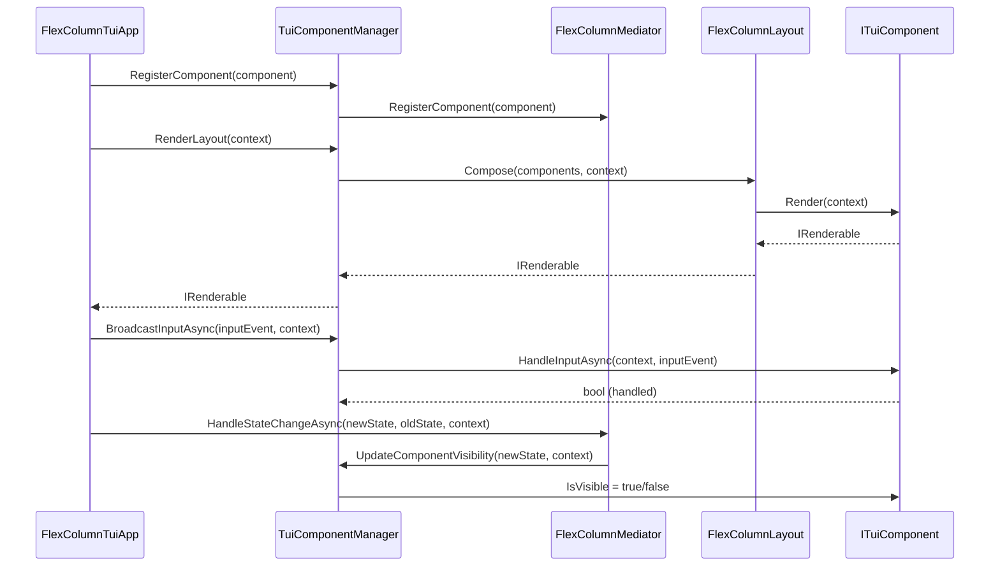

# Mogzi Terminal User Interface (TUI) Design

## 1. Core Philosophy

The Mogzi TUI has been refactored from a monolithic architecture to a modern, component-based design. This new architecture emphasizes modularity, reusability, and maintainability. By breaking the UI into independent, reusable components, we can manage complexity, improve testability, and enable more flexible layouts.

The core principles of this design are:
- **Componentization**: The UI is composed of distinct, self-contained components (e.g., `InputPanel`, `FooterPanel`).
- **Centralized Management**: A `TuiComponentManager` handles the lifecycle and registration of all components.
- **Decoupled Communication**: The **Mediator pattern** (`FlexColumnMediator`) facilitates communication between components, preventing direct dependencies.
- **Flexible Layouts**: A `FlexColumnLayout` system composes components into a final view, allowing for adaptable UI structures.
- **State-Driven UI**: Component visibility and behavior are driven by the application's state (`ChatState`).

## 2. Component-Based Architecture

The TUI is built around a set of core interfaces that define the component system.

### 2.1. Key Interfaces

-   **`ITuiComponent`**: The base interface for all UI components. It defines the contract for rendering, input handling, and lifecycle management.
-   **`ITuiComponentManager`**: Responsible for registering, managing, and rendering all UI components. It acts as the central hub for the component system.
-   **`ITuiMediator`**: Defines the contract for coordinating interactions between components, ensuring they remain decoupled.
-   **`ITuiLayout`**: Defines how components are arranged and composed into a single `IRenderable` view.
-   **`IRenderContext`**: Provides components with access to shared services, application state, and rendering utilities.

### 2.2. Architectural Diagram

The following diagram illustrates the relationships between the key architectural interfaces:

```mermaid
classDiagram
    class ITuiComponent {
        +string Name
        +bool IsVisible
        +Render(IRenderContext) IRenderable
        +HandleInputAsync(IRenderContext, object) Task~bool~
        +InitializeAsync(IRenderContext) Task
        +DisposeAsync() Task
    }
    
    class ITuiComponentManager {
        +Components IReadOnlyDictionary~string, ITuiComponent~
        +CurrentLayout ITuiLayout
        +RegisterComponent(ITuiComponent) void
        +RenderLayout(IRenderContext) IRenderable
        +BroadcastInputAsync(object, IRenderContext) Task~bool~
        +UpdateComponentVisibility(ChatState, IRenderContext) void
    }
    
    class ITuiMediator {
        +Name string
        +HandleUserInputAsync(string, ITuiContext) Task
        +HandleKeyPressAsync(KeyPressEventArgs, ITuiContext) Task
        +HandleCharacterTypedAsync(CharacterTypedEventArgs, ITuiContext) Task
        +HandleStateChangeAsync(ChatState, ChatState, ITuiContext) Task
        +NotifyComponentAsync(string, object, ITuiContext) Task
    }
    
    class ITuiLayout {
        +Name string
        +GetRequiredComponents() IEnumerable~string~
        +Compose(IReadOnlyDictionary~string, ITuiComponent~, IRenderContext) IRenderable
        +ValidateComponents(IReadOnlyDictionary~string, ITuiComponent~) bool
    }
    
    class InputPanel {
        +Render(IRenderContext) IRenderable
        +HandleInputAsync(IRenderContext, object) Task~bool~
    }
    
    class AutocompletePanel {
        +Render(IRenderContext) IRenderable
        +HandleInputAsync(IRenderContext, object) Task~bool~
    }
    
    class ProgressPanel {
        +Render(IRenderContext) IRenderable
        +HandleInputAsync(IRenderContext, object) Task~bool~
    }
    
    class FooterPanel {
        +Render(IRenderContext) IRenderable
        +HandleInputAsync(IRenderContext, object) Task~bool~
    }
    
    ITuiComponentManager --* ITuiComponent : manages
    ITuiComponentManager --* ITuiLayout : uses
    ITuiMediator --o ITuiComponent : coordinates
    InputPanel ..|> ITuiComponent : implements
    AutocompletePanel ..|> ITuiComponent : implements
    ProgressPanel ..|> ITuiComponent : implements
    FooterPanel ..|> ITuiComponent : implements
```



### 2.3. Component Flow and Lifecycle

The `TuiComponentManager` orchestrates the flow of data and user input through the component system.



-   **Initialization**: Components are registered with the `TuiComponentManager` at startup.
-   **Rendering**: The manager delegates rendering to the current `ITuiLayout`, which composes the visible components into a single `IRenderable` object for Spectre.Console.
-   **Input Handling**: Input events are broadcast to all visible components. A component can "handle" an event to stop its propagation.
-   **State Changes**: When the application state changes, the mediator notifies the manager to update the visibility of components accordingly.

## 3. Core UI Components

The TUI is composed of several specialized components, each with a distinct responsibility.

-   **`WelcomePanel`**: Displays the initial welcome message, branding, and version information. Visible only at startup.
-   **`InputPanel`**: Manages the main user input area, including text entry, cursor movement, and history navigation.
-   **`AutocompletePanel`**: Displays autocomplete suggestions below the input panel. It handles suggestion navigation and selection.
-   **`UserSelectionPanel`**: Shows interactive options for slash commands, allowing the user to make a selection.
-   **`ProgressPanel`**: Renders animated progress indicators and status messages during AI processing or tool execution.
-   **`FooterPanel`**: Displays persistent status information at the bottom of the screen, such as the current working directory, AI model, and token usage.

## 4. State Management and UI Updates

The visibility and behavior of UI components are driven by the application's state, which is represented by the `ChatState` enum (`Input`, `Thinking`, `ToolExecution`).

The `TuiComponentManager` is responsible for mapping the application state to component visibility.

```csharp
// In TuiComponentManager.cs
public void UpdateComponentVisibility(ChatState currentState, IRenderContext context)
{
    foreach (var component in _components.Values)
    {
        component.IsVisible = component.Name switch
        {
            "Welcome" => currentState == ChatState.Input && context.InputContext.IsFirstRender,
            "Input" => currentState == ChatState.Input,
            "Autocomplete" => currentState == ChatState.Input && context.InputContext.HasSuggestions,
            "UserSelection" => currentState == ChatState.Input && context.UserSelectionManager.IsActive,
            "Progress" => currentState == ChatState.Thinking || currentState == ChatState.ToolExecution,
            "Footer" => true, // Always visible
            _ => component.IsVisible
        };
    }
}
```

When the state transitions (e.g., from `Input` to `Thinking`), the `FlexColumnMediator` calls this method to ensure only the relevant components are visible and rendered.

## 5. Layout and Rendering

The `FlexColumnLayout` is the primary layout system. It arranges visible components into a vertical column, consuming the full terminal window. It uses Spectre.Console's `Rows` and `Columns` to structure the final output.

The rendering process is as follows:
1.  The main application requests a renderable from the `TuiComponentManager`.
2.  The manager gets the `IRenderable` for each visible component by calling its `Render()` method.
3.  It passes the dictionary of components to the `FlexColumnLayout`.
4.  The layout class arranges the renderables into a structured `Rows` object.
5.  This final `IRenderable` is returned to the application to be drawn by Spectre.Console.

## 6. Dependency Injection

All components, managers, and mediators are registered with the dependency injection container at startup. This ensures that services are properly instantiated and dependencies are resolved automatically.

```csharp
// In ServiceConfiguration.cs
private static void ConfigureServices(IServiceCollection services)
{
    // ... other services

    // TUI Components
    services.AddSingleton<ITuiComponent, WelcomePanel>();
    services.AddSingleton<ITuiComponent, InputPanel>();
    services.AddSingleton<ITuiComponent, AutocompletePanel>();
    services.AddSingleton<ITuiComponent, UserSelectionPanel>();
    services.AddSingleton<ITuiComponent, ProgressPanel>();
    services.AddSingleton<ITuiComponent, FooterPanel>();

    // TUI Management
    services.AddSingleton<ITuiLayout, FlexColumnLayout>();
    services.AddSingleton<ITuiMediator, FlexColumnMediator>();
    services.AddSingleton<ITuiComponentManager, TuiComponentManager>();

    // Main TUI Application
    services.AddSingleton<FlexColumnTuiApp>();
}
```

This modular and decoupled design provides a robust foundation for the Mogzi TUI, enabling future extensions and features to be added with minimal friction.
