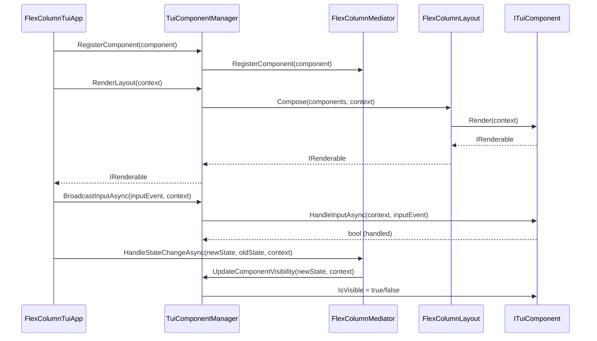
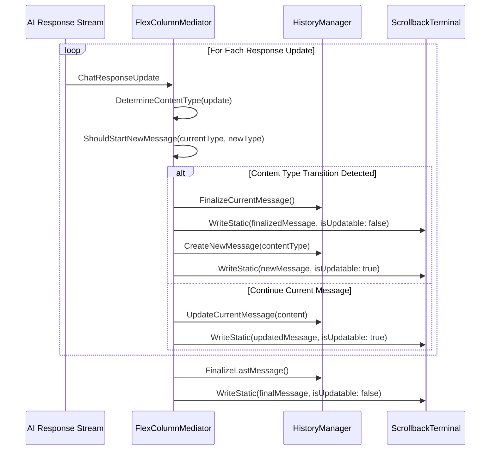
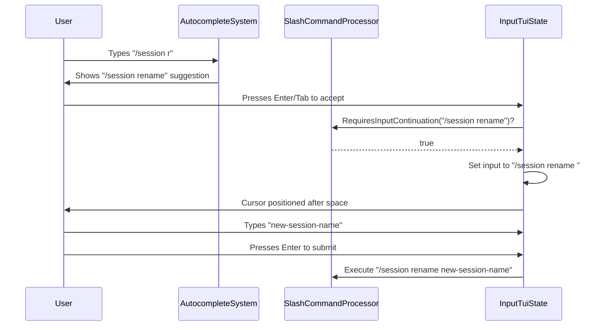

# Mogzi Terminal User Interface (TUI) Design

## 1. Core Philosophy

The Mogzi TUI has been refactored from a monolithic architecture to a modern, component-based design. This new architecture emphasizes modularity, reusability, and maintainability. By breaking the UI into independent, reusable components, we can manage complexity, improve testability, and enable more flexible layouts.

The core principles of this design are:
- **Componentization**: The UI is composed of distinct, self-contained components (e.g., `InputPanel`, `FooterPanel`).
- **Centralized Management**: A `TuiComponentManager` handles the lifecycle and registration of all components.
- **Decoupled Communication**: The **Mediator pattern** (`FlexColumnMediator`) facilitates communication between components, preventing direct dependencies.
- **Flexible Layouts**: A `FlexColumnLayout` system composes components into a final view, allowing for adaptable UI structures.
- **State-Driven UI**: Component visibility and behavior are driven by the application's state (`ChatState`).

## 2. Component-Based Architecture

The TUI is built around a set of core interfaces that define the component system.

### 2.1. Key Interfaces

-   **`ITuiComponent`**: The base interface for all UI components. It defines the contract for rendering, input handling, and lifecycle management.
-   **`ITuiComponentManager`**: Responsible for registering, managing, and rendering all UI components. It acts as the central hub for the component system.
-   **`IAiProcessingCoordinator`**: Defines the contract for coordinating AI processing workflows and component interactions, ensuring they remain decoupled.
-   **`ITuiLayout`**: Defines how components are arranged and composed into a single `IRenderable` view.
-   **`IRenderContext`**: Provides components with access to shared services, application state, and rendering utilities.

### 2.2. Architectural Diagram

The following diagram illustrates the relationships between the key architectural interfaces:

```mermaid
classDiagram
    class ITuiComponent {
        +string Name
        +bool IsVisible
        +Render(IRenderContext) IRenderable
        +HandleInputAsync(IRenderContext, object) Task~bool~
        +InitializeAsync(IRenderContext) Task
        +DisposeAsync() Task
    }
    
    class ITuiComponentManager {
        +Components IReadOnlyDictionary~string, ITuiComponent~
        +CurrentLayout ITuiLayout
        +RegisterComponent(ITuiComponent) void
        +RenderLayout(IRenderContext) IRenderable
        +BroadcastInputAsync(object, IRenderContext) Task~bool~
        +UpdateComponentVisibility(ChatState, IRenderContext) void
    }
    
    class IAiProcessingCoordinator {
        +Name string
        +StartAiProcessingWorkflow(ITuiContext) Task
        +NotifyHistoryChangedAsync() Task
    }
    
    class ITuiLayout {
        +Name string
        +GetRequiredComponents() IEnumerable~string~
        +Compose(IReadOnlyDictionary~string, ITuiComponent~, IRenderContext) IRenderable
        +ValidateComponents(IReadOnlyDictionary~string, ITuiComponent~) bool
    }
    
    class InputPanel {
        +Render(IRenderContext) IRenderable
        +HandleInputAsync(IRenderContext, object) Task~bool~
    }
    
    class AutocompletePanel {
        +Render(IRenderContext) IRenderable
        +HandleInputAsync(IRenderContext, object) Task~bool~
    }
    
    class ProgressPanel {
        +Render(IRenderContext) IRenderable
        +HandleInputAsync(IRenderContext, object) Task~bool~
    }
    
    class FooterPanel {
        +Render(IRenderContext) IRenderable
        +HandleInputAsync(IRenderContext, object) Task~bool~
    }
    
    ITuiComponentManager --* ITuiComponent : manages
    ITuiComponentManager --* ITuiLayout : uses
    IAiProcessingCoordinator --o ITuiComponent : coordinates
    InputPanel ..|> ITuiComponent : implements
    AutocompletePanel ..|> ITuiComponent : implements
    ProgressPanel ..|> ITuiComponent : implements
    FooterPanel ..|> ITuiComponent : implements
```



### 2.3. Component Flow and Lifecycle

The `TuiComponentManager` orchestrates the flow of data and user input through the component system.



-   **Initialization**: Components are registered with the `TuiComponentManager` at startup.
-   **Rendering**: The manager delegates rendering to the current `ITuiLayout`, which composes the visible components into a single `IRenderable` object for Spectre.Console.
-   **Input Handling**: Input events are broadcast to all visible components. A component can "handle" an event to stop its propagation.
-   **State Changes**: When the application state changes, the mediator notifies the manager to update the visibility of components accordingly.

## 3. Core UI Components

The TUI is composed of several specialized components, each with a distinct responsibility.

-   **`WelcomePanel`**: Displays the initial welcome message, branding, and version information. Visible only at startup.
-   **`InputPanel`**: Manages the main user input area, including text entry, cursor movement, and history navigation.
-   **`AutocompletePanel`**: Displays autocomplete suggestions below the input panel. It handles suggestion navigation and selection.
-   **`UserSelectionPanel`**: Shows interactive options for slash commands, allowing the user to make a selection.
-   **`ProgressPanel`**: Renders animated progress indicators and status messages during AI processing or tool execution.
-   **`FooterPanel`**: Displays persistent status information at the bottom of the screen, such as the current working directory, AI model, and token usage.

## 4. State Management and UI Updates

The visibility and behavior of UI components are driven by the application's state, which is represented by the `ChatState` enum (`Input`, `Thinking`, `ToolExecution`).

The `TuiComponentManager` is responsible for mapping the application state to component visibility.

```csharp
// In TuiComponentManager.cs
public void UpdateComponentVisibility(ChatState currentState, IRenderContext context)
{
    foreach (var component in _components.Values)
    {
        component.IsVisible = component.Name switch
        {
            "Welcome" => currentState == ChatState.Input && context.InputContext.IsFirstRender,
            "Input" => currentState == ChatState.Input,
            "Autocomplete" => currentState == ChatState.Input && context.InputContext.HasSuggestions,
            "UserSelection" => currentState == ChatState.Input && context.UserSelectionManager.IsActive,
            "Progress" => currentState == ChatState.Thinking || currentState == ChatState.ToolExecution,
            "Footer" => true, // Always visible
            _ => component.IsVisible
        };
    }
}
```

When the state transitions (e.g., from `Input` to `Thinking`), the `FlexColumnMediator` calls this method to ensure only the relevant components are visible and rendered.

## 5. Layout and Rendering

The `FlexColumnLayout` is the primary layout system. It arranges visible components into a vertical column, consuming the full terminal window. It uses Spectre.Console's `Rows` and `Columns` to structure the final output.

The rendering process is as follows:
1.  The main application requests a renderable from the `TuiComponentManager`.
2.  The manager gets the `IRenderable` for each visible component by calling its `Render()` method.
3.  It passes the dictionary of components to the `FlexColumnLayout`.
4.  The layout class arranges the renderables into a structured `Rows` object.
5.  This final `IRenderable` is returned to the application to be drawn by Spectre.Console.

## 6. Dependency Injection

All components, managers, and mediators are registered with the dependency injection container at startup. This ensures that services are properly instantiated and dependencies are resolved automatically.

```csharp
// In ServiceConfiguration.cs
private static void ConfigureServices(IServiceCollection services)
{
    // ... other services

    // TUI Components
    services.AddSingleton<ITuiComponent, WelcomePanel>();
    services.AddSingleton<ITuiComponent, InputPanel>();
    services.AddSingleton<ITuiComponent, AutocompletePanel>();
    services.AddSingleton<ITuiComponent, UserSelectionPanel>();
    services.AddSingleton<ITuiComponent, ProgressPanel>();
    services.AddSingleton<ITuiComponent, FooterPanel>();

    // TUI Management
    services.AddSingleton<ITuiLayout, FlexColumnLayout>();
    services.AddSingleton<IAiProcessingCoordinator, AiProcessingCoordinator>();
    services.AddSingleton<ITuiComponentManager, TuiComponentManager>();

    // Main TUI Application
    services.AddSingleton<FlexColumnTuiApp>();
}
```

## 7. Event Handler Timing Considerations

### 7.1. Async Void Event Handler Timing Issues

**Critical Design Principle**: Event handlers in TUI applications must carefully manage timing between UI feedback display and asynchronous operations to prevent feedback messages from being cleared before users can see them.

#### Problem Pattern
```csharp
// ❌ PROBLEMATIC: Async void can clear UI after feedback is displayed
private async void OnSessionClearRequested()
{
    await sessionManager.ClearCurrentSessionAsync();  // Async operation
    _scrollbackTerminal.Initialize();                 // Clears feedback message
    RenderInitialContent();                          // User never sees feedback
}
```

#### Solution Pattern
```csharp
// ✅ CORRECT: Synchronous lambda for immediate UI operations
_processor.ClearRequested += () => {
    _historyManager.ClearHistory();
    _scrollbackTerminal.Initialize();
    RenderInitialContent();
};

// ✅ CORRECT: Async void without UI clearing
private async void OnSessionClearRequested()
{
    await sessionManager.ClearCurrentSessionAsync();
    _historyManager.ClearHistory();
    // No scrollback clearing - allows feedback to persist
}
```

#### Key Design Guidelines
- **UI Feedback First**: Component feedback must be displayed before any UI clearing operations
- **Synchronous UI Operations**: Use synchronous lambdas for immediate UI state changes  
- **Async Data Operations**: Separate data persistence (async) from UI operations (sync)
- **Timing Awareness**: Understand that `async void` runs asynchronously and can interfere with component rendering

## 8. Message Boundary Detection System

### 7.1. Problem Statement

The TUI application faced a critical UI/UX issue where assistant messages and tool execution results were not being properly sequenced and separated in scrollback history. All streaming content (text + tool calls + tool results) was being appended to a single ChatMessage, causing poor message boundaries and unclear conversation flow.

### 7.2. Solution Architecture

The **Message Boundary Detection System** was implemented in `FlexColumnMediator` to create distinct ChatMessage objects for different content types, ensuring proper message sequencing and boundaries.

#### Content Type Classification

```csharp
// Content type enumeration for boundary detection
private enum ContentType
{
    None,           // No content or unknown
    Text,           // Regular assistant text response
    FunctionCall,   // Tool invocation
    FunctionResult  // Tool execution result
}

// Content type detection logic
private static ContentType DetermineContentType(ChatResponseUpdate responseUpdate)
{
    // Check for function call/result content first (highest priority)
    if (responseUpdate.Contents != null)
    {
        if (responseUpdate.Contents.Any(content => content is FunctionCallContent))
            return ContentType.FunctionCall;
        
        if (responseUpdate.Contents.Any(content => content is FunctionResultContent))
            return ContentType.FunctionResult;
    }
    
    // Check for text content
    if (!string.IsNullOrEmpty(responseUpdate.Text))
        return ContentType.Text;
    
    return ContentType.None;
}
```

#### Boundary Decision Logic

```csharp
// Message boundary decision logic
private static bool ShouldStartNewMessage(ContentType currentType, ContentType newType, ChatMessage? currentMessage)
{
    // Always start a new message if we don't have one
    if (currentMessage == null)
        return true;
    
    // Start new message when content type changes
    // This creates boundaries between: Text → Tool → Text sequences
    if (currentType != newType)
        return true;
    
    // For function calls/results, always create separate messages
    // This ensures each tool invocation and result is a distinct history entry
    if (newType is ContentType.FunctionCall or ContentType.FunctionResult)
        return true;
    
    // Continue with current message for same content type
    return false;
}
```

### 7.3. AI Behavior Pattern Handling

The system robustly handles non-deterministic AI model behavior:

- **Pattern A**: Text → Tools → Text (creates 2 assistant messages)
- **Pattern B**: Tools → Text (creates 1 assistant message)

This ensures consistent UX regardless of whether the AI provides initial text before tool execution or goes directly to tool calls.

### 7.4. Implementation Flow



### 7.5. Message Factory Pattern

```csharp
// Message factory for different content types
private static ChatMessage CreateMessageForContentType(ChatResponseUpdate responseUpdate, ContentType contentType)
{
    return contentType switch
    {
        ContentType.Text => new ChatMessage(ChatRole.Assistant, responseUpdate.Text ?? ""),
        ContentType.FunctionCall => new ChatMessage(ChatRole.Assistant, responseUpdate.Contents ?? []),
        ContentType.FunctionResult => new ChatMessage(ChatRole.Assistant, responseUpdate.Contents ?? []),
        _ => new ChatMessage(ChatRole.Assistant, "")
    };
}
```

### 7.6. Content Validation

```csharp
// Content validation to prevent empty messages
private static bool HasMeaningfulContent(ChatMessage message)
{
    // Text messages need non-empty text
    if (!string.IsNullOrWhiteSpace(message.Text))
        return true;
    
    // Function messages need content
    if (message.Contents != null && message.Contents.Count > 0)
        return true;
    
    return false;
}
```

### 7.7. Testing Strategy

The system is validated through comprehensive black-box acceptance tests:

```csharp
[Fact]
public async Task ToolExecutionWorkflow_ShowsProperMessageSequenceInScrollbackHistory()
{
    // Test verifies:
    // 1. User messages are properly formatted and standalone
    // 2. Assistant messages have proper ✦ symbol boundaries
    // 3. Tool execution results are separated from text responses
    // 4. Message chronological order is maintained
    // 5. Both AI behavior patterns (A and B) are handled correctly
}
```

### 7.8. Key Benefits

- **Clear Message Boundaries**: Each message type is visually distinct and properly separated
- **Improved Conversation Flow**: Users can easily follow the sequence of interactions
- **Robust AI Handling**: Works with both deterministic and non-deterministic AI behavior
- **Preserved Chat History**: Maintains proper ChatMessage objects for AI context
- **Enhanced UX**: Professional chat interface matching user expectations

### 7.9. Future Extensibility

The system is designed for extensibility:

- **New Content Types**: Additional content types can be added to the enum
- **Custom Boundary Logic**: Boundary decision logic can be enhanced for specific use cases
- **Message Formatting**: Message factory pattern supports different formatting strategies
- **Validation Rules**: Content validation can be customized per message type

## 9. Input Continuation Command Pattern

### 9.1. Problem Statement

Certain slash commands require additional user input after being selected from autocomplete suggestions. For example, `/session rename` needs the user to provide a new session name. The original implementation had a brittle, hardcoded solution that was not extensible for future commands with similar requirements.

### 9.2. Solution Architecture

A generic **Input Continuation Command Pattern** was implemented to handle commands that need to populate the input field for continued typing instead of executing immediately.

#### Command Configuration

```csharp
// Enhanced SlashCommand record with input continuation flag
public sealed record SlashCommand(
    string Name, 
    string Description, 
    Func<string, ITuiComponent>? ExecuteWithComponent = null, 
    bool IsInteractive = false, 
    bool RequiresInputContinuation = false  // New flag
);

// Command registration with input continuation
_commands["/session rename"] = new SlashCommand(
    "/session rename", 
    "Rename the current session", 
    GetSessionRenameComponent, 
    RequiresInputContinuation: true
);
```

#### Generic Detection Logic

```csharp
// Generic method to check if command requires input continuation
public bool RequiresInputContinuation(string input)
{
    if (string.IsNullOrWhiteSpace(input) || !input.StartsWith("/"))
        return false;

    var inputLower = input.ToLower();

    // Check for multi-word commands first
    var matchingCommand = _commands.Keys
        .Where(inputLower.StartsWith)
        .OrderByDescending(cmd => cmd.Length)
        .FirstOrDefault();

    if (matchingCommand != null)
        return _commands[matchingCommand].RequiresInputContinuation;

    // Fallback to single-word command check
    var parts = input.Split(' ', 2, StringSplitOptions.RemoveEmptyEntries);
    var command = parts[0].ToLower();

    return _commands.TryGetValue(command, out var cmd) && cmd.RequiresInputContinuation;
}
```

### 9.3. Autocomplete Integration

The pattern integrates seamlessly with the existing autocomplete system in `InputTuiState`:

```csharp
private async Task AcceptAutocompleteSuggestion(ITuiContext context)
{
    context.AutocompleteManager.AcceptSuggestion(context.InputContext);

    var trimmedInput = context.InputContext.CurrentInput.Trim();
    if (context.SlashCommandProcessor?.IsValidCommand(trimmedInput) == true)
    {
        // Generic check for input continuation requirement
        if (context.SlashCommandProcessor.RequiresInputContinuation(trimmedInput))
        {
            // Populate input field with command + space for continued typing
            context.InputContext.CurrentInput = trimmedInput + " ";
            context.InputContext.CursorPosition = context.InputContext.CurrentInput.Length;
            context.InputContext.ClearAutocomplete();
            
            context.Logger.LogTrace("Populated input field with '{Command} ' for user to continue typing", trimmedInput);
            return;
        }

        // For other commands, submit immediately
        context.InputContext.CurrentInput = trimmedInput;
        context.InputContext.CursorPosition = trimmedInput.Length;
        await SubmitCurrentInput(context);
    }
}
```

### 9.4. User Experience Flow



### 9.5. Extensibility Benefits

This pattern provides several key advantages:

- **Declarative Configuration**: New input continuation commands can be added by simply setting the `RequiresInputContinuation` flag
- **No Code Duplication**: The logic is generic and reusable for any command type
- **Consistent UX**: All input continuation commands behave identically
- **Maintainable**: Changes to the pattern affect all commands uniformly

#### Adding New Input Continuation Commands

```csharp
// Example: Adding a new command that requires input continuation
_commands["/config set"] = new SlashCommand(
    "/config set", 
    "Set a configuration value", 
    GetConfigSetComponent, 
    RequiresInputContinuation: true
);

// No additional code changes needed - the pattern handles it automatically
```

### 9.6. Command Type Classification

The system now supports three distinct command types:

1. **Immediate Commands**: Execute immediately when selected (e.g., `/help`, `/clear`)
2. **Interactive Commands**: Show selection UI for user choice (e.g., `/session list`, `/tool-approvals`)
3. **Input Continuation Commands**: Populate input field for additional typing (e.g., `/session rename`)

### 9.7. Testing Strategy

The pattern is validated through existing acceptance tests that verify:

- Commands marked with `RequiresInputContinuation: true` populate the input field correctly
- The cursor is positioned appropriately for continued typing
- Autocomplete state is cleared to return to normal input mode
- The final command with arguments executes properly when submitted

### 9.8. Future Enhancements

The pattern can be extended to support:

- **Custom Input Prompts**: Different placeholder text for different command types
- **Input Validation**: Real-time validation of continued input
- **Multi-Step Commands**: Commands requiring multiple input phases
- **Context-Aware Suggestions**: Autocomplete for command arguments

This modular and decoupled design provides a robust foundation for the Mogzi TUI, enabling future extensions and features to be added with minimal friction.
