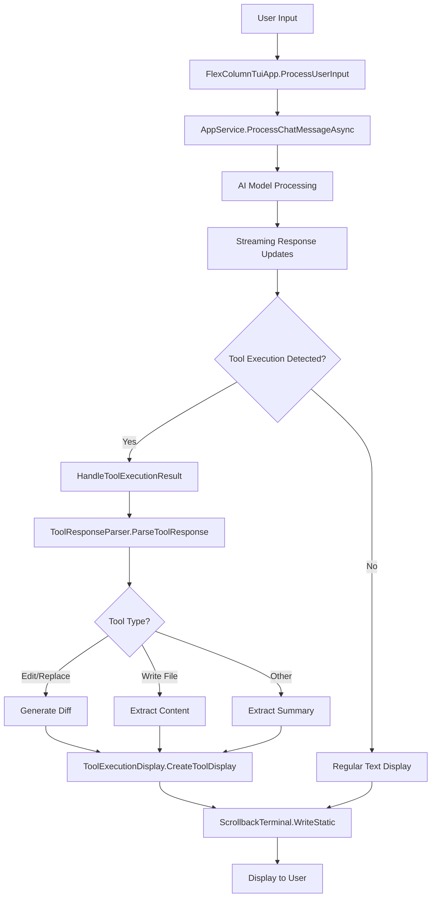
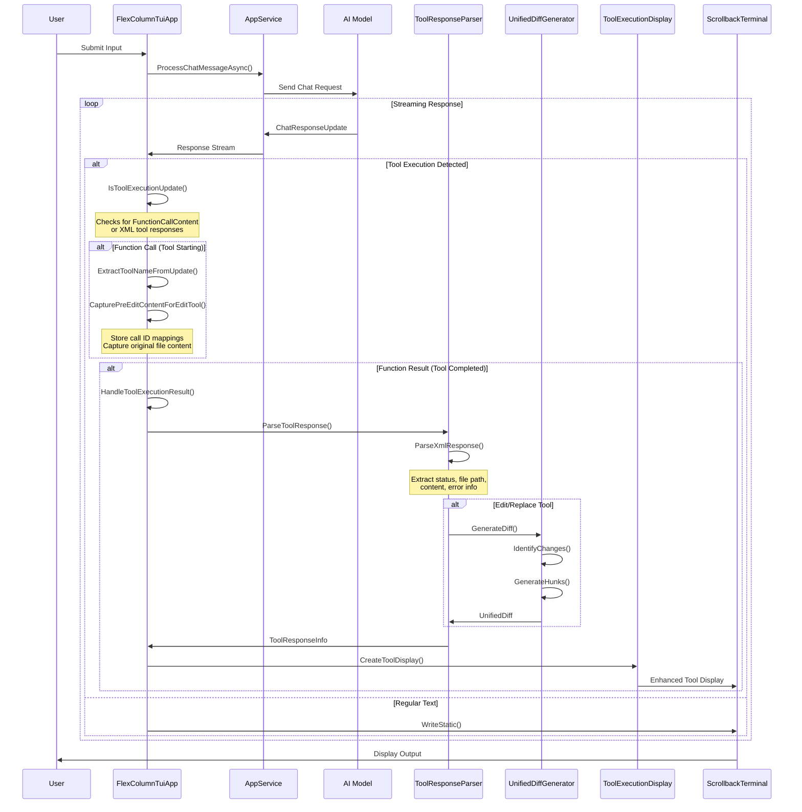
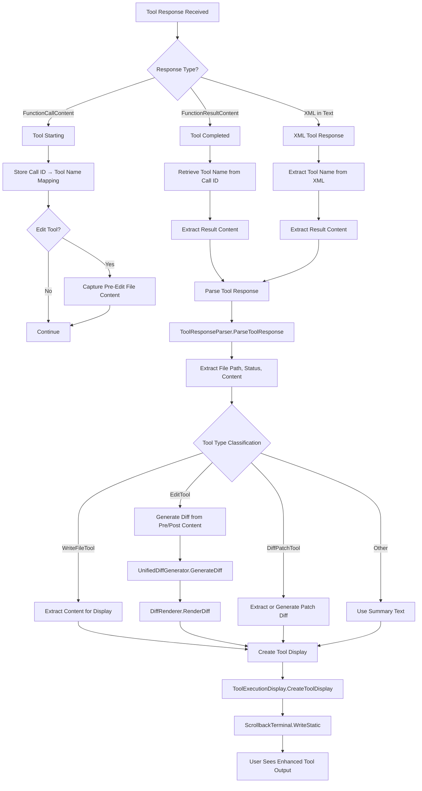
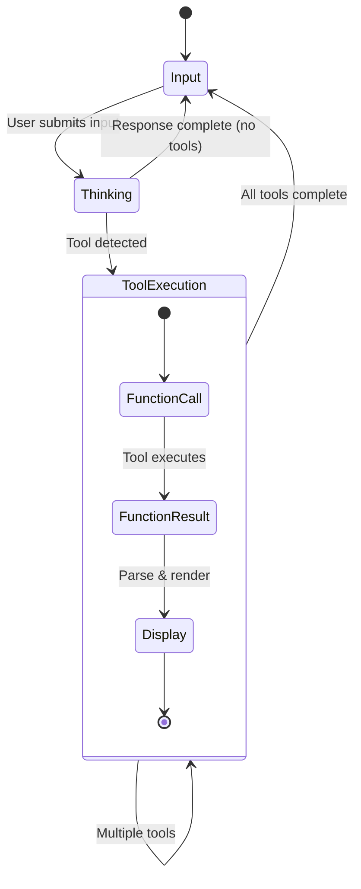
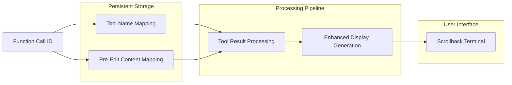
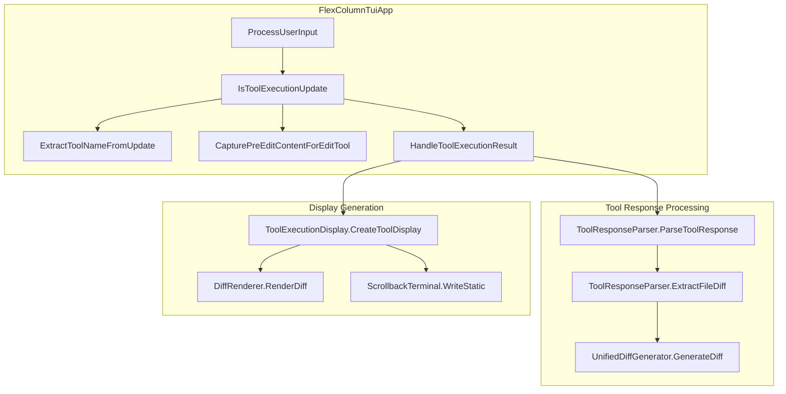
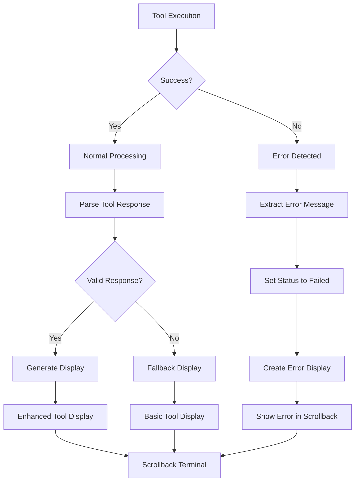
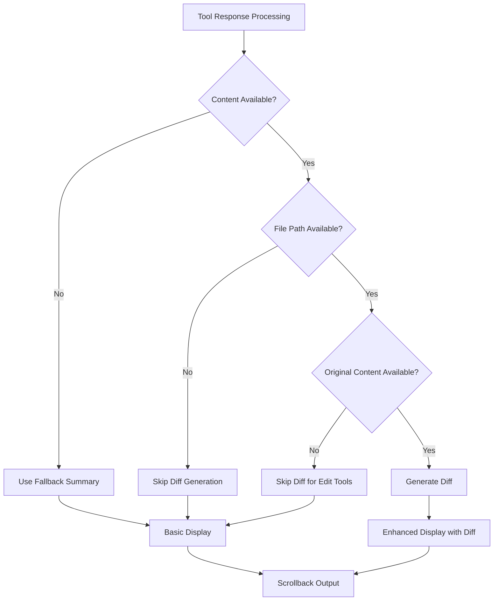
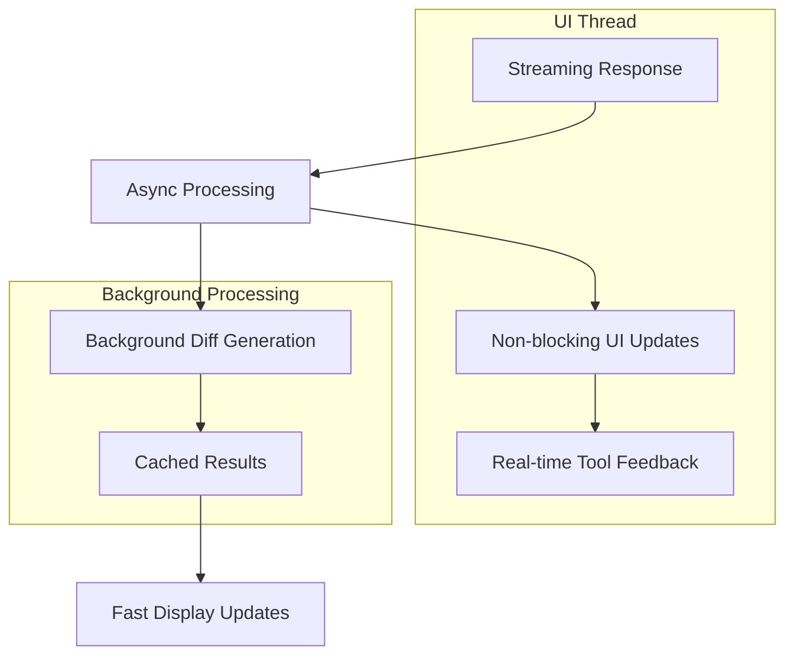
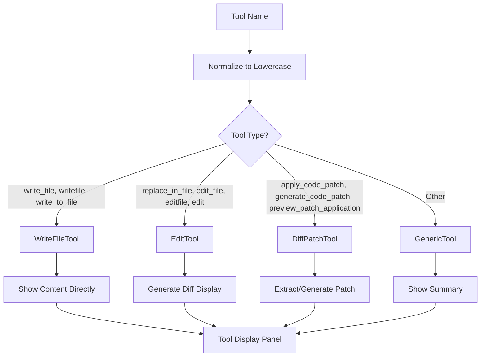

# Tool Execution Flow Design

## Overview

This document describes the complex flow of tool execution in Mogzi's TUI, from the initial user input through AI model processing to the final display in the scrollback terminal. The system involves multiple components working together to provide enhanced tool feedback with visual diff displays.

## Architecture Components

### Core Components
- **FlexColumnTuiApp**: Main TUI application orchestrating the flow
- **AppService**: Handles AI model communication and streaming responses
- **ToolResponseParser**: Parses tool responses and extracts display information
- **UnifiedDiffGenerator**: Generates diffs for file modifications
- **DiffRenderer**: Renders diff visualizations
- **ToolExecutionDisplay**: Creates enhanced tool display components
- **ScrollbackTerminal**: Manages terminal output and display

## Tool Execution Flow

### High-Level Flow



### Detailed Tool Execution Flow



### Tool Response Processing Detail



### Diff Generation Process

```mermaid
graph TD
    A[Diff Generation Request] --> B[UnifiedDiffGenerator.GenerateDiff]
    B --> C[Split Content into Lines]
    C --> D[LongestCommonSubsequence.FindLcs]
    D --> E[IdentifyChanges]
    E --> F[Group Changes into Hunks]
    F --> G[Generate Context Lines]
    G --> H[Create DiffHunk Objects]
    H --> I[Return UnifiedDiff]
    
    I --> J[DiffRenderer.RenderDiff]
    J --> K{Empty Diff?}
    K -->|Yes| L[Display "No changes detected"]
    K -->|No| M[Render Diff Lines]
    
    M --> M1[Context Lines: dim gray]
    M --> M2[Added Lines: green with +]
    M --> M3[Removed Lines: red with -]
    
    M1 --> N[Formatted Diff Display]
    M2 --> N
    M3 --> N
    N --> O[Include in Tool Display Panel]
```

## State Management

### Tool Execution State Tracking



### Data Flow Tracking



## Component Interactions

### Key Method Interactions



## Error Handling and Edge Cases

### Error Flow



### Edge Case Handling



## Performance Considerations

### Async Processing



## Configuration and Extensibility

### Tool Type Detection



## Future Enhancements

### Planned Improvements

1. **Visual Refinements**
   - Replace heavy bordered panels with subtle rounded rectangles
   - Implement compact tool execution boxes with dark background
   - Add line numbers to diff visualization
   - Improve diff color scheme and syntax highlighting

2. **Enhanced Tool Support**
   - Support for more tool types
   - Better content extraction for different response formats
   - Improved error handling and recovery

3. **Performance Optimizations**
   - Diff caching for repeated operations
   - Lazy loading of large file content
   - Optimized rendering for large diffs

## Conclusion

The tool execution flow in Mogzi's TUI is a sophisticated system that provides enhanced feedback for AI tool operations. The integration of multiple components enables real-time tool execution tracking, intelligent diff generation, and rich visual displays that help users understand what tools are doing and what changes they're making.

The system's modular design allows for easy extension and customization while maintaining clean separation of concerns between UI management, tool response processing, and display generation.
