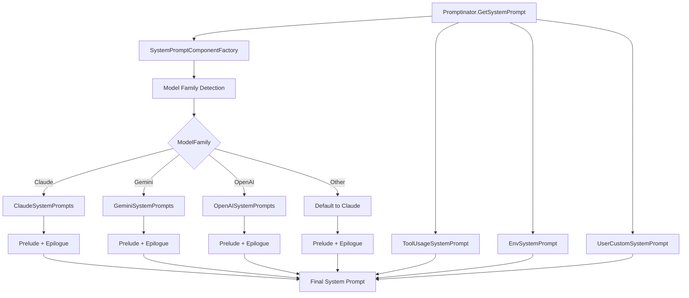
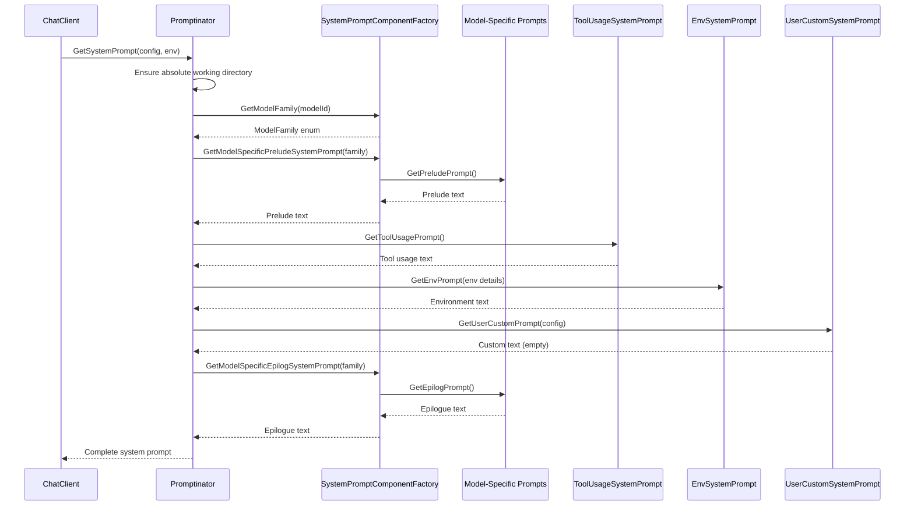
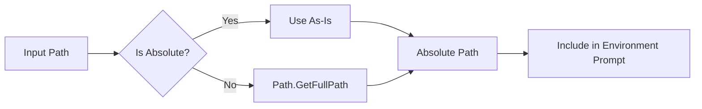

# Modular System Prompt Design

## Overview

The modular system prompt architecture provides model-specific prompt generation for different AI model families while maintaining consistent tool usage instructions and environment information.

## Architecture

### Component Structure



### Prompt Assembly Flow



## Model Family Detection

### Detection Logic

```csharp
public static ModelFamily GetModelFamily(string modelId)
{
    var lowerModelId = modelId.ToLowerInvariant();

    if (lowerModelId.Contains("claude"))
        return ModelFamily.Claude;
    
    if (lowerModelId.Contains("gemini"))
        return ModelFamily.Gemini;
    
    if (lowerModelId.Contains("gpt") || lowerModelId.Contains("openai"))
        return ModelFamily.OpenAI;
    
    return ModelFamily.Other;
}
```

### Model Family Characteristics

| Family | Detection Pattern | Personality | Tone |
|--------|------------------|-------------|------|
| Claude | "claude" | Warm, empathetic | Natural, conversational |
| Gemini | "gemini" | Direct, helpful | Methodical, precise |
| OpenAI | "gpt", "openai" | Professional | Efficient, practical |
| Other | Default fallback | Uses Claude prompts | Compatibility mode |

## File Organization

### Class Structure

```
src/MaxBot/Prompts/
├── ModelFamily.cs                 # Enum definition
├── SystemPrompt.cs               # Main orchestrator
├── SystemPromptComponents.cs     # Factory class
├── ClaudeSystemPrompts.cs        # Claude-specific prompts
├── GeminiSystemPrompts.cs        # Gemini-specific prompts
├── OpenAISystemPrompts.cs        # OpenAI-specific prompts
├── ToolUsageSystemPrompt.cs      # Model-agnostic tools
├── EnvSystemPrompt.cs            # Environment information
└── UserCustomSystemPrompt.cs    # User customization
```

### Responsibility Matrix

| Class | Responsibility | Scope |
|-------|---------------|-------|
| `Promptinator` | Orchestrates prompt assembly | Main entry point |
| `SystemPromptComponentFactory` | Model family detection and routing | Factory pattern |
| `ClaudeSystemPrompts` | Claude prelude/epilogue | Model-specific |
| `GeminiSystemPrompts` | Gemini prelude/epilogue | Model-specific |
| `OpenAISystemPrompts` | OpenAI prelude/epilogue | Model-specific |
| `ToolUsageSystemPrompt` | Tool usage instructions | Model-agnostic |
| `EnvSystemPrompt` | Environment details | Model-agnostic |
| `UserCustomSystemPrompt` | Custom user prompts | Configuration-based |

## Working Directory Path Resolution

### Path Handling Flow



### Implementation

```csharp
// In Promptinator.GetSystemPrompt()
var absoluteWorkingDirectory = Path.IsPathRooted(currentWorkingDirectory) 
    ? currentWorkingDirectory 
    : Path.GetFullPath(currentWorkingDirectory);

// In DefaultWorkingDirectoryProvider
public string GetCurrentDirectory()
{
    var currentDirectory = Directory.GetCurrentDirectory();
    return Path.IsPathRooted(currentDirectory)
        ? currentDirectory 
        : Path.GetFullPath(currentDirectory);
}
```

## Prompt Assembly Structure

### Final Prompt Format

```
[Model-Specific Prelude]

[Tool Usage Instructions]

[Environment Information]

[User Custom Prompts] (if any)

[Model-Specific Epilogue]
```

### Component Ordering

1. **Model-Specific Prelude** - Sets personality and context
2. **Tool Usage Instructions** - Universal tool guidelines
3. **Environment Information** - System context and settings
4. **User Custom Prompts** - Optional user-defined content
5. **Model-Specific Epilogue** - Final instructions and reminders

## Interface Contracts

### Core Interfaces

```csharp
// Model-specific prompt providers
internal static class ClaudeSystemPrompts
{
    public static string GetPreludePrompt();
    public static string GetEpilogPrompt();
}

// Factory methods
public static class SystemPromptComponentFactory
{
    public static ModelFamily GetModelFamily(string modelId);
    public static string GetModelSpecificPreludeSystemPrompt(ModelFamily family);
    public static string GetModelSpecificEpilogSystemPrompt(ModelFamily family);
}

// Component providers
internal static class ToolUsageSystemPrompt
{
    public static string GetToolUsagePrompt();
}

internal static class EnvSystemPrompt
{
    public static string GetEnvPrompt(string dateTime, string os, string shell, 
                                     string username, string hostname, 
                                     string workingDir, string mode, string approvals);
}
```

## Testing Strategy

### Test Coverage Areas

- Model family detection accuracy
- Absolute path resolution
- Prompt component assembly
- Model-specific content inclusion
- Environment information formatting

### Key Test Cases

```csharp
[Fact] GetModelFamily_ShouldReturnClaude_WhenModelIdContainsClaude()
[Fact] GetModelFamily_ShouldReturnGemini_WhenModelIdContainsGemini()
[Fact] GetModelFamily_ShouldReturnOpenAI_WhenModelIdContainsGpt()
[Fact] GetSystemPrompt_ShouldIncludeAbsolutePath_WhenRelativePathProvided()
[Fact] GetSystemPrompt_ShouldContainModelSpecificContent_ForEachFamily()
