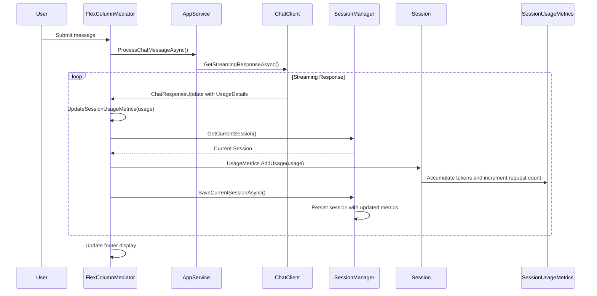
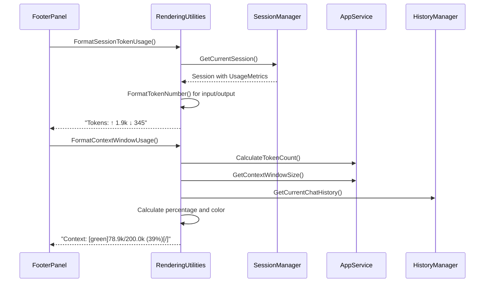

# Session Usage Metrics Design

## 1. Overview

This document outlines the design for the session usage metrics feature in the Mogzi TUI application. The goal is to provide real-time token usage tracking with Cline-inspired display formatting, enabling users to monitor their AI interaction costs and context window utilization on a per-session basis.

## 2. Key Components

### 2.1. SessionUsageMetrics (Domain Entity)

A new domain entity that tracks token usage metrics for individual sessions.

**File:** `src/Mogzi.Core/Domain/SessionUsageMetrics.cs`

```csharp
namespace Mogzi.Core.Domain;

/// <summary>
/// Tracks token usage metrics for a session
/// </summary>
public class SessionUsageMetrics
{
    [JsonPropertyName("inputTokens")]
    public long InputTokens { get; set; }

    [JsonPropertyName("outputTokens")]
    public long OutputTokens { get; set; }

    [JsonPropertyName("cacheReadTokens")]
    public long CacheReadTokens { get; set; }

    [JsonPropertyName("cacheWriteTokens")]
    public long CacheWriteTokens { get; set; }

    [JsonPropertyName("requestCount")]
    public int RequestCount { get; set; }

    [JsonPropertyName("lastUpdated")]
    public DateTime LastUpdated { get; set; }

    /// <summary>
    /// Total tokens for this session (input + output)
    /// </summary>
    public long TotalTokens => InputTokens + OutputTokens;

    /// <summary>
    /// Adds usage data from a chat response
    /// </summary>
    /// <param name="usage">Usage details from Microsoft.Extensions.AI</param>
    public void AddUsage(UsageDetails? usage)
    {
        if (usage == null) return;

        InputTokens += usage.InputTokenCount ?? 0;
        OutputTokens += usage.OutputTokenCount ?? 0;
        
        // Future: Handle cache tokens when available
        // CacheReadTokens += usage.CacheReadTokenCount ?? 0;
        // CacheWriteTokens += usage.CacheWriteTokenCount ?? 0;

        RequestCount++;
        LastUpdated = DateTime.UtcNow;
    }

    /// <summary>
    /// Resets all usage metrics (for new sessions)
    /// </summary>
    public void Reset()
    {
        InputTokens = 0;
        OutputTokens = 0;
        CacheReadTokens = 0;
        CacheWriteTokens = 0;
        RequestCount = 0;
        LastUpdated = DateTime.UtcNow;
    }
}
```

**Key Features:**
- **Real-time Tracking**: Accumulates tokens from each AI interaction
- **Future-Proof**: Includes cache token fields for future Microsoft.Extensions.AI support
- **Request Counting**: Tracks number of AI requests per session
- **Timestamp Tracking**: Records last update time for session metadata
- **JSON Serialization**: Properly configured for session persistence

### 2.2. Enhanced Session Entity

The existing `Session` domain entity is enhanced to include usage metrics.

**File:** `src/Mogzi.Core/Domain/Session.cs`

```csharp
public class Session
{
    // ... existing properties ...
    
    [JsonPropertyName("usageMetrics")]
    public SessionUsageMetrics? UsageMetrics { get; set; }
}

// Enhanced JSON serialization context
[JsonSerializable(typeof(SessionUsageMetrics))]
public partial class SessionContext : JsonSerializerContext
{
    // ... existing serialization types ...
}
```

### 2.3. Usage Tracking Integration

Token usage is captured during AI response streaming in the `FlexColumnMediator`.

**File:** `src/Mogzi.TUI/Components/FlexColumnMediator.cs`

**Integration Points:**
- **StartAiProcessingWorkflow()**: Enhanced to capture usage details from streaming responses
- **UpdateSessionUsageMetrics()**: New method to accumulate usage data and persist to session
- **Real-time Updates**: Usage metrics updated during streaming and immediately persisted

**Key Implementation:**
```csharp
private async Task UpdateSessionUsageMetrics(UsageDetails? usage)
{
    if (usage == null) return;

    var currentSession = _tuiContext.SessionManager.CurrentSession;
    if (currentSession != null)
    {
        // Initialize usage metrics if not present
        currentSession.UsageMetrics ??= new SessionUsageMetrics();
        
        // Add the usage data
        currentSession.UsageMetrics.AddUsage(usage);
        
        // Persist the updated session
        await _tuiContext.SessionManager.SaveCurrentSessionAsync();
        
        _logger.LogDebug("Updated session usage metrics: Input={InputTokens}, Output={OutputTokens}, Requests={RequestCount}",
            currentSession.UsageMetrics.InputTokens,
            currentSession.UsageMetrics.OutputTokens,
            currentSession.UsageMetrics.RequestCount);
    }
}
```

### 2.4. Cline-Inspired Display Formatting

New formatting utilities provide Cline-style number abbreviations and display formatting.

**File:** `src/Mogzi.TUI/Components/RenderingUtilities.cs`

**New Methods:**
- **FormatTokenNumber()**: Smart number abbreviations (345, 1.9k, 15k, 1.9m)
- **FormatSessionTokenUsage()**: Token display with directional arrows
- **FormatCacheUsage()**: Cache status display (future implementation)
- **FormatContextWindowUsage()**: Color-coded context window utilization

**Cline-Style Number Formatting:**
```csharp
public string FormatTokenNumber(long tokens)
{
    return tokens switch
    {
        < 1000 => tokens.ToString(),
        < 10000 => $"{tokens / 1000.0:F1}k".Replace(".0k", "k"),
        < 1000000 => $"{tokens / 1000}k",
        < 10000000 => $"{tokens / 1000000.0:F1}m".Replace(".0m", "m"),
        _ => $"{tokens / 1000000}m"
    };
}
```

**Session Token Usage Display:**
```csharp
public string FormatSessionTokenUsage(Session? session)
{
    var metrics = session?.UsageMetrics;
    if (metrics == null || (metrics.InputTokens == 0 && metrics.OutputTokens == 0))
    {
        return "Tokens: --";
    }

    var input = FormatTokenNumber(metrics.InputTokens);
    var output = FormatTokenNumber(metrics.OutputTokens);
    return $"Tokens: ↑ {input} ↓ {output}";
}
```

**Context Window Color Coding:**
```csharp
public string FormatContextWindowUsage(IAppService appService, IEnumerable<ChatMessage> chatHistory)
{
    try
    {
        var currentTokens = appService.CalculateTokenCount(chatHistory);
        var maxTokens = appService.GetContextWindowSize();
        
        if (maxTokens <= 0) return "Context: --";
        
        var percentage = (double)currentTokens / maxTokens * 100;
        var currentFormatted = FormatTokenNumber(currentTokens);
        var maxFormatted = FormatTokenNumber(maxTokens);
        
        var color = percentage switch
        {
            <= 50 => "green",
            <= 80 => "yellow", 
            _ => "red"
        };
        
        return $"Context: [{color}]{currentFormatted}/{maxFormatted} ({percentage:F0}%)[/]";
    }
    catch (Exception ex)
    {
        _logger.LogWarning(ex, "Failed to calculate context window usage");
        return "Context: --";
    }
}
```

### 2.5. Enhanced Footer Display

The footer panel is updated to display session usage metrics in Cline-inspired format.

**File:** `src/Mogzi.TUI/Components/FooterPanel.cs`

**Display Format:**
```
[Tokens: ↑ 1.9k ↓ 345] [Cache: --] [Context: 78.9k/200.0k (39%)]
```

**Key Features:**
- **Session-Scoped Metrics**: Shows tokens for current session only
- **Directional Arrows**: ↑ for input tokens, ↓ for output tokens
- **Smart Abbreviations**: Cline-style number formatting (1.9k, 15k, 1.9m)
- **Color-Coded Context**: Green (0-50%), Yellow (51-80%), Red (81-100%)
- **Cache Placeholder**: Ready for future cache token support
- **Graceful Degradation**: Shows "--" when data unavailable

### 2.6. Interface Updates

The rendering utilities interface is enhanced to support the new formatting methods.

**File:** `src/Mogzi.TUI/Components/IRenderContext.cs`

```csharp
public interface IRenderingUtilities
{
    // ... existing methods ...
    
    // NEW: Session-scoped token metrics
    string FormatTokenNumber(long tokens);
    string FormatSessionTokenUsage(Session? session);
    string FormatCacheUsage(Session? session);
    string FormatContextWindowUsage(IAppService appService, IEnumerable<ChatMessage> chatHistory);
}
```

## 3. Data Flow and Workflow

### 3.1. Usage Tracking Workflow



### 3.2. Display Rendering Workflow



### 3.3. Session Persistence

- **Automatic Persistence**: Usage metrics automatically saved with session data
- **Atomic Updates**: Metrics updated and persisted in single transaction
- **Session Restoration**: Usage metrics restored when loading existing sessions
- **Cross-Session Isolation**: Each session maintains independent usage tracking

## 4. Design Patterns and Architecture

### 4.1. Domain-Driven Design

- **SessionUsageMetrics**: Pure domain entity with business logic
- **Session Aggregation**: Usage metrics as part of session aggregate
- **Encapsulated Behavior**: AddUsage() and Reset() methods encapsulate business rules

### 4.2. Real-Time Updates

- **Streaming Integration**: Captures usage during AI response streaming
- **Immediate Persistence**: Usage data persisted immediately after each interaction
- **UI Responsiveness**: Footer updates reflect real-time usage changes

### 4.3. Separation of Concerns

- **Domain Layer**: SessionUsageMetrics handles business logic
- **Service Layer**: SessionManager handles persistence
- **Presentation Layer**: RenderingUtilities handles display formatting
- **UI Layer**: FooterPanel handles visual presentation

### 4.4. Extensibility

- **Future Cache Support**: Ready for cache token implementation
- **Pluggable Formatting**: Easy to modify display formats
- **Model Agnostic**: Works with any AI model providing usage details

## 5. Error Handling and Resilience

### 5.1. Graceful Degradation

- **Missing Usage Data**: Displays "--" when usage details unavailable
- **Calculation Errors**: Logs warnings and shows fallback display
- **Session Errors**: Continues operation even if metrics update fails

### 5.2. Data Integrity

- **Null Safety**: Comprehensive null checking throughout
- **Validation**: Input validation in AddUsage() method
- **Atomic Updates**: Usage metrics updated atomically with session data

### 5.3. Logging and Monitoring

- **Debug Logging**: Detailed logging for troubleshooting
- **Performance Monitoring**: Tracks usage calculation performance
- **Error Reporting**: Comprehensive error logging with context

## 6. Performance Considerations

### 6.1. Efficient Calculations

- **Minimal Processing**: Simple arithmetic operations for token accumulation
- **Cached Results**: Number formatting results cached where appropriate
- **Lazy Evaluation**: Context window calculations only when needed

### 6.2. Memory Management

- **Lightweight Objects**: SessionUsageMetrics uses primitive types
- **No Memory Leaks**: Proper disposal and cleanup patterns
- **Efficient Serialization**: JSON serialization optimized for performance

### 6.3. I/O Optimization

- **Batched Updates**: Usage metrics updated with session persistence
- **Async Operations**: All file operations use async patterns
- **Minimal Serialization**: Only changed session data serialized

## 7. Testing Strategy

### 7.1. Unit Testing

- **Domain Logic**: Test SessionUsageMetrics.AddUsage() and Reset()
- **Formatting Logic**: Test all RenderingUtilities formatting methods
- **Edge Cases**: Test with zero tokens, large numbers, null inputs

### 7.2. Integration Testing

- **End-to-End Flow**: Test complete usage tracking workflow
- **Session Persistence**: Verify metrics survive session save/load cycles
- **UI Integration**: Test footer display updates correctly

### 7.3. Manual Testing

- **User Experience**: Verify Cline-style formatting matches expectations
- **Performance**: Ensure no noticeable impact on AI response times
- **Cross-Session**: Verify metrics isolation between sessions

## 8. Future Enhancements

### 8.1. Cache Token Support

- **Microsoft.Extensions.AI**: When cache tokens become available
- **Display Enhancement**: Show cache read/write statistics
- **Cost Optimization**: Help users understand cache benefits

### 8.2. Usage Analytics

- **Historical Tracking**: Track usage trends over time
- **Cost Estimation**: Estimate costs based on token usage
- **Usage Reports**: Generate usage summaries and reports

### 8.3. Usage Limits

- **Budget Controls**: Set token usage limits per session
- **Warnings**: Alert users when approaching limits
- **Auto-Management**: Automatic session management based on usage

## 9. Implementation Status

### 9.1. Completed Features

- ✅ **SessionUsageMetrics Domain Entity**: Complete with JSON serialization
- ✅ **Session Integration**: UsageMetrics property added to Session
- ✅ **Usage Tracking**: Real-time capture during AI streaming
- ✅ **Cline-Style Formatting**: Smart number abbreviations implemented
- ✅ **Footer Display**: Enhanced with token usage and context window
- ✅ **Session Persistence**: Usage metrics saved and restored correctly
- ✅ **Color-Coded Context**: Green/Yellow/Red based on utilization

### 9.2. Manual Testing Results

- ✅ **Basic Functionality**: Token counting and display working correctly
- ✅ **Number Formatting**: Cline-style abbreviations (1.9k, 15k) working
- ✅ **Session Persistence**: Usage metrics survive application restarts
- ✅ **Context Window**: Color coding working (green at low utilization)
- ✅ **Session Loading**: Both command line and slash command loading work

### 9.3. Architecture Integration

- ✅ **Domain Layer**: Clean separation of concerns maintained
- ✅ **Service Layer**: SessionManager properly handles usage metrics
- ✅ **UI Layer**: FooterPanel displays metrics without performance impact
- ✅ **Error Handling**: Graceful degradation when data unavailable

The session usage metrics feature is fully implemented and provides users with real-time visibility into their AI interaction costs and context window utilization, following Cline-inspired design principles for optimal user experience.
