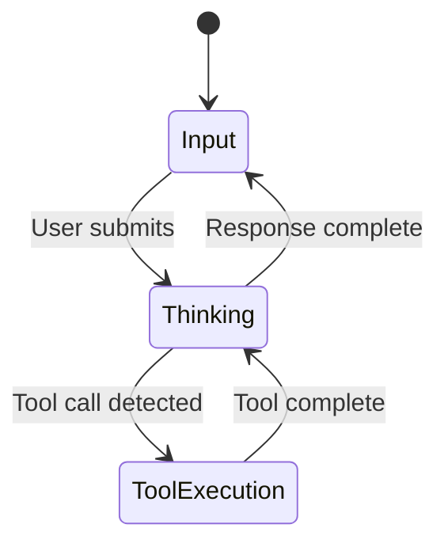

# MaxBot CLI Design Details

## Visual Design System

**Color Scheme:**
- Primary: Blue accents for input prompts and active elements
- Secondary: Yellow for tool execution, Orange for API requests
- Status: Green for success, Red for errors
- Text: White for content, Dim/Gray for secondary info

**Component Visual Design:**

### Input Component
```
┌─────────────────────────────────────┐
│ > [cursor]Type your message or @... │
└─────────────────────────────────────┘
```
- Panel with no border (NoBorder())
- "> " prefix in blue
- Blinking cursor "[blink]▋[/]"
- Placeholder text in dim styling
- Single-line input with cursor positioning

### Tool Execution Component
```
...  Executing read_file(path="src/app.cs")...
```
- Animated dots with descriptive progress text
- Tool name and arguments displayed
- Orange/yellow color scheme for processing state

### Message Display
```
[dim]>[/] user message here

✦ assistant response with streaming
  updates that appear in real-time
```
- User messages: "[dim]>[/] " prefix
- Assistant messages: "✦ " prefix
- Clean, minimal styling with Spectre.Console markup

## Input Handling Design

**Keyboard Shortcuts:**
- `Enter`: Submit message
- `Ctrl+P/N`: History navigation
- `Ctrl+L`: Clear screen
- `Ctrl+C`: Exit application
- `Ctrl+E`: External editor (placeholder)
- Arrow keys: Cursor movement
- `Home/End`: Cursor to start/end
- `Backspace/Delete`: Character deletion

**Text Input Features:**
- Real-time cursor positioning with visual feedback
- Single-line editing with proper character handling
- Command history with up/down navigation
- Input validation and sanitization

**Event-Driven Input System:**
```csharp
// Custom keyboard handler with events
_keyboardHandler.KeyPressed += OnKeyPressed;
_keyboardHandler.CharacterTyped += OnCharacterTyped;
_keyboardHandler.KeyCombinationPressed += OnKeyCombinationPressed;
```

## State Management Design

**Chat States:**
- `Input`: Ready for user input
- `Thinking`: API request in progress
- `ToolExecution`: Tool execution in progress

**UI State Transitions:**


**History Management:**
- Static rendering for completed messages via ScrollbackTerminal
- Dynamic rendering for current input and progress
- Persistent storage across sessions
- Memory-efficient message handling

## Animation and Feedback

**Loading Indicators:**
```csharp
var animationFrame = DateTime.Now.Millisecond / 250 % 4;
var leadingAnimation = animationFrame switch
{
    0 => "   ",
    1 => ".  ",
    2 => ".. ",
    3 => "...",
    _ => "   "
};
```
- Animated dots with 4-frame cycle
- Context-aware progress messages
- Smooth state transitions

**Visual Feedback:**
- Real-time cursor blinking and positioning
- Color-coded status indicators
- Progress text updates during tool execution
- Immediate response to user input

## Layout and Responsive Design

**Terminal Layout:**
```
┌─────────────────────────────────────┐
│ Max                                 │
│                                     │
│ [Static History Area]               │
│                                     │
│ [Dynamic Content Area]              │
│                                     │
│ [Input Component]                   │
│                                     │
│ [Footer: status info]               │
└─────────────────────────────────────┘
```

**Component Structure:**
```csharp
// Dynamic content rendering
return new Rows(
    new Text(""),           // Spacer
    bottomComponent,        // Input/Thinking/Tool
    CreateFlexFooterComponent()
);
```

**Responsive Behavior:**
- Flexible layout using Spectre.Console Rows/Columns
- Automatic text wrapping and overflow handling
- Dynamic component sizing based on terminal dimensions
- Efficient rendering with minimal redraws

## Technology-Specific Design

**Spectre.Console Integration:**
- Markup-based styling: `[blue]text[/]`, `[dim]text[/]`
- Panel components with configurable borders
- Rich text rendering with color support
- Cross-platform terminal compatibility

**Microsoft.Extensions.AI Integration:**
- Streaming response handling via IAsyncEnumerable
- Function calling for tool integration
- Structured content types (FunctionCallContent, FunctionResultContent)
- Built-in token counting and metrics

**Dependency Injection Design:**
- Service registration in Program.cs
- Clean separation of concerns
- Testable architecture with interface abstractions
- Lifecycle management for resources
