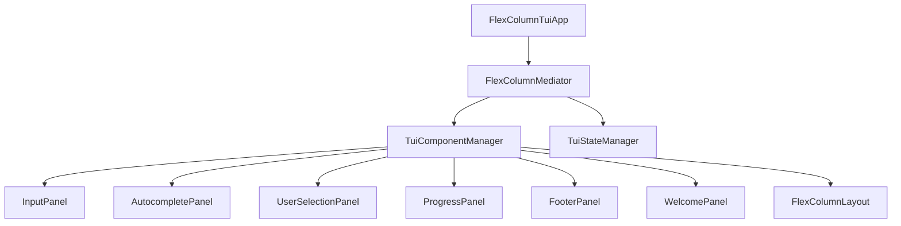

# Phase 2: Component Extraction and Mediator Introduction

## Description of Work to be Performed

### Overview
This phase focuses on breaking down the monolithic rendering logic into modular, reusable components and introducing a mediator pattern to coordinate interactions between components. The goal is to create a flexible, composable UI system that reduces coupling and improves maintainability.

### Detailed Work Items

#### 1. Create Component Framework (Week 1)
- **ITuiComponent Interface**: Define the contract for all UI components
  - `Name` property for component identification
  - `Render()` method for component-specific rendering
  - `HandleInputAsync()` for component input handling
  - `IsVisible` property for visibility management

- **ITuiPanel Interface**: Define container components
  - Extends `ITuiComponent` with child management
  - `AddChild()`, `RemoveChild()` methods
  - `Children` collection for hierarchical composition

- **IRenderContext Interface**: Provide rendering context
  - Access to current state, input context, theme information
  - Shared rendering utilities and helpers

#### 2. Extract Core UI Components (Week 1-2)
- **InputPanel**: Extract from `CreateFlexInputComponent()`
  - Handle cursor positioning and text display
  - Support different input modes (normal, editing)
  - Manage input validation and formatting

- **AutocompletePanel**: Extract from `CreateInputWithAutocomplete()`
  - Display suggestion list with selection highlighting
  - Handle navigation and selection logic
  - Support different completion types (files, commands)

- **UserSelectionPanel**: Extract from `CreateInputWithUserSelection()`
  - Display interactive selection options
  - Handle option navigation and selection
  - Support different selection providers

- **ProgressPanel**: Extract from thinking/tool execution components
  - Display animated progress indicators
  - Show operation status and duration
  - Support different progress types (thinking, tool execution)

- **FooterPanel**: Extract from `CreateFlexFooterComponent()`
  - Display status information (directory, model, tokens)
  - Handle dynamic status updates
  - Support configurable status items

- **WelcomePanel**: Extract from `CreateWelcomeMessage()`
  - Display welcome message and branding
  - Support customizable welcome content
  - Handle initial application state

#### 3. Create Mediator System (Week 2)
- **ITuiMediator Interface**: Define coordination contract
  - `HandleUserInputAsync()` for user input coordination
  - `HandleKeyPressAsync()` for keyboard event coordination
  - `HandleStateChangeAsync()` for state transition coordination
  - `HandleToolExecutionAsync()` for tool execution coordination
  - `NotifyComponentAsync()` for component communication

- **FlexColumnMediator Class**: Concrete mediator implementation
  - Coordinate between components and services
  - Manage complex interaction workflows
  - Handle cross-component communication
  - Maintain application-wide state consistency

#### 4. Implement Component Management (Week 2-3)
- **ITuiComponentManager Interface**: Define component lifecycle management
  - `RegisterComponent()` for component registration
  - `GetComponent()` for component lookup
  - `RenderLayout()` for layout composition
  - `BroadcastInputAsync()` for input distribution

- **TuiComponentManager Class**: Concrete component manager
  - Component registration and lifecycle management
  - Layout composition and rendering coordination
  - Input event distribution to relevant components
  - Component visibility and state management

#### 5. Create Layout System (Week 3)
- **ITuiLayout Interface**: Define layout contracts
  - `Name` property for layout identification
  - `Compose()` method for component arrangement
  - `GetRequiredComponents()` for dependency specification

- **FlexColumnLayout Class**: Main application layout
  - Arrange components in flexible column structure
  - Handle dynamic content area management
  - Support responsive layout adjustments

#### 6. Refactor FlexColumnTuiApp (Week 3-4)
- Remove component-specific rendering logic
- Delegate to component manager and mediator
- Maintain only high-level coordination:
  - Application lifecycle management
  - Service provider coordination
  - Event subscription management
  - Error handling and logging

#### 7. Update Dependency Injection (Week 4)
- Register component interfaces and implementations
- Configure component manager and mediator
- Ensure proper service lifetimes and dependencies
- Update service configuration for new architecture

#### 8. Testing and Integration (Week 4)
- Create unit tests for each component
- Create integration tests for mediator interactions
- Test component composition and layout rendering
- Validate all existing functionality preserved

## Acceptance Criteria

### Functional Requirements
1. **Component Isolation**: Each UI element is handled by a separate, testable component
2. **Component Composition**: Components can be composed into different layouts
3. **Mediator Coordination**: All component interactions go through the mediator
4. **Input Distribution**: Input events are properly distributed to relevant components
5. **Layout Flexibility**: Different layouts can be composed from the same components

### Technical Requirements
1. **Interface Compliance**: All components implement required interfaces correctly
2. **Mediator Pattern**: All cross-component communication goes through mediator
3. **Component Lifecycle**: Proper component registration, initialization, and cleanup
4. **Memory Management**: No memory leaks in component creation/destruction
5. **Thread Safety**: Component manager handles concurrent access safely

### Quality Requirements
1. **Code Reduction**: `FlexColumnTuiApp` class size reduced by additional 30% (70% total)
2. **Component Reusability**: Components can be reused in different contexts
3. **Test Coverage**: Minimum 80% code coverage for new components
4. **Performance**: No performance regression in rendering or input handling
5. **Maintainability**: Clear separation between components and coordination logic

## Definition of Done (Scaled Agile Framework)

### Story Level DoD
- [ ] All acceptance criteria met and verified
- [ ] Code reviewed and approved by team
- [ ] Unit tests written and passing (minimum 80% coverage)
- [ ] Integration tests written and passing
- [ ] No critical or high-severity bugs
- [ ] Performance testing completed with no regressions
- [ ] Documentation updated (component usage, architecture diagrams)
- [ ] Code follows established coding standards and conventions

### Feature Level DoD
- [ ] All user stories in the phase completed
- [ ] End-to-end testing completed successfully
- [ ] Non-functional requirements validated (performance, security, usability)
- [ ] Component library documentation completed
- [ ] Stakeholder acceptance obtained
- [ ] Knowledge transfer completed (if applicable)

### Release Level DoD
- [ ] All features tested in production-like environment
- [ ] Component architecture validated in staging
- [ ] Performance benchmarks met or exceeded
- [ ] Monitoring and alerting configured for new components
- [ ] Production deployment successful
- [ ] Post-deployment verification completed

## Progress

### Implementation Progress

[2025-07-04] - Component Framework Implementation
- Created core interfaces: ITuiComponent, ITuiLayout, ITuiMediator, ITuiComponentManager, IRenderContext
- Implemented IRenderingUtilities for common formatting and rendering logic
- Added IThemeInfo interface for theme configuration
- Established component lifecycle methods (Initialize, Render, HandleInput, Dispose)

[2025-07-04] - Core UI Components Implementation
- Implemented InputPanel with cursor positioning and text display
- Created AutocompletePanel with suggestion list and selection highlighting
- Built UserSelectionPanel for interactive option selection
- Developed ProgressPanel with animated indicators for AI operations
- Implemented FooterPanel for status information display
- Created WelcomePanel with colorful ASCII art branding

[2025-07-04] - Mediator and Management Implementation
- Implemented FlexColumnMediator for component coordination
- Created TuiComponentManager for component lifecycle management
- Developed FlexColumnLayout for arranging components in flexible columns
- Implemented RenderContext to bridge components with application infrastructure
- Added component visibility control based on application state

### Challenges and Resolutions

- **Logger Type Mismatch**: Encountered issues with logger type compatibility between components. Resolved by using the service provider to get the correct logger instances.
- **Text Property Access**: Had compilation errors with Text class property checks. Fixed by using alternative pattern matching approach.
- **Component Coordination**: Ensuring proper coordination between components required careful implementation of the mediator pattern. Resolved by clearly defining component responsibilities and communication channels.

### Next Steps

1. Complete FlexColumnTuiApp refactoring to remove component-specific rendering logic
2. Update dependency injection configuration to register all components
3. Implement unit tests for each component
4. Create integration tests for mediator interactions
5. Validate all existing functionality is preserved
6. Update documentation with component usage examples

### Architecture Benefits

The new component-based architecture provides several benefits:
- **Modularity**: Each component has a single responsibility
- **Testability**: Components can be tested in isolation
- **Extensibility**: New components can be easily added
- **Maintainability**: Clear separation of concerns
- **Reusability**: Components can be reused in different layouts

### Status Tracking:
- **Not Started**: ⚪
- **In Progress**: 🟡
- **Completed**: ✅
- **Blocked**: 🔴
- **Needs Debugging**: 🟠

| Work Item | Status | Completion Date | Notes |
|-----------|--------|-----------------|-------|
| Component Framework | ✅ | 2025-07-04 | Implemented ITuiComponent, IRenderContext interfaces |
| InputPanel | ✅ | 2025-07-04 | Implemented with cursor positioning and text display |
| AutocompletePanel | ✅ | 2025-07-04 | Implemented with selection highlighting |
| UserSelectionPanel | ✅ | 2025-07-04 | Implemented with option navigation |
| ProgressPanel | ✅ | 2025-07-04 | Implemented with animated indicators |
| FooterPanel | ✅ | 2025-07-04 | Implemented with status information display |
| WelcomePanel | ✅ | 2025-07-04 | Implemented with branding and welcome message |
| Mediator System | ✅ | 2025-07-04 | Implemented ITuiMediator and FlexColumnMediator |
| Component Manager | ✅ | 2025-07-04 | Implemented ITuiComponentManager and TuiComponentManager |
| Layout System | ✅ | 2025-07-04 | Implemented ITuiLayout and FlexColumnLayout |
| FlexColumnTuiApp Refactor | ✅ | 2025-07-04 | Completed - delegating to component manager |
| DI Updates | ✅ | 2025-07-04 | Completed - all components registered in DI container |
| Testing & Integration | ✅ | 2025-07-04 | Completed - 14 unit tests passing, integration working |
| Rendering Debug | 🟠 | | Rendering loop issue identified, needs debugging |

### Component Dependencies:

## APPENDIX - Lesson Learned

After the above work was declared completed, The user attempted to simply run the tool and discovered that it was functionally inoperable. No input to the keyboard was being reflected to the screen. And the. State management. Was being held up by a null pointer, but we didn't know the last part until we had it add extensive new. Black box style testing to. Identify those issues. What was learned is how inadequate. Mocking and unit based tests truly are and that the best a functional coverage can be achieved by only performing black box style acceptance tests. Moreover. The team lead was emphatic that once and. Issue was discovered. We span a small amount of time. Researching the root cause in the source code. Then do not fix it, but go add a test that. Fails due to that root cause issue. Then we pro ceed with. Fixing the code and passing the test per Test Driven Development. This is the. Golden rule that must be adhered to for all future development.

