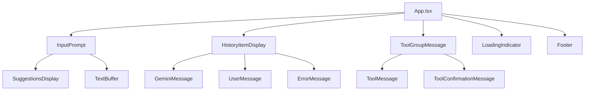
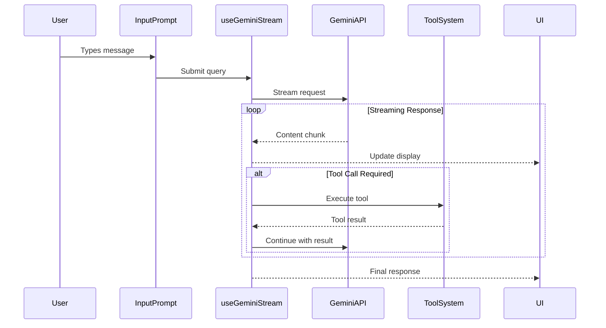
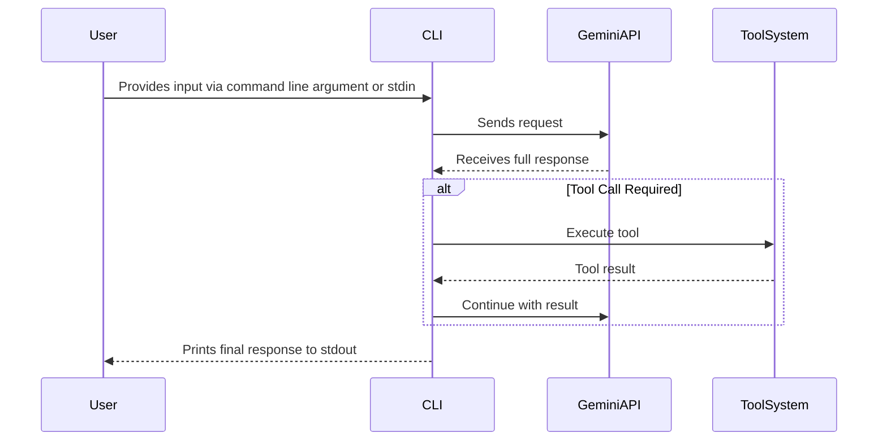

# Gemini-CLI Architecture

## Core Architecture

**Technology Stack:**
- React/Ink for terminal UI rendering
- TypeScript for type safety
- Node.js runtime environment
- Streaming API integration with Google Gemini

**Component Hierarchy:**

**Data Flow Architecture (Interactive TUI):**

**Data Flow Architecture (Non-Interactive CLI):**

**State Management:**
- React Context for global state (SessionContext, StreamingContext)
- Custom hooks for feature-specific state (useGeminiStream, useInputHistory)
- Local component state for UI interactions

**Key Architectural Patterns:**
- **Streaming Architecture**: Real-time response updates via async generators
- **Event-Driven Input**: Ink's useInput hook for keyboard handling
- **Component Composition**: Modular UI components with clear responsibilities
- **Hook-Based Logic**: Custom hooks encapsulate complex business logic
- **Static/Dynamic Rendering**: Ink's Static component for history, dynamic for live updates
