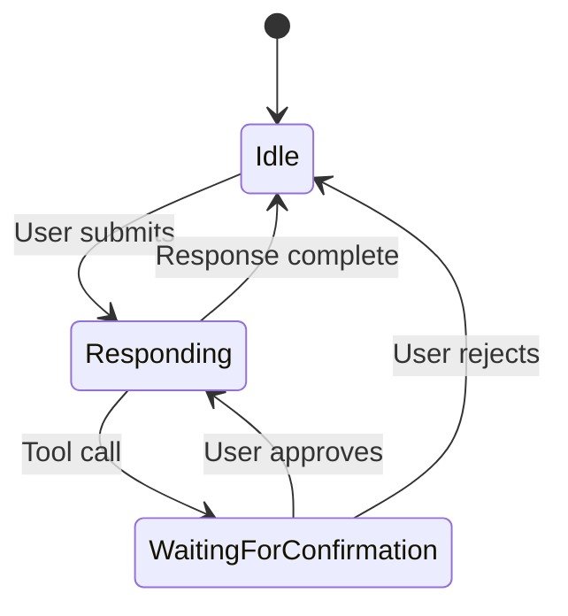

# Gemini-CLI Design Details

## Visual Design System

**Color Scheme:**
- Primary: Blue accents for input prompts and active elements
- Secondary: Yellow for pending operations, Gray for completed
- Status: Red for errors, Green for success, Orange for processing
- Text: White/bright for content, Gray/dim for secondary info

**Component Visual Design:**

### InputPrompt Component
```
┌─────────────────────────────────────┐
│ > [cursor]Type your message or @... │
└─────────────────────────────────────┘
```
- Rounded border with blue accent color
- "> " prefix in purple/blue
- Blinking cursor (chalk.inverse)
- Placeholder text in gray when empty
- Multi-line support with proper text wrapping

### ToolGroupMessage Component
```
┌─────────────────────────────────────┐
│ 🔧 edit_file(path="src/app.js")     │
│    ✓ File successfully modified     │
│                                     │
│ 🔧 shell_command(cmd="npm test")    │
│    ⏳ Running command...            │
│    [y/n] Execute this command?      │
└─────────────────────────────────────┘
```
- Yellow border for pending tools, Gray for completed
- Tool icons and descriptive names
- Progress indicators and confirmation prompts
- Nested result displays with proper indentation

### Message Display
```
> user message here

✦ assistant response with streaming
  updates that appear in real-time
  
🔧 tool execution results
```
- User messages: "> " prefix, dim styling
- Assistant messages: "✦ " prefix, normal styling  
- Tool messages: "🔧 " prefix with status indicators

## Input Handling Design

**Keyboard Shortcuts:**
- `Enter`: Submit message
- `Ctrl+Enter`: Insert newline
- `Ctrl+P/N`: History navigation
- `Ctrl+L`: Clear screen
- `Ctrl+C`: Exit (double-press)
- `Ctrl+E`: External editor
- `Escape`: Cancel/clear

**Text Input Features:**
- Real-time cursor positioning with visual feedback
- Multi-line editing with proper line wrapping
- File path autocomplete with `@` prefix
- Slash command autocomplete with `/` prefix
- Command history with up/down arrows

**Autocomplete System:**
```
> @src/
┌─────────────────────┐
│ app.js             │
│ components/        │
│ utils/             │
│ > index.ts         │
└─────────────────────┘
```
- Dropdown suggestions below input
- Keyboard navigation (up/down arrows)
- Tab completion for selected items
- Context-aware suggestions

## State Management Design

**Streaming States:**
- `Idle`: Ready for user input
- `Responding`: AI generating response
- `WaitingForConfirmation`: Tool approval needed

**UI State Transitions:**


**History Management:**
- Static rendering for completed messages
- Dynamic rendering for streaming content
- Automatic scrolling and overflow handling
- Memory-efficient message storage

## Animation and Feedback

**Loading Indicators:**
```
...  API Request...
..   Executing tool...
.    Processing...
     [cycle repeats]
```
- Animated dots with descriptive text
- Context-aware loading messages
- Smooth transitions between states

**Visual Feedback:**
- Border color changes for component states
- Cursor blinking and positioning
- Real-time text streaming effects
- Status icons for different message types

## Layout and Responsive Design

**Terminal Layout:**
```
┌─────────────────────────────────────┐
│ Header: Gemini CLI                  │
├─────────────────────────────────────┤
│                                     │
│ [Static History Area]               │
│                                     │
├─────────────────────────────────────┤
│ [Dynamic Content Area]              │
├─────────────────────────────────────┤
│ [Input Prompt]                      │
├─────────────────────────────────────┤
│ Footer: model | dir | tokens        │
└─────────────────────────────────────┘
```

**Responsive Behavior:**
- Dynamic width calculation (90% of terminal)
- Height constraints with overflow handling
- Automatic text wrapping and truncation
- Adaptive component sizing based on content
